# AMReX P5-003 C5.2 mapped boundary modes

_AVWiS separable-orthogonal inlet/outlet, moving wall, slip, symmetry, and projection closure · 2026-09-01_

---

## 📋 Conclusion

C5.2 extends the existing C5.1 boundary pipeline for the explicit
`analytic_orthogonal` separable mapping. Named mapped inlet/fixed-pressure
outlet, tangential moving wall, slip, and symmetry now use physical face-area
vectors and the matching orthogonal pressure projection. The default Cartesian
path and its numerical behavior remain selected by default.

This is a supported subset, not general curvilinear completion. General
non-orthogonal or curved-surface boundaries, cross-metric pressure terms,
mapped momentum RHS/time advancement, mapped restart, periodic hill, AMR,
IBM/FSI, and a physical mapped-flow validation case remain outside C5.2.

## 🎯 Supported and rejected configurations

Mapped boundaries require the same explicit opt-in as C5.1:

```text
avwis.coordinates = mapped
avwis.mapping.type = analytic_orthogonal
avwis.projection.operator = orthogonal_mlmg
avwisbcs.enabled = 1
avwisbcs.geometry = mapped_orthogonal
```

| Configuration | C5.2 result |
| --- | --- |
| Named `noslip`, `moving_wall`, `slip`, or `symmetry` | Supported on non-periodic separable-orthogonal sides |
| One named `inflow` and one named `outflow` | Supported with integrated inlet normalization and fixed-pressure outlet correction |
| Mixed periodic and physical directions | Supported; periodicity remains a direction-pair geometry property |
| Tangential constant Cartesian moving-wall vector | Supported; the normal component must be zero on every moving side |
| Legacy integer mapped BC | Rejected; mapped case-specific legacy semantics are not frozen |
| Identity or unknown physical-boundary provider | Rejected; C5.2 physical boundaries require `analytic_orthogonal` |
| General non-orthogonal or curved mapping | Rejected with a C3/C4 diagnostic; no Cartesian fallback |
| Coordinate/boundary geometry mismatch | Rejected before initialization |

`slip` and `symmetry` intentionally share the same velocity/pressure rule in
this incompressible subset: zero physical-normal velocity, extrapolated
tangential velocity, and homogeneous-Neumann pressure correction. C5.2 does
not claim scalar, turbulence, thermal, or case-specific symmetry semantics.

## ⚙️ Algorithm and projection closure

For logical face direction $m$, the immutable metric stores the oriented
physical area vector $\mathbf S_f^m$. C5.2 derives

$$
A_f=\lVert\mathbf S_f^m\rVert,
\qquad
\mathbf n_f^m=\frac{\mathbf S_f^m}{A_f},
\qquad
U_f^m=\mathbf u_f\mathbin{\cdot}\mathbf S_f^m.
$$

The separable provider has positive, axis-aligned area vectors, but the ghost
formulas operate on the stored physical vector. No boundary consumer
multiplies `Ucont` by area or Jacobian after it has become integrated flux.

For inlet profile weight $w_f$, evaluated from mapped physical tangential cell
centres, the physical normal speed scale is

$$
c=\frac{Q_{\mathrm{target}}}{\sum_{f\in\Gamma_{in}}w_f A_f}.
$$

The inlet vector points into the domain and its authoritative flux is
$U_f^m=\mathbf u_{in}\cdot\mathbf S_f^m$. A constrained outlet uses uniform
normal speed $Q_{\mathrm{target}}/\sum A_f$ before projection. The fixed-
pressure outlet is the only side whose normal flux may subsequently be
corrected.

Velocity ghost states use the following physical-vector rules:

| Mode | Face target or reflection | Pressure correction |
| --- | --- | --- |
| No-slip | $\mathbf u_g=-\mathbf u_i$ | Homogeneous Neumann |
| Moving wall | $\mathbf u_g=2\mathbf u_w-\mathbf u_i$ | Homogeneous Neumann |
| Slip/symmetry | $\mathbf u_g=\mathbf u_i-2(\mathbf u_i\cdot\mathbf n)\mathbf n$ | Homogeneous Neumann |
| Inlet | $\mathbf u_g=2\mathbf u_{in}-\mathbf u_i$ | Homogeneous Neumann |
| Outlet | $\mathbf u_g=\mathbf u_i$ | Homogeneous Dirichlet for the pressure increment |

The projection uses the same diagonal face-gradient flux as C2.2. Periodic and
prescribed-normal-flux sides select periodic/Neumann operator conditions. A
fixed-pressure outlet selects homogeneous Dirichlet for the pressure increment,
making the system nonsingular. A closed periodic/Neumann system retains the
integrated-RHS compatibility check and physical-volume-weighted pressure gauge.

```mermaid
flowchart LR
    accTitle: C5.2 Boundary Projection Loop
    accDescr: Deterministic mapped boundary order from metric validation and face ownership through physical ghost and flux conditions, classified pressure projection, reconstruction, and diagnostics.

    metric([⚙️ Validate mapping and metric epoch]) --> owner[🔄 Select deterministic face owners]
    owner --> halo[🔄 Fill same-level and periodic halo]
    halo --> ghost[⚙️ Apply physical-vector ghost rule]
    ghost --> flux[⚙️ Set authoritative physical u dot S]
    flux --> classify{🔍 Fixed-pressure outlet?}
    classify -->|No| neumann[⚙️ Periodic or Neumann projection]
    classify -->|Yes| dirichlet[⚙️ Outlet Dirichlet projection]
    neumann --> reconstruct[🔄 Resync flux and reconstruct Ucat]
    dirichlet --> reconstruct
    reconstruct --> diagnostics([📊 Verify divergence and prescribed flux])

    classDef process fill:#dbeafe,stroke:#2563eb,stroke-width:2px,color:#1e3a5f
    classDef decision fill:#fef9c3,stroke:#ca8a04,stroke-width:2px,color:#713f12
    classDef terminal fill:#dcfce7,stroke:#16a34a,stroke-width:2px,color:#14532d

    class owner,halo,ghost,flux,neumann,dirichlet,reconstruct process
    class classify decision
    class metric,diagnostics terminal
```



Physical corners first retain periodic halo values, then select the first
non-periodic side in x/y/z order. Reapplying the complete pipeline must produce
bitwise-identical valid and ghost `Ucat`. This is deterministic ownership and
precedence, not a multi-normal curved-corner model.

## ✅ Focused contracts

| Contract | Evidence |
| --- | --- |
| Mapped inlet/outlet | Physical-space linear profile; integrated inflow `-0.7`, constrained pre-projection outflow `+0.7`; outlet pressure increment is Dirichlet |
| Moving wall | Boundary face average reconstructs the configured Cartesian wall vector; normal `u·S` remains zero |
| Slip and symmetry | Physical-normal face average is zero and the tangential interior projection is retained |
| Mixed periodic/physical | Inlet/outlet case uses periodic y; wall-mode case uses periodic x |
| Multi-Box ownership | `max_grid_size=4` layouts match exact `OwnerMask` unique-face counts in every direction |
| Corners and repeatability | Repeated halo/physical/owner pipeline is bitwise identical across all `Ucat` valid and ghost values |
| Inlet/outlet projection | Nonsingular; maximum divergence `11.98241117` to `1.88616314e-10` |
| Closed wall-mode projection | Singular compatible system; maximum divergence `27.1142973` to `3.666039288e-10` |
| Prescribed flux after projection | Inlet and every no-penetration side remain unchanged within `4e-12` absolute tolerance |
| Invalid configuration | Mapped legacy BC, moving-wall normal velocity, non-orthogonal provider, and mapped/Cartesian operator mismatch are expected failures |

## 🔧 Files changed

| Area | Files |
| --- | --- |
| Boundary and projection | `amrex_port/src/AVWiSBoundary.cpp`, `AVWiSProjection.cpp`, `AVWiSCoordinateMapping.cpp` |
| Contract dispatch | `amrex_port/src/RunMode.H`, `RunMode.cpp`, `amrex_port/tests/contracts/AVWiSContractRunner.H`, `AVWiSContractRunner.cpp`, `AVWiSContractTestAccess.H` |
| Focused contracts | `amrex_port/tests/contracts/AVWiSC5ContractChecks.cpp`, `amrex_port/CMakeLists.txt`, `amrex_port/tests/static_contract_check.sh` |
| Inputs | `amrex_port/inputs/p5_c52_mapped_inflow_outflow.in`, `p5_c52_mapped_wall_modes.in`, `p5_c52_mapped_legacy_rejected.in`, `p5_c52_mapped_moving_normal_rejected.in`, `p5_c52_nonorthogonal_rejected.in` |
| Documentation | `amrex_port/README.md`, `_Docs/AMReX迁移方案.md`, `_Docs/AMReX移植任务清单.md`, this report |

The earlier C5.1 report and inputs are retained as regression evidence. The old
`p5_c5_mapped_inflow_rejected.in` file is no longer registered with CTest
because mapped inlet/outlet is now a supported C5.2 configuration.

## 🧪 Verification results

The acceptance directory is `build/amrex_port_p5c52`. It is a clean Release
build against locked AMReX 26.04, GNU C/C++ 13.3.0, CPU double, MPI OFF, and
CUDA OFF.

| Verification | Result |
| --- | --- |
| Clean configure/build | PASS; all targets built |
| Focused C5.1/C5.2 CTest | PASS; 7/7 |
| Full relevant CTest | PASS; 39/39 |
| Static contract | PASS |
| `git diff --check` | PASS |
| MPI build/runtime | NOT TESTED for C5.2; acceptance AMReX package has `AMReX_MPI=OFF` |
| CUDA build/runtime | NOT TESTED for C5.2; acceptance AMReX package has `AMReX_CUDA=OFF` |

Commands:

```bash
cmake -S amrex_port -B build/amrex_port_p5c52 \
  -DAMReX_DIR=/tmp/vwis-p5-amrex-git-install.Ra0ukN/lib/cmake/AMReX \
  -DCMAKE_BUILD_TYPE=Release
cmake --build build/amrex_port_p5c52 -j2
ctest --test-dir build/amrex_port_p5c52 \
  -R 'avwis_p5_c5|avwis_p5_c52' --output-on-failure
ctest --test-dir build/amrex_port_p5c52 --output-on-failure
bash amrex_port/tests/static_contract_check.sh
git diff --check
```

## ⚠️ Limitations and next seam

C5.2 relies on a separable mapping whose logical boundary faces are orthogonal
and axis aligned in physical Cartesian components. It does not support a
spatially varying moving-wall vector, non-normal inlet velocity, arbitrary
curved-wall tangent frames, multi-normal corner physics, multiple inlet/outlet
pairs, scalar/thermal/turbulence BCs, or non-orthogonal projection cross terms.

The next defensible seam remains C6 mapping/boundary provenance for restart,
followed by C7 backend runtime and C8 physical mapped regression. C3/C4 must
establish cross-metric operators and their pressure closure before any general
non-orthogonal boundary claim.

## 🔗 Internal references

- [C5.1 mapped wall report](./AMReX_P5-003_C5.1_mapped_boundary_20260901.md)
- [C2.2 orthogonal operator report](./AMReX_P5-003_C2.2_orthogonal_operators_20260901.md)
- [Migration plan](./AMReX迁移方案.md#当前状态剩余工作与下一步路线)
- [Task list](./AMReX移植任务清单.md#p5-003-曲线路线子模块状态)
- [Port README](../amrex_port/README.md#p5-003-c51c52-mapped-physical-boundaries)
