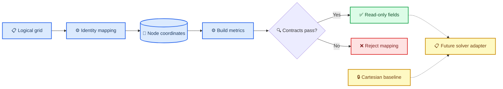

# AMReX P5-003 G0.1 identity metric 增量报告

_AVWiS 曲线坐标移植首个可验收数据模型增量 · 2026-08-31_

---

## 📋 结论摘要

- **结果：** 已实现可独立链接和测试的生产 `CoordinateMapping/MetricData` 模块，以及唯一生产 mapping `identity`
- **字段语义：** 已冻结并实际分配正向 $J_x$、逆 $J_\xi$、离散 $V_c$、共享 $\mathbf S_f^m$，同时提供规格要求的 cell/face metric 辅助字段
- **证据：** locked AMReX 26.04、CPU double、非周期多 Box identity 契约通过；现有完整 CTest 和 lid cavity sanity 保持通过
- **状态：** `P5-003` 从“未开始”转为“进行中”；这是 G0.1 基础，不是 G0 总门完成，更不是一般曲线坐标支持

> ⚠️ **能力边界：** 当前 `AVWiSSolver` 未消费 `MetricData`。Cartesian 投影、RHS、checkpoint 和方腔仍走既有标量面积/体积路径，输出 schema 未改变。

## 🎯 范围与设计取舍

### 已实施

| 范围 | 实现 |
| --- | --- |
| Mapping 边界 | `CoordinateMapping::fill_nodes()` 与稳定 `id()` |
| Identity provider | 用显式逻辑原点/步长构造物理节点坐标 |
| 数据所有权 | 同一 cell `BoxArray`、同一 `DistributionMapping` 的 node/cell/face `MultiFab` |
| 生命周期 | `define()`、一次性 `build()`、显式 `rebuild()`、`epoch()` |
| 不可写边界 | 全部生产 accessor 仅返回 `const MultiFab&` |
| 离散几何 | 固定 face 对角线、同向两三角形、同一三角面矩构造体积 |
| 共享面 | face metric 写后 `OverrideSync`，再 `FillBoundary` |
| 验证 | 正值、互反、metric identity/GCL、cofactor 互反、多 Box/ghost/owner、常速度通量 |

### INFERENCE

当前 solver 的 Cartesian 面积/体积被 P2–P8、checkpoint 和边界代码共同使用。首增量若直接替换，会把 metric 数据模型任务扩大为投影、状态同步和 restart schema 迁移。因此本次把 `avwis_metric` 建成独立生产库，由独立测试直接链接，不通过 `AVWiSSolver` friend/test bridge。下一增量再以逐算子 adapter 接入。

identity 采用 `LogicalGrid::from_cartesian_geometry()`：计算坐标与物理 Cartesian 坐标相同，故 $J_x=J_\xi=1$，而 $V_c=h_1h_2h_3$。这明确选择了规格允许的“计算步长为 $h_m$”参数化，没有把 $J_x$ 与离散体积混用。



## 📚 字段与离散语义

| 生产字段 | IndexType / 组件 | 语义 |
| --- | --- | --- |
| `node_coordinates_nd` | node / 3 | 物理节点坐标；内部多一层缓存以构造 face ghost metric |
| `cell_center_coordinates_cc` | cell / 3 | 八节点算术平均；内部多一层缓存 |
| `mapping_jacobian_cc` | cell / 1 | $J_x=\det(\partial x/\partial\xi)$ |
| `inverse_mapping_jacobian_cc` | cell / 1 | $J_\xi=1/J_x$；legacy `Aj` 语义 |
| `grad_xi_cc` | cell / 9 | component `3*m+l` 为 $\partial\xi^m/\partial x_l$ |
| `area_cofactor_cc` | cell / 9 | component `3*m+l` 为 $J_x\partial\xi^m/\partial x_l$ |
| `cell_volume_cc` | cell / 1 | 同一三角面离散定义得到的 $V_c$ |
| `face_area_vector_fc[m]` | m-face / 3 | 指向 $+\xi^m$ 的共享积分面积向量 |
| `face_gradient_metric_fc[m]` | m-face / 3 | $Q_f^{mk}=\mathbf S_f^m\cdot\nabla\xi_f^k$ |
| `projection_beta_fc[m]` | m-face / 1 | 定密度基线值 `1`；尚未接入投影 |

面使用固定 `p0-p2` 对角线。每个三角形面积向量为

$$
\mathbf S_t=\frac12(\mathbf x_1-\mathbf x_0)\times(\mathbf x_2-\mathbf x_0),
$$

体积使用同一三角形的面积向量和三角形重心，避免用 $J_x$ 代替 $V_c$。cell basis 由相对面中心差除以显式逻辑步长构造；cofactor、逆 metric 和 Jacobian 来自同一个 $3\times3$ basis。

## ✅ 验收契约

专用测试 `tests/curvilinear/MetricIdentityContract.cpp` 不进入 `src/`，也不依赖 solver 私有访问桥。它直接链接生产 `avwis_metric`。

| 契约 | 判据 | 结果 |
| --- | --- | --- |
| 正 Jacobian/体积/面积 | `min(Jx)>0`、`min(V)>0`、`min(abs(S))>0` | PASS |
| Jacobian 互反 | relative error $\le5\times10^{-13}$ | PASS |
| GCL 闭合 | normalized closure $\le10^{-12}$ | PASS |
| metric 互反 | relative error $\le10^{-11}$ | PASS |
| Cartesian identity | $J_x=J_\xi=1$、$V=dx\,dy\,dz$、轴向 face vector | PASS |
| 常速度 | `Ucont=u dot S`，cell divergence $\le10^{-12}$ | PASS |
| 多 Box/owner | `max_grid_size=4`，owner 数与全局 face 数一致 | PASS |
| Ghost | node/cell/face 的 inter-Box 与物理 ghost identity 值 | PASS |
| API | accessor 编译期为 `const MultiFab&` | PASS |

## ⚠️ OPEN 与未实施项

| 项目 | 状态 | 后续门 |
| --- | --- | --- |
| Solver 接入 | OPEN | 用 identity metric adapter 替换一条 Cartesian transform/divergence 路径并做 bitwise/紧容差回归 |
| 坐标 checksum/checkpoint provenance | OPEN | G0 总门前冻结 checksum、规则版本与 restart 校验 |
| 解析光滑 mapping | NOT IMPLEMENTED | G1 增加 separable、正 Jacobian、强拉伸 fixture |
| 文件 mapping | NOT IMPLEMENTED | 在拓扑、周期平移和 checksum schema 冻结后实现 |
| `Ucat<->Ucont` mapped 重构 | NOT IMPLEMENTED | M2 决策与常量/光滑场收敛测试 |
| mapped divergence/gradient/RHS | NOT IMPLEMENTED | 后续 G0/G1 算子增量 |
| 19 点压力/非正交交叉项 | NOT IMPLEMENTED | G2/G3，不属于本增量 |
| MPI runtime | NOT TESTED | 需要可用 MPI runtime 环境 |
| CUDA runtime | NOT TESTED | 需要可见 NVIDIA device/driver |

M1 仍为 OPEN：本实现采用规格的共享面三角化规则，但没有宣称与 legacy `CurvGrid::FormMetrics` 中心叉积逐点相同。M2–M6 均未由本增量决定。

## 🔍 验证记录

锁定包：AMReX `26.04`，git SHA `9219ba416b7ba2073dd1b12bf19fdce27391f17b`，CPU double，GNU C++ 13.3.0。

```bash
cmake -S amrex_port -B build/amrex_port_p5g0_final \
  -DAMReX_DIR=/tmp/vwis-p5-amrex-git-install.Ra0ukN/lib/cmake/AMReX \
  -DCMAKE_BUILD_TYPE=Release -DBUILD_TESTING=ON \
  -DAVWIS_EXPECTED_VERSION=26.04
cmake --build build/amrex_port_p5g0_final -j2
cmake --build build/amrex_port_p5g0_final -j2
bash amrex_port/tests/static_contract_check.sh
ctest --test-dir build/amrex_port_p5g0_final --output-on-failure
ctest --test-dir build/amrex_port_p5g0_final -R avwis_lid_driven_cavity_sanity --output-on-failure
git diff --check
```

| 验证项 | 结果 |
| --- | --- |
| Clean configure/build | PASS；新目录 `build/amrex_port_p5g0_final` |
| Incremental build | PASS；全部目标 up to date |
| Static contract | PASS |
| Focused identity metric | PASS，1/1 |
| Full CTest | PASS，27/27 |
| Lid cavity sanity | PASS，1/1（同时包含于全量） |
| `git diff --check` | PASS |
| MPI runtime | NOT TESTED；所用 AMReX 包 `AMReX_MPI=OFF` |
| CUDA runtime | NOT TESTED；所用 AMReX 包 `AMReX_CUDA=OFF` |

Configure 只计构建配置，不计 runtime。MPI/CUDA 未以 configure 代替 runtime。

## 🔗 依据

- [唯一曲线坐标实现规格](./AVWiS曲线坐标实现规格.md)
- [AMReX 迁移方案](./AMReX迁移方案.md)
- [VFS 算法详解](./VFS_算法详解.md)
- [P2 增量实施测试报告](./AMReX_P2_增量实施测试报告_20260821.md)
- [P4 Cartesian 压力投影报告](./AMReX_P4_Cartesian压力投影设计及测试_20260826.md)
- [当前端口 README](../amrex_port/README.md)
