# AMReX P5-004 时间推进设计及测试

_单层均匀 Cartesian 最小路径，基线日期 2026-08-28_

---

## 📋 结论与状态

P5-004 选择“显式 Euler 动量预测 + P4 Cartesian 投影”作为当前唯一可执行
基线，投影时间系数固定为 `1.0`。CPU clean build 与完整 CTest 18/18 PASS；
周期剪切扩散的 `dt`/`dt/2` 误差比为 `2.002575751`，验证了该半离散制造问题的
一阶时间收敛。周期总动量漂移为 `1.387778781e-17`，投影后最大散度与历史层
旋转误差均为 `0`。

任务状态从“未开始”改为“进行中”，不改为“已完成”。真实 checkpoint/restart
payload 尚不存在，MPI 2-rank 在应用启动前被 PMIx socket 权限阻塞，CUDA 设备
不可见，也没有真实 CFD case。上述 PASS 只证明有限 Cartesian 制造路径，不证明
完整 CFD 数值正确。

## 🔍 基线与范围审计

| 项目 | 记录 |
| --- | --- |
| 仓库 HEAD | `d1694f8adaf09d46b4439ab5165aa2f1a0b6798c` |
| 分支 | `codex-p4-cartesian-projection` |
| AMReX | `26.04`，SHA `9219ba416b7ba2073dd1b12bf19fdce27391f17b` |
| CPU compiler | GCC/G++ `13.3.0`，Release，double，3D |
| MPI | OpenMPI `4.1.6`，AMReX MPI package 与 consumer clean build PASS |
| 工作区基线 | 已有未提交 P5-001/P5-002 源码、输入和文档；本次保留并在其上增量修改 |
| hooks | 仅 `.git/hooks/*.sample`，无启用 hook；未信任或执行第三方 hook |

本次改动仅位于 `amrex_port/` 与 `_Docs/`。没有修改 legacy `vwis2.0/` solver，
没有实现 P5-003 曲线 metric、P5-005 SNES 策略或 P5-006 LES，也没有覆盖已有
P5-001/P5-002 未提交成果。

## 🎯 时间离散决策

| 候选 | 语义 | 当前决定 | 原因与边界 |
| --- | --- | --- | --- |
| 显式 Euler | `U*=U^n+dt*RHS(U^n)`，再以系数 1 投影 | 选择并实现 | 现有 P5-001/P5-002 已提供显式 RHS，可形成最小可验证路径 |
| 半隐式 | 对粘性或完整动量建立线性/非线性隐式 solve | 不实现 | 当前没有隐式动量 operator、边界闭合、残差容差与失败处理 |
| BDF2 | 时间导数系数 `(1.5,-2,0.5)/dt`，投影系数 1.5 | 不实现 | 需要两层有效历史和隐式当前 RHS；legacy 分支当前不可达 |

legacy `Integrator::SolveFunction` 的可达 `timeCoeff≈1` 分支并非显式 Euler：它把
当前与旧 RHS 各乘 `0.5`，再由 PETSc SNES 求非线性残差根。其另一分支使用
`(-1.5 U^n + 2 U^{n-1} - 0.5 U^{n-2})/dt` 形状，但
`UData::getTimeCoeff()` 在当前源码硬编码返回 `1.0`，所以不可达。P5-004 保留这些
事实，不声称新显式路径与 legacy SNES、半隐式或 BDF2 等价；是否恢复或替换 SNES
仍属于 P5-005。

## ⚙️ 实施语义

```mermaid
flowchart LR
    accTitle: P5 Explicit Time Step
    accDescr: The selected Cartesian step checks explicit limits, evaluates advection and viscosity at layer n, rotates three history layers, predicts velocity, and applies the existing projection with coefficient one.

    state_n([📥 Read layer n]) --> check_limits{🔍 Limits accepted?}
    check_limits -->|No| reject_step[❌ Reject step]
    check_limits -->|Yes| evaluate_rhs[⚙️ Evaluate explicit RHS]
    evaluate_rhs --> rotate_history[🔄 Rotate history layers]
    rotate_history --> predict_velocity[⚡ Predict cell velocity]
    predict_velocity --> sync_flux[🔄 Synchronize face flux]
    sync_flux --> project_flux[⚙️ Project with coefficient 1]
    project_flux --> state_next([✅ Record layer n plus 1])

    classDef process fill:#dbeafe,stroke:#2563eb,stroke-width:2px,color:#1e3a5f
    classDef decision fill:#fef9c3,stroke:#ca8a04,stroke-width:2px,color:#713f12
    classDef success fill:#dcfce7,stroke:#16a34a,stroke-width:2px,color:#14532d
    classDef danger fill:#fee2e2,stroke:#dc2626,stroke-width:2px,color:#7f1d1d

    class evaluate_rhs,rotate_history,predict_velocity,sync_flux,project_flux process
    class check_limits decision
    class state_n,state_next success
    class reject_step danger
```



每一步开始时先计算 P5-001 对流 RHS 与 P5-002 常系数粘性 RHS，然后按下表旋转
cell 与 face 状态，最后更新 `Ucat`、重建 `Ucont` 并调用现有投影。

| 步后字段 | 内容 | 有效性 |
| --- | --- | --- |
| `Ucat`, `Ucont[d]` | `n+1` | 预测并投影后的当前状态 |
| `Ucat_old`, `Ucont_old[d]` | `n` | 步前快照 |
| `Ucat_older`, `Ucont_older[d]` | `n-1` | 上一步的 old 层 |
| `time`, `step` | `time+dt`, `step+1` | 每次成功推进后更新 |
| `history_depth` | `min(3, depth+1)` | 初始化为 1；不把重复初值冒充有效 BDF2 历史 |

## 📊 dt、CFL 与制造证据

代码在每步前计算

```text
C_adv = sum_d(dt * max(abs(Ucat_d)) / dx_d)
C_nu  = 2 * nu * dt * sum_d(1 / dx_d^2)
```

二者任一大于 `1` 即拒绝时间步。该门禁是保守的输入错误防线，不是中心对流加
显式 Euler 的非线性稳定性证明。当前代码也不会像自适应控制器那样自动缩小 `dt`。

制造场为全周期 `16x8x8` 多 Box 网格上的散度自由剪切
`U=(0,sin(2*pi*x),0)`，`nu=0.1`，终止时间 `0.008`。该场的对流 RHS 与压力
修正为零，因此全路径退化为离散 Laplacian 的已知特征模扩散；误差相对半离散
精确解计算，从而隔离时间误差而不把空间误差混入阶数。

| 指标 | `dt=1e-3` | `dt=5e-4` | 判定 |
| --- | ---: | ---: | --- |
| `Linf` 时间误差 | `5.790991343e-05` | `2.891771430e-05` | PASS |
| 粗/细误差比 | `2.002575751` | — | PASS，一阶 |
| 粗步 advective CFL | `0.007846282243` | — | PASS，低于 1 |
| 粗步 diffusive number | `0.0768` | — | PASS，低于 1 |
| 细步总动量漂移 | — | `1.387778781e-17` | PASS |
| 细步最大散度 | — | `0` | PASS |
| history 最大误差 | — | `0` | PASS |
| 投影时间系数 | — | `1` | PASS |

额外输入把 `dt` 提高到 `0.02`，得到扩散数大于 1；程序以退出码 `1` 拒绝，且
输出 `P5-004 explicit step rejected`。CTest 将此登记为预期失败测试，另有独立命令
同时核对非零返回码和错误文本，避免任意崩溃被误算为门禁 PASS。

## 🧪 验证命令与真实结果

| 检查 | 命令摘要 | 结果 |
| --- | --- | --- |
| 静态契约 | `bash amrex_port/tests/static_contract_check.sh` | PASS |
| CPU clean configure | `cmake -S amrex_port -B /tmp/vwis-p5-004-cpu-build.Fbb1Ww ... -DAMReX_DIR=/tmp/vwis-p5-amrex-git-install.Ra0ukN/lib/cmake/AMReX` | PASS |
| CPU clean build | `cmake --build /tmp/vwis-p5-004-cpu-build.Fbb1Ww --parallel 2` | PASS |
| CPU 完整回归 | `ctest --test-dir /tmp/vwis-p5-004-cpu-build.Fbb1Ww --output-on-failure` | PASS 18/18 |
| CFL 定向拒绝 | 直接运行 `p5_explicit_cfl_rejected.in`，检查退出码与文本 | PASS，exit `1` |
| AMReX MPI package | locked SHA，MPI ON，Release，double，3D，clean build/install | PASS |
| MPI consumer | `/tmp/vwis-p5-004-port-mpi-build.CUUFco` clean configure/build/link | PASS |
| MPI 2-rank P5-004 | `timeout 20s mpiexec -n 2 ... p5_explicit_time.in` | BLOCKED，PMIx listener `socket() errno=1`，未进入应用 |
| CUDA runtime preflight | `nvcc --version`、`nvidia-smi`、设备节点检查 | toolkit PASS；runtime BLOCKED，NVML 报 OS blocked，`/dev/dxg` 与 `/dev/nvidia0` 不存在 |
| 真实 CFD case | 审计仓库输入 | BLOCKED，没有冻结的可运行 case/基准输出 |

CUDA P5-004 consumer compile 本次未执行，因此没有 CUDA compile PASS 结论。MPI build
PASS 也不能替代 MPI runtime。所有构建目录均为新建 `/tmp` 目录，没有清理或覆盖
用户工作区。

## 💾 Restart 影响

`write_metadata_manifest()` 仍明确写出 `payload_written=false`。本次把字段 schema、
`time`、`step` 与 `history_depth` 记录清楚，但没有把任何 MultiFab payload 写盘，
所以不能恢复 `Ucat/Ucont` 的 `n/n-1/n-2` 层。内存内历史旋转回归 PASS 不是 restart
回归；真正的 checkpoint/restart 必须原子保存所有历史层、时间、步号、上一步 `dt`
及 schema 版本，并在 P1-005/P8 I/O 路径存在后做连续运行与重启运行逐场比较。

## ⚠️ 限制与剩余阻塞

- P5-004 保持“进行中”：restart 时间层一致性 BLOCKED
- MPI build/link PASS，但 2-rank runtime 在 `MPI_Init` 前 BLOCKED
- CUDA toolkit 存在但设备/驱动不可用；没有 P5-004 CUDA compile/runtime 证据
- 时间收敛只覆盖无对流贡献的周期剪切扩散，不是 Taylor–Green 或真实 CFD
- 显式 CFL 门禁不等于中心对流非线性稳定性证明，也不提供自动 `dt` 控制
- 半隐式、BDF2、SNES 残差/容差/失败策略未实现，留给 P5-005
- P5-003 曲线 metric、P5-006 LES、IBM/EB、AMR 均不在本次范围
