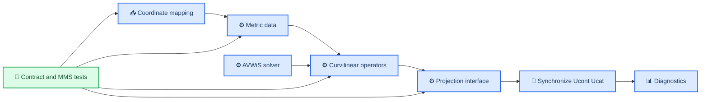
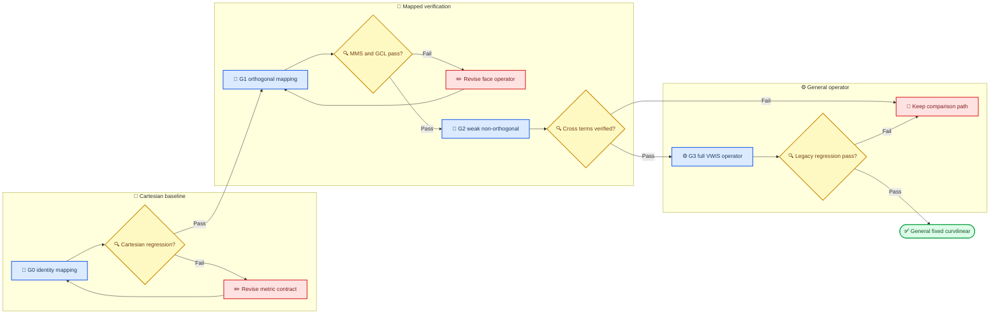

# AVWiS 曲线坐标实现规格

_面向 AVWiS（AMReX–VWiS）固定结构化曲线网格端口的设计、实现与评审基线；本文描述计划，不表示功能已经实现_

---

## 📋 范围、状态与规范语言

### 目标与当前状态

本文规定 AVWiS 单层、三维、固定结构化曲线网格路径的数据语义、离散算子、压力投影、边界顺序、生产 API 和分阶段验收门。目标是把原 VWiS 的 `Csi/Eta/Zet`、`Aj`、`Ucat/Ucont` 语义迁移到 AMReX `MultiFab`，同时保持共享面有限体积守恒和 Cartesian 基线可回归。

> ⚠️ **当前状态（2026-09-01）：** `amrex_port/` 的 solver 仍是单层均匀 Cartesian 实现。它已有积分面体积通量、Cartesian 物理边界、MLMG 压力投影、保守对流 RHS、常系数黏性 RHS、显式推进及单层 CPU checkpoint/restart。P5-003 C0/G0.1 已建立独立生产 `CoordinateMapping/MetricData`，C1/G0.2 已将 identity `MetricData` 接入现有 integrated-flux divergence 路径；C2.1 新增了参数化 separable analytic orthogonal provider 及 G1 几何契约，但尚未接入 solver 算子。仍没有 mapped 梯度/投影、曲线 BC/restart、19 点压力算子、AMR、IBM/FSI 或 LES。此结论以当前 [`amrex_port/README.md`](../amrex_port/README.md#p5-003-c1g02-identity-metric-adapter-and-c21g1-geometry)、[`AVWiSCoordinateMapping.H`](../amrex_port/src/AVWiSCoordinateMapping.H)、[`AVWiSMetricData.H`](../amrex_port/src/AVWiSMetricData.H) 和 [`AVWiSProjection.cpp`](../amrex_port/src/AVWiSProjection.cpp) 为准。

当前 Cartesian 路径是本规格的强制回归基线，不得被描述为任意正交曲线坐标支持。原 VWiS 目标是一般结构化曲线网格；其非正交 metric 会产生交叉项，可能要求 19 点模板。因此只完成正交映射不等于完成 VWiS 曲线算子。

### 实施状态与路线索引

状态采用以下单向追踪关系，避免规格、路线和历史报告互相覆盖：

- [`AMReX移植任务清单.md`](./AMReX移植任务清单.md) 是唯一状态记录；其 P5-003 子模块表当前记录 C0、C1 已完成，C2 进行中（C2.1 已完成、C2.2 待做）
- [`AMReX迁移方案.md`](./AMReX迁移方案.md#当前状态剩余工作与下一步路线) 给出剩余模块的目标、依赖、源码位置、验收证据和下一增量
- [`AMReX_P5-003_G0_identity_metric_20260831.md`](./AMReX_P5-003_G0_identity_metric_20260831.md) 是 G0.1 的不可覆盖增量证据；[`AMReX_P5-003_C1_identity_adapter_20260831.md`](./AMReX_P5-003_C1_identity_adapter_20260831.md) 记录 C1；[`AMReX_P5-003_C2_analytic_orthogonal_20260831.md`](./AMReX_P5-003_C2_analytic_orthogonal_20260831.md) 记录 C2.1 的 provider/geometry 边界

因此当前准确声明是“P5-003 的 C0/G0.1、C1/G0.2 与 C2.1/G1 geometry 已完成，
C2/G1 与 P5-003 总体仍在进行中”；不能写成“G1 已完成”或“solver 已支持曲线坐标”。
下一增量 C2.2 是 metric-aware gradient/divergence 与 orthogonal projection，仍须保持
Cartesian 紧容差回归。

### 范围与非目标

| 类别 | 本规格范围 | 本阶段非目标 |
| --- | --- | --- |
| 网格 | 单层、逻辑矩形、固定、可正交或非正交的三维映射 | AMR、regrid、移动/变形网格、overset |
| 方程 | 单相、不可压缩、定密度基线；预留面系数 `beta` | 两相 level set、表面张力、可压缩流 |
| 算子 | metric、变换、散度、梯度、对流、黏性、投影 | LES、IBM/EB、FSI、壁函数 |
| 求解 | Cartesian MLMG 基线、正交曲线 MLMG 候选、一般非正交对照/自定义路径 | 未验证前替换 legacy 全部算例 |
| 后端 | CPU double 首先；设计保持 MPI/GPU 可移植 | 首阶段即宣称 GPU 或多层性能完成 |

### 规范语言与证据等级

| 标记 | 含义 |
| --- | --- |
| **必须（MUST）** | 合并生产路径前不可违背；对应验收测试或显式审查项 |
| **应（SHOULD）** | 推荐默认；偏离时必须在设计记录中说明理由和验证替代项 |
| **可（MAY）** | 可选实现，不得成为前序阶段通过的隐含条件 |
| **待决（OPEN）** | 现有资料不足或需实验决策；不得静默假设为 legacy 行为 |
| **推断（INFERENCE）** | 由连续公式或源码结构推得的拟议设计，不声称是 legacy 逐点复刻 |

本规格的连续语义主要来自 [`VFS_算法详解.md` 第 1.1、1.2、1.5 节](./VFS_算法详解.md#11-从不可压缩质量守恒到曲线坐标连续性方程)，迁移边界来自 [`AMReX迁移方案.md` 第 1.2、1.3、2.1、2.2 节](./AMReX迁移方案.md#12-网格变量和度量)，当前 Cartesian 证据来自 [`AMReX_P2_增量实施测试报告_20260821.md` 最终订正](./AMReX_P2_增量实施测试报告_20260821.md#算法审查订正最终有效2026-08-21) 与 [`AMReX_P4_Cartesian压力投影设计及测试_20260826.md`](./AMReX_P4_Cartesian压力投影设计及测试_20260826.md)。

## 📚 术语、变量关系与冻结约定

### 坐标、指标与朝向

物理坐标和计算坐标分别定义为

$$
\mathbf{x}=(x_1,x_2,x_3),\qquad
\boldsymbol{\xi}=(\xi^1,\xi^2,\xi^3),\qquad
\mathbf{x}=\mathbf{x}(\boldsymbol{\xi}).
$$

重复的拉丁指标求和；$l=1,2,3$ 表示 Cartesian 分量，$m,k=1,2,3$ 表示计算方向。AMReX 数组方向 `dir=0,1,2` 分别对应 $m=1,2,3$。逻辑面 $m$ 的正向固定为 $\xi^m$ 增大方向；`lo` 边界的外法向面积向量是 $-\mathbf S^m$，`hi` 边界的是 $+\mathbf S^m$。

首个实现 **必须** 使用右手、无折叠映射：$J_x>0$ 且所有 $V_c>0$。负值或接近零的 Jacobian/体积是输入错误，不能通过取绝对值修复。

### `Csi/Eta/Zet`、Jacobian 与体积

冻结以下无歧义记号：

$$
J_x=\det\!\left(\frac{\partial\mathbf x}{\partial\boldsymbol\xi}\right),
\qquad
J_\xi=\det\!\left(\frac{\partial\boldsymbol\xi}{\partial\mathbf x}\right)
=\frac{1}{J_x},
$$

$$
\mathbf a^m=J_x\nabla\xi^m
=\frac{1}{J_\xi}\nabla\xi^m.
$$

legacy `Csi/Eta/Zet` 对应三行面积余因子 $\mathbf a^1,\mathbf a^2,\mathbf a^3$，不是裸 $\nabla\xi^m$；legacy `Aj` 对应 $J_\xi$，不是 $J_x$，也不是离散单元体积。该语义由 [`VFS_算法详解.md` 第 1.1 节](./VFS_算法详解.md#11-从不可压缩质量守恒到曲线坐标连续性方程) 说明，并与 legacy [`CurvGrid.C::FormMetrics`](../vwis2.0/CurvGrid.C) 的叉积和取逆行为一致。

本实现 **禁止** 使用无修饰字段名 `J`、`jac` 或 `jacobian`。规范字段名如下：

| 数学量 | 生产名 | 含义 | 物理量纲（$\xi$ 无量纲） |
| --- | --- | --- | --- |
| $J_x$ | `mapping_jacobian_cc` | 正向映射 Jacobian | $L^3$ |
| $J_\xi$ | `inverse_mapping_jacobian_cc` | 逆映射 Jacobian；legacy `Aj` 语义 | $L^{-3}$ |
| $\mathbf a^m$ | `area_cofactor_cc` | cell-centered `Csi/Eta/Zet` 等价量 | $L^2$ |
| $\mathbf S_f^m$ | `face_area_vector_fc[m]` | 离散共享面的有向积分面积向量 | $L^2$ |
| $V_c$ | `cell_volume_cc` | 离散物理单元体积 | $L^3$ |

连续微元 $J_x\,d\xi^1d\xi^2d\xi^3$ 与离散 $V_c$ 只有在特定积分规则下才相等。所有有限体积散度 **必须** 除以 `cell_volume_cc`；不得用 `mapping_jacobian_cc` 或 `1/Aj` 暗代。identity mapping 且计算步长为 $h_m$ 时，$V_c=h_1h_2h_3$，`inverse_mapping_jacobian_cc=1`；若采用单位索引坐标 $h_m=1$ 而把物理尺度放入映射，则 $J_x=V_c$。这两种坐标参数化不得混用。

### `Ucat`、`Ucont` 与单位

冻结

$$
q^m=\mathbf u\cdot\nabla\xi^m,
\qquad
\widehat U_f^m=\mathbf u_f\cdot\mathbf S_f^m.
$$

`Ucat` 存 Cartesian 速度 $\mathbf u=(u_1,u_2,u_3)$；`Ucont[m]` 存积分面体积通量 $\widehat U_f^m$，不是逆变速度 $q^m$，也不是面法向速度。量纲化时 `Ucat` 为 $L/T$、`Ucont` 为 $L^3/T$；当前 legacy 无量纲尺度尚未冻结，因此元数据必须明确写 `nondimensional` 或给出实际尺度，不能因此改变两字段的速度/通量语义。

压力修正采用当前 Cartesian 基线的符号：

$$
\mathcal L\Phi=\frac{\alpha}{\Delta t}D(U^*),
\qquad
U^{m,n+1}_f=U^{m,*}_f-\frac{\Delta t}{\alpha}G_f^m(\Phi),
$$

其中 $\alpha>0$，$D$ 是净积分面通量除体积，$G_f^m$ 是穿过 $m$ 面的压力梯度通量。此约定与当前 [`AVWiSProjection.cpp`](../amrex_port/src/AVWiSProjection.cpp) 一致；若 AMReX operator API 返回 $-\nabla\Phi$ 型 signed flux，适配层负责符号转换，数学 API 不改变符号。

## ⚙️ 坐标映射、metric 构造与数据模型

### 连续映射和离散几何

映射提供者必须定义顶点坐标 $\mathbf x_{i+1/2,j+1/2,k+1/2}$。identity 或解析映射可直接求值；文件输入必须给出全局逻辑节点及拓扑/周期元数据。每个四边形面使用固定对角线规则三角化，面上每个三角形的顶点顺序必须使面积向量指向 $+\xi^m$。定义

$$
\mathbf S_t=\frac12(\mathbf x_1-\mathbf x_0)\times(\mathbf x_2-\mathbf x_0),
\qquad
\mathbf S_f^m=\sum_{t\subset f}\mathbf S_t.
$$

共享面只构造一次或在 `OverrideSync` 后由 AMReX owner 值覆盖；相邻单元不得独立生成略有不同的面积向量。离散单元体积使用同一组有向三角面和散度定理：

$$
V_c=\frac13\sum_{f\subset\partial c}\sum_{t\subset f}
s_{c,f}\,\mathbf x_{t,c}\cdot\mathbf S_t,
\qquad
\mathbf x_{t,c}=\frac{\mathbf x_0+\mathbf x_1+\mathbf x_2}{3},
$$

其中 cell 的 `hi` 面 $s_{c,f}=+1$，`lo` 面 $s_{c,f}=-1$。该定义对采用同一三角化的闭合多面体是精确几何体积，并使离散 metric identity

$$
\sum_{m=1}^{3}\left(\mathbf S^m_{f+}-\mathbf S^m_{f-}\right)=\mathbf0
$$

成为逐 cell 的可测条件。对于翘曲四边形，固定对角线是离散几何定义的一部分；**待决门 M1** 将决定是否需要与 legacy `FormMetrics` 的中心叉积规则逐点兼容。

cell-centered $J_x$、$J_\xi$、$\nabla\xi^m$ 和 $\mathbf a^m$ 由同一个坐标差分/体积规则生成，必须满足

$$
\mathbf a^m=J_x\nabla\xi^m,
\qquad
\mathbf a^m\cdot\frac{\partial\mathbf x}{\partial\xi^k}=J_x\delta^m_k.
$$

具体离散规则冻结如下。令 cell center 为八顶点算术平均，$\mathbf x^m_f$ 为该 $m$-face 四顶点的算术平均；在 cell center 以相对两面中心差构造

$$
\mathbf r_{m,c}=\left(\frac{\partial\mathbf x}{\partial\xi^m}\right)_c
\approx\frac{\mathbf x^m_{f+}-\mathbf x^m_{f-}}{h_m},
\qquad
\mathbf B_c=[\mathbf r_{1,c}\;\mathbf r_{2,c}\;\mathbf r_{3,c}].
$$

随后取 $J_{x,c}=\det\mathbf B_c$、$[\nabla\xi^1\;\nabla\xi^2\;\nabla\xi^3]=\mathbf B_c^{-T}$ 和 $\mathbf a_c^m=J_{x,c}\nabla\xi_c^m$。在内部 $m$-face，$\mathbf r_{m,f}$ 用相邻 cell center 差，两个切向 $\mathbf r_{k,f}$ 用该 face 上相对边中点差；物理边界的 $\mathbf r_{m,f}$ 用 mapping 生成的 ghost cell center 做同一中心差。令 $\mathbf B_f$ 由这三列组成并取 $\nabla\xi_f^k=\mathbf B_f^{-T}$，最终存储 $Q_f^{mk}=\mathbf S_f^m\cdot\nabla\xi_f^k$。这一定义避免在每个算子内重复或不一致地插值 metric。

任何从 cell 到 face 的 metric 插值都只能作为诊断或低阶原型；生产通量使用直接由 face 节点构造的 `face_area_vector_fc`，避免破坏共享面闭合关系。

### AMReX 字段契约

| 字段 | IndexType / 组件 | 最小 ghost | 所有权与用途 |
| --- | --- | ---: | --- |
| `node_coordinates_nd` | all-node / 3 | 1 | `convert(m_ba, TheNodeVector())`、同一 `m_dm`；物理坐标 |
| `cell_center_coordinates_cc` | cell / 3 | 1 | 诊断、映射求值和输出 |
| `mapping_jacobian_cc` | cell / 1 | 1 | $J_x$；不得用于替代 $V_c$ |
| `inverse_mapping_jacobian_cc` | cell / 1 | 1 | $J_\xi$；legacy `Aj` 对照 |
| `grad_xi_cc` | cell / 9 | 1 | component `3*m+l` 为 $\partial\xi^m/\partial x_l$ |
| `area_cofactor_cc` | cell / 9 | 1 | component `3*m+l` 为 $a_l^m$；`Csi/Eta/Zet` 对照 |
| `cell_volume_cc` | cell / 1 | 1 | $V_c$；所有 cell 积分与散度唯一体积源 |
| `face_area_vector_fc[m]` | m-face / 3 | 1 | $\mathbf S_f^m$；通量、BC、GCL |
| `face_gradient_metric_fc[m]` | m-face / 3 | 1 | $Q_f^{mk}=\mathbf S_f^m\cdot\nabla\xi_f^k$ |
| `projection_beta_fc[m]` | m-face / 1 | 0 | 投影系数 $\beta_f$；定密度基线填 `1`，未来可由密度生成 |
| `Ucat` 各时间层 | cell / 3 | `avwis.nghost`, 且 ≥2 | Cartesian 速度；保持当前字段契约 |
| `Ucont[m]` 各时间层 | m-face / 1 | `avwis.nghost`, 且 ≥2 | 积分面体积通量；保持当前 owner 规则 |
| `P`, `Phi` | cell / 1 | `avwis.nghost`, 且 ≥2 | 压力和增量压力；19 点 stencil 只需一层，统一分配两层便于 BC/后续算子 |

所有 cell metric 使用 solver 的 `m_ba/m_dm`；所有 face/node metric 仅通过对应 `convert(m_ba, IndexType)` 改变 `BoxArray`，继续使用同一 `DistributionMapping`。重叠 face/node valid 区以 AMReX owner 为权威，写后执行 `OverrideSync(periodicity)`，再 `FillBoundary(periodicity)`。不得建立独立 metric 分块或复制到 case runner。

所有数值字段使用 `amrex::Real`。曲线阶段 G0–G3 的正式验收 **必须** 以 double 构建；single precision 仅可作为单独性能实验，并需重新批准容差。GPU kernel 只能捕获标量和 `Array4` 值，不得捕获 host 容器或多态 mapping 对象。

### 生命周期、不可变性与一致性

静态映射的 metric 在 `MetricData::define()` 后构造一次，成功验证后转为逻辑只读。字段对象仍由 RAII 持有，但生产算子只接收 `const MetricData&`；除 `rebuild()` 外不暴露可写 `MultiFab`。`metric_epoch`、映射标识、坐标 checksum 和离散规则版本进入 metadata/checkpoint Header。

重启默认从坐标/映射输入重建 metric，再校验 checksum；若未来为启动性能保存 metric payload，读入后仍必须重新执行正体积、metric identity 和共享面一致性检查。动态/变形网格属于非目标；引入前必须增加 `geometry_epoch`、历史几何守恒律和重建屏障，不能复用“静态只读”假设。

## 📐 连续与离散算子

### 通用 face 梯度

连续物理梯度为

$$
\nabla\phi=\nabla\xi^k\frac{\partial\phi}{\partial\xi^k}.
$$

在 $m$-face 上定义

$$
Q_f^{mk}=\mathbf S_f^m\cdot\nabla\xi_f^k,
\qquad
G_f^m(\phi)=\beta_f\sum_{k=1}^{3}Q_f^{mk}(\delta_k\phi)_f.
$$

法向计算导数使用两侧 cell：

$$
(\delta_m\phi)_f=\frac{\phi_R-\phi_L}{h_m}.
$$

切向导数在内部面采用相邻两 cell 的 centered derivative 平均：

$$
(\delta_k\phi)_f=
\frac{(\phi_{R,+k}-\phi_{R,-k})+(\phi_{L,+k}-\phi_{L,-k})}{4h_k},
\qquad k\ne m.
$$

物理边界用已填充的 ghost cell 套用同一公式，不在算子内嵌 case 分支。$h_m$ 是计算坐标步长；首版解析映射建议取 unit-index 坐标 $h_m=1$，并把物理尺度全部放入 $\mathbf x(\xi)$。若输入使用 $[0,1]^3$ 计算域，则必须从 mapping metadata 读取 $h_m=1/N_m$，不得再套当前 Cartesian `Geometry::CellSize()` 的物理含义。

cell-centered 标量物理梯度明确采用同一逆映射 metric 与 centered 计算导数：

$$
(\nabla_h\phi)_c
=\sum_{k=1}^{3}(\nabla\xi^k)_c
\frac{\phi_{c+e_k}-\phi_{c-e_k}}{2h_k}.
$$

边界仍通过物理 ghost 使用该式。需要严格有限体积伴随性的压力、黏性和通量诊断不得改用此 cell gradient 后再插值，而必须直接调用上面的 face `G_f^m`；这样 operator 与 correction 共享逐面离散。

正交网格满足 $Q_f^{mk}=0\;(m\ne k)$，只剩 face-normal 两点差。一般非正交网格的 $Q_f^{mk}$ 交叉项不可忽略；上述切向差分使一个 cell 与边、角邻居耦合，三维组装得到最多 19 点模板，与 legacy [`PoissonSolver.C::PoissonLHS`](../vwis2.0/PoissonSolver.C) 的结构一致，但系数逐点等价仍须 G3 对照验证。

### `Ucat` 与 `Ucont` 同步

cell 到 face 的规范路径是

$$
\mathbf u_f=I_f(\mathbf u_L,\mathbf u_R),
\qquad
U_f^m=\mathbf u_f\cdot\mathbf S_f^m.
$$

内部面首版 $I_f=(\mathbf u_L+\mathbf u_R)/2$；物理面直接使用边界给出的 face state；周期面使用周期邻 cell。非正交 skewness correction **可** 在 G2 后加入，但必须保持常量场精确并通过守恒回归。

face 到 cell 不得逐方向除面积，因为 $\mathbf S^m$ 不一定与 Cartesian 轴对齐。每个 cell 使用六个 bounding faces 的加权最小二乘：

$$
\mathbf H_c=\sum_{f\subset\partial c}w_f\mathbf S_f\mathbf S_f^T,
\qquad
\mathbf b_c=\sum_{f\subset\partial c}w_f\mathbf S_fU_f,
\qquad
\mathbf u_c=\mathbf H_c^{-1}\mathbf b_c,
$$

其中面向量在方程中统一取 $+\xi^m$ 存储朝向，默认 $w_f=1/\|\mathbf S_f\|^2$。面积低于网格尺度阈值的面必须在 metric validation 阶段拒绝，因此这里不以数值 floor 掩盖退化面。identity Cartesian 映射下该式严格退化为当前“两侧通量除面积后平均”。必须检测 $\mathbf H_c$ 的条件数；超过配置阈值或不可逆时拒绝网格。

> 📌 **推断：** 六面最小二乘是 AVWiS 的拟议稳健重构，不声称是 legacy `Contra2Cart` 的逐点算法。legacy 使用三组 cofactor 解 $3\times3$ 系统；**决策门 M2** 必须比较二者在 identity、正交和 legacy 网格上的常量精确性、二阶误差、条件数与下游结果，再冻结生产默认。

每个时间步只允许一个权威速度状态。预测步以 `Ucat` 构造 `Ucont*`；投影直接修改 `Ucont`；投影后以修正的 `Ucont` 重构 `Ucat`。任何对 `Ucat` valid 区的写入都使 `Ucont` stale，反之亦然；实现应把当前 freshness epoch 扩展为 `ucat_epoch/ucont_epoch/metric_epoch` 并在消费者入口断言。

### 体积散度与守恒

连续恒等式为

$$
\nabla\cdot\mathbf u
=\frac1{J_x}\frac{\partial}{\partial\xi^m}
\left(J_x\mathbf u\cdot\nabla\xi^m\right).
$$

离散有限体积散度严格定义为

$$
D_c(U)=\frac1{V_c}\sum_{m=1}^{3}
\left(U^m_{f+}-U^m_{f-}\right).
$$

该式不含额外 $J_x$、$J_\xi$、$h_m$、`dx` 或面积除法。MPI/多 Box 归约必须用唯一 face owner；全域积分满足

$$
\sum_cV_cD_c(U)=\sum_{f\subset\partial\Omega}U_f^{out}
$$

到 roundoff。constant $\mathbf u$ 的自由流保持依赖离散 metric identity，而不是压力投影“修好”错误 metric。

### 对流项

连续 Cartesian 动量分量 $u_l$ 的保守对流为

$$
\mathcal A_l=-\nabla\cdot(\mathbf u u_l)
=-\frac1{J_x}\frac{\partial}{\partial\xi^m}
\left(\widehat U^m u_l\right).
$$

首版离散保持当前 P5 中心通量语义：

$$
F^m_{f,l}=U_f^m\,I_f(u_l),
\qquad
(RHS_{adv})_{c,l}=-\frac1{V_c}\sum_m
\left(F^m_{f+,l}-F^m_{f-,l}\right).
$$

正交与非正交网格都使用同一式；差别只在 $U_f^m=\mathbf u_f\cdot\mathbf S_f^m$ 和插值 skewness。若加入迎风、限制器或 LES 通量，它们必须替换 `I_f` 策略而不改变 `Ucont` 的积分通量语义。face momentum flux 应保留为显式临时量，便于守恒诊断和未来 reflux。

### 黏性项

对常运动黏度 $\nu$，每个 Cartesian 分量的连续算子为

$$
\mathcal V_l=\nabla\cdot(\nu\nabla u_l)
=\frac1{J_x}\frac{\partial}{\partial\xi^m}
\left(J_x\nu g^{mk}\frac{\partial u_l}{\partial\xi^k}\right),
\qquad
g^{mk}=\nabla\xi^m\cdot\nabla\xi^k.
$$

离散 diffusive flux 和 RHS 为

$$
F^{m,\nu}_{f,l}=\nu_f\sum_kQ_f^{mk}(\delta_ku_l)_f,
\qquad
(RHS_\nu)_{c,l}=\frac1{V_c}\sum_m
\left(F^{m,\nu}_{f+,l}-F^{m,\nu}_{f-,l}\right).
$$

正交时非对角 $Q^{mk}$ 为零，得到每方向两点 face 梯度和 cell-centered 7 点 Laplacian；非正交时必须包含切向梯度交叉项。若未来采用不可压缩牛顿应力 $\nabla\cdot[\nu(\nabla\mathbf u+\nabla\mathbf u^T)]$ 或变黏度，必须新建独立算子契约和 MMS，不得静默替换本节的 component-wise Laplacian 基线。

## 🔄 压力投影设计

### 连续与离散方程

给定预测通量 $U^*$ 和面系数 $\beta_f$，定义

$$
\mathcal L\Phi=\nabla\cdot(\beta\nabla\Phi)
=\frac1{J_x}\frac{\partial}{\partial\xi^m}
\left(J_x\beta g^{mk}\frac{\partial\Phi}{\partial\xi^k}\right).
$$

离散 operator 与修正 **必须** 复用同一个 `G_f^m`：

$$
(L_h\Phi)_c=\frac1{V_c}\sum_m
\left[G^m_{f+}(\Phi)-G^m_{f-}(\Phi)\right],
$$

$$
(L_h\Phi)_c=\frac{\alpha}{\Delta t}D_c(U^*),
\qquad
U_f^{m,n+1}=U_f^{m,*}-\frac{\Delta t}{\alpha}G_f^m(\Phi).
$$

代回可得 $D(U^{n+1})=0$ 到线性求解与边界误差。默认定密度 `beta=1`；变密度扩展取 `beta=1/rho` 前，必须冻结 face 平均方法并增加跳变系数测试。RHS 只做一次净通量/体积和一次 $\alpha/\Delta t$ 缩放。

### AMReX 路径边界

| 网格/算子 | 可用路径 | 限制与审查要求 |
| --- | --- | --- |
| identity Cartesian | 当前 `MLPoisson`/MLMG + face area adapter | G0 必须复现现有 P4 |
| 解析正交曲线 | `MLABecLaplacian`/可表示的 variable-coefficient MLMG 候选 | 只有在离散 face coefficient 与上式逐面等价时可用；不能只按 axis-aligned `dx` 填系数 |
| 弱非正交 | 对角主算子 MLMG + cross term deferred correction | 仅是 G2 比较路径；外迭代残差和全算子散度必须收敛 |
| 一般非正交 | 自定义 `MLLinOp` 或临时 PETSc/HYPRE 对照层 | 必须表达交叉项、19 点 stencil、BC、null space、MPI/GPU 语义 |

AMReX 标准 Cartesian `MLPoisson` 不能表达一般 $m\ne k$ 项，不能作为 legacy 19 点算子的 drop-in replacement。deferred correction 把

$$
L_h=L_{diag}+L_{cross}
$$

拆为 $L_{diag}\Phi^{r+1}=RHS-L_{cross}\Phi^r$；只有当全残差 $\|L_h\Phi-RHS\|$、投影后散度和网格非正交性扫描均过门时，才可成为“弱非正交”路径。高非正交生产路径需要 custom operator 或经验证的等价实现。

### 压力边界、可解性与 gauge

| 速度边界 | `Phi` 条件 | `Ucont` 修正 |
| --- | --- | --- |
| periodic | periodic；坐标允许平移周期但 metric 必须严格周期 | 周期配对面的同一离散梯度 |
| 固壁/移动壁/slip/symmetry | 齐次 Neumann，除非法向预测误差另有已验证策略 | 规定的法向体积通量保持不变 |
| 规定速度 inflow | 齐次 Neumann | 入口积分通量保持不变 |
| fixed-pressure outflow | 对增量压力 `Phi=0` | 允许修正出口通量 |

曲线边界的速度条件以物理单位法向 $\mathbf n=\pm\mathbf S/\|\mathbf S\|$ 和切向基定义，不按 `dir` 的 Cartesian 分量定义。固定静止壁直接令法向 `Ucont=0`；移动壁令 `Ucont=\mathbf u_w\cdot\mathbf S`。slip/symmetry 只约束法向，切向 ghost 用物理反射构造。

全周期或全 Neumann 系统有常数 null space。实现必须：

1. 以 $V_c$ 加权检查 compatibility：$\sum_cV_cRHS_c=0$；不能使用未加权 cell mean 处理非均匀体积
2. 不静默修改 RHS；不兼容时明确失败并报告边界净通量
3. 求解后用 $\sum_cV_c\Phi_c/\sum_cV_c=0$ 固定 gauge
4. 有 Dirichlet pressure outlet 时由该边界提供 datum，不再减均值

当前 Cartesian P4 使用等体积网格，未加权均值与体积加权均值等价；曲线实现必须升级为后者。若 legacy case 使用不同 pressure datum 或边界代码，属于 **决策门 M3**，需要逐 case 证据，不能从一般边界名称推断。

## 🔗 边界条件与 ghost 流水线

### metric-aware 固定顺序

初始化顺序必须为：

1. 构造/读入全局逻辑节点坐标，处理周期平移关系
2. 同步 node owner 并填同层/MPI/periodic 坐标 ghost
3. 从坐标构造 face 面积向量、体积和 cell/face metric
4. 同步 metric owner，填 metric halo，执行正体积、GCL、互反关系和周期一致性检查
5. 冻结 `MetricData` 并记录 `metric_epoch`
6. 初始化 `Ucat/P` valid 区；同步 cell halo
7. 以物理法向/切向填 `Ucat/P/Phi` 物理 ghost
8. 从 boundary face state 与 `face_area_vector_fc` 形成边界 `Ucont`
9. `OverrideSync` face owner，填 `Ucont` halo；运行边界通量和散度诊断

每个时间步的消费者顺序为 `cell/face same-level halo → physical state ghost → boundary Ucont → operator → projection BC → projection → Ucont owner/halo → Ucat reconstruction → physical tangential ghost → diagnostics`。物理 ghost 不得先于周期/MPI halo；metric 不得在状态算子中临时更新。

### 物理边界的 metric 一致性

边界面 metric 必须由边界面真实节点计算，不能从 interior face 零阶外推。边界 ghost metric 若 stencil 需要，应由解析 mapping 延拓或与边界几何相容的单侧构造生成；不得逐分量镜像 `Csi/Eta/Zet`。周期 mapping 可满足 $\mathbf x(\xi^m+L_m)=\mathbf x(\xi^m)+\mathbf T_m$，但 $\mathbf S$、$Q$、$J_x$、$V$ 必须周期匹配。

入口目标流量归一化必须使用 $\sum_f\mathbf u_f\cdot\mathbf S_f$；出口、壁面和全域守恒诊断使用 outward sign。若边界面面积向量与相邻 cell 闭合误差超过 GCL 容差，必须在进入求解器前失败，不能用通量归一化掩盖几何错误。

## 🏗️ 生产架构与 API

### 组件和文件所有权



| 建议文件 | 责任 | 禁止内容 |
| --- | --- | --- |
| `src/AVWiSCoordinateMapping.H/.cpp` | mapping 接口、identity/文件输入生产解析 | MMS 断言、case 常量 |
| `src/AVWiSMetricData.H/.cpp` | metric 分配、构造、验证、epoch/checksum | 时间推进、压力求解 |
| `src/AVWiSCurvilinearOperators.H/.cpp` | 变换、散度、梯度、对流、黏性通量 | case-specific BC |
| `src/AVWiSProjectionOperator.H` | projector 抽象和 diagnostics | AMReX/legacy 细节泄漏到 solver |
| `src/AVWiSCartesianProjection.cpp` | 保留当前 P4 基线 adapter | 曲线近似冒充完整路径 |
| `src/AVWiSCurvilinearProjection.cpp` | 正交/deferred/custom 路径选择与统一修正 | 测试制造场 |
| `src/AVWiSBoundary.cpp` | 使用 metric 的通用物理 BC/ghost 顺序 | curved-channel 专用代码 |
| `src/AVWiSSolver.*` | 生命周期、状态 owner、模块编排 | analytic test mapping 和验收逻辑 |
| `tests/curvilinear/` | mapping、metric、MMS、回归和 legacy 对照 | 生产 API 实现 |
| `inputs/` | 用户配置；测试输入可引用 `tests/curvilinear/data/` | 硬编码 solver 分支 |

解析正交/非正交 mapping 若只用于验收，必须放在 `tests/curvilinear/`；只有经过 M1 评审且确有用户用途的通用 mapping 才进入 `src/`。物理 benchmark runner 可位于现有 `benchmarks/`，但数值断言、制造解和 golden comparison 必须留在 `tests/`。

### 拟议最小 API

```cpp
class CoordinateMapping {
public:
    virtual void fill_nodes(amrex::MultiFab& xyz_nd,
                            LogicalGrid const& logical) const = 0;
    virtual std::string id() const = 0;
    virtual ~CoordinateMapping() = default;
};

class MetricData {
public:
    void define(amrex::BoxArray const&, amrex::DistributionMapping const&, int nghost);
    void build(CoordinateMapping const&, LogicalGrid const&, amrex::Geometry const&);
    MetricDiagnostics validate(MetricTolerance const&) const;
    std::uint64_t epoch() const noexcept;
    // Accessors return const MultiFab& or const face arrays only.
};

class ProjectionOperator {
public:
    virtual ProjectionDiagnostics project(FlowState&, MetricData const&,
                                          BoundaryData const&, amrex::Real dt,
                                          amrex::Real alpha) = 0;
    virtual ~ProjectionOperator() = default;
};
```

runtime 选择建议为 `avwis.coordinates=cartesian|mapped`、`avwis.mapping.type=file|...` 和 `avwis.projection.operator=cartesian_mlmg|orthogonal_mlmg|deferred_nonorthogonal|custom_nonorthogonal|legacy_compare`。未知组合必须拒绝；尤其 `mapped + cartesian_mlmg` 不得自动降级运行。

## 🎯 增量实施与决策门

### 阶段和接受条件

| 阶段 | 实施内容 | 必须通过的接受测试 | 退出声明 |
| --- | --- | --- | --- |
| G0 identity mapping | 新 data model、metric 构造、通用算子接入；$\mathbf x=\boldsymbol\xi$ 或当前 Cartesian 尺度映射 | metric/GCL；`Ucat↔Ucont`；所有现有 Cartesian CTest；P4 投影结果与基线，CPU double | “mapped infrastructure preserves Cartesian baseline” |
| G1 analytic orthogonal | separable $x=f(\xi),y=g(\eta),z=h(\zeta)$；对角 $Q$；正交 MLMG 路径 | 常量/线性场、MMS 二阶、free-stream、投影、拉伸扫描、多 Box/MPI、restart | “analytic orthogonal mapping verified”；不得称一般曲线完成 |
| G2 weak non-orthogonal | 小幅平滑 skew mapping；全 cross flux；deferred correction 与 assembled reference 比较 | cross-term 单项测试、非正交 MMS、外迭代全残差、守恒、非正交强度扫描 | 只允许标为“weak non-orthogonal verified” |
| G3 full VWiS operator | custom 19 点或经证实等价路径；legacy 网格/BC/datum 对照 | matrix action、逐项 stencil、legacy case regression、MPI 分块、收敛、性能/内存审查 | 评审通过后才可称“general fixed curvilinear VWiS operator” |
| G4 optional advanced | GPU、AMR、IBM/FSI、moving mesh、变密度/黏度 | 每项独立规格、GCL/守恒/重启/后端测试 | 不影响 G0–G3 的证据边界 |

G0 必须首先证明 identity 映射不会改变当前 Cartesian 数值语义。若不能达到预期的紧容差，应先解释离散差异，不得用放宽所有测试掩盖。G1 的 analytic orthogonal mapping 应至少包含强拉伸但正 Jacobian 的网格；G2 建议采用带可调 $\epsilon$ 的光滑剪切映射，并覆盖 $\epsilon=0$ 回到 G1 的连续极限。

### 显式决策门

| 门 | 决策 | 所需证据 | 默认状态 |
| --- | --- | --- | --- |
| M1 | face 三角化/metric 是否逐点仿 legacy `FormMetrics` | GCL、MMS、legacy geometry 对照、翘曲面敏感性 | OPEN；先用共享面三角化规则 |
| M2 | `Ucont→Ucat` 用六面最小二乘还是 legacy 三 cofactor 解 | 条件数、常量精确、二阶误差、legacy 回归 | OPEN；最小二乘仅为拟议默认 |
| M3 | legacy case 的 pressure BC/datum 映射 | case 输入、legacy 分支和 pressure history 证据 | OPEN；只支持已冻结通用 BC |
| M4 | G2 deferred correction 是否可进入生产 | 全残差、收敛半径、非正交扫描、成本 | OPEN；未通过则仅比较路径 |
| M5 | G3 使用 custom `MLLinOp` 还是 PETSc/HYPRE 过渡 | AMReX API 原型、19 点 action、BC/null space、GPU/AMR 前景 | OPEN；不得预选宣传 |
| M6 | 离散黏性采用 component Laplacian 还是完整应力散度 | legacy `RHSSolver` 逐项证据和 MMS | OPEN；本规格基线为 component Laplacian |

## ✅ 验证矩阵与容差

### 测试矩阵

以下容差针对 double、平滑且条件良好的映射，是初始门槛；若映射条件数放大 roundoff，调整必须按归一化误差模型和 convergence 证据逐测试批准，不能全局放宽。

| 测试 | 量与初始容差 | 覆盖阶段 | 证明什么 |
| --- | --- | --- | --- |
| 正体积/Jacobian | `min(V)>0`, `min(Jx)>0`; reciprocal relative error ≤ $5\times10^{-13}$ | G0+ | 朝向、无折叠、`Jx/Jxi` 语义 |
| metric identity / GCL | $\max_c\|\sum_m(S_{f+}^m-S_{f-}^m)\|/\sum_f\|S_f\|\le10^{-12}$ | G0+ | 共享面闭合、constant free stream 基础 |
| metric 互反关系 | $\|a^m\cdot x_{,k}-J_x\delta^m_k\|/(|J_x|+\epsilon)\le10^{-11}$ | G0+ | cofactor/gradient/Jacobian 一致 |
| constant velocity | `Ucont=u·S` ≤ $10^{-13}$ relative；`D(U)` ≤ $10^{-12}U/L$ | G0+ | 变换和 GCL |
| linear scalar gradient | identity absolute ≤ $10^{-12}$；mapped $L_2$ rate ≥ 1.8 | G0–G2 | gradient 与 cross metric |
| `Ucat→Ucont→Ucat` | constant ≤ $10^{-12}$；smooth field $L_2$ rate ≥ 1.8 | G0+ | 同步、非正交重构、条件数 |
| divergence theorem | $|\sum V D-\sum U_{boundary}|/Q_{scale}\le10^{-12}$ | G0+ | 有限体积守恒、owner 去重 |
| advection constant/linear | constant RHS ≤ $10^{-12}$；smooth MMS $L_2$ rate ≥ 1.8 | G0+ | 保守对流与体积缩放 |
| viscous constant/linear | RHS ≤ $10^{-12}$；quadratic/MMS $L_2$ rate ≥ 1.8 | G0+ | diagonal/cross diffusive flux |
| free-stream preservation | 100 步 $\|u-u_0\|_\infty/U\le10^{-11}$，pressure drift ≤ $10^{-11}$ | G1+ | metric、BC、时间流水线整体一致 |
| projection residual | relative linear residual ≤ $10^{-10}$ | G0+ | 线性系统求解质量 |
| projection divergence | $\|D^{n+1}\|_\infty\le10^{-10}U/L$ 且相对下降 ≥ $10^8$（可达时） | G0+ | operator/correction 离散一致 |
| singular compatibility | $|\sum V RHS|/(\sum V\max|RHS|)\le10^{-12}$；注入不兼容 RHS 必须失败 | G0+ | 体积加权 null space 处理 |
| full operator action | matrix-free 与显式 19 点 action relative $L_2\le10^{-12}$ | G2–G3 | cross-term 组装准确 |
| MMS refinement | 至少 $N,2N,4N$；$L_2$ order ≥ 1.8、$L_\infty$ ≥ 1.6 | G1+ | 二阶空间收敛而非单网格吻合 |
| multibox/MPI | 1/2/4 ranks 和不同 `max_grid_size`：global norms relative ≤ $10^{-12}$ | G0+ | halo、shared-face owner、reduction |
| restart | 同 mapping/config CPU 同分解 bitwise；跨分解 relative ≤ $10^{-12}$ | G1+ | metric provenance、时间层和重建一致 |
| legacy VWiS | metric/stencil action relative ≤ $10^{-11}$；物理输出容差由 case gate 预先冻结 | G3 | legacy 算法可追踪性与科学回归 |

物理 case 比较至少报告 $L_2/L_\infty$ 速度、压力去 datum 后误差、质量误差、壁面剪切/流量和迭代历史，不能只看一张图。

### 测试资产与失败诊断

每个 mapping fixture 应记录公式/数据来源、$h_m$、周期平移、min/max $J_x$、最大非正交指标

$$
\chi=\max_f\max_{k\ne m}
\frac{|Q_f^{mk}|}{\sqrt{|Q_f^{mm}Q_f^{kk}|}+\epsilon}.
$$

失败输出必须包含 mapping ID/checksum、metric epoch、Box/rank、最坏 cell/face 全局索引、$V_c$、$J_x$、$\mathbf S_f$、$Q^{mk}$ 和归一化残差。CPU、MPI、GPU 的数值结果应以 norm-based 容差比较；仅在明确要求的同后端同分解 restart 测试中要求 bitwise。

## ⚠️ 风险、未决问题与实施检查单

### 主要风险与控制

| 风险 | 后果 | 控制/门 |
| --- | --- | --- |
| `Aj`、$J_x$、$V_c$ 混用 | 散度/Poisson 尺度错误 | 禁裸 `jac`；字段维度检查；G0 identity |
| 面由两 cell 独立构造 | MPI/多 Box 非守恒、free-stream 漂移 | shared face owner；GCL 与分块不变性 |
| 把 `Ucont` 当 face velocity | 面积重复乘除、错误 MLMG adapter | 类型/API 命名、单位元数据、P2/P4 回归 |
| 正交路径被误称一般曲线 | legacy 非正交结果错误 | G1/G2/G3 退出声明；runtime 明确 operator |
| 忽略 19 点 cross term | 高 skew 网格压力/黏性误差 | $\chi$ 扫描、full action、M4/M5 |
| operator 与 correction 不共用 face flux | 投影 residual 小但散度不消失 | 单一 `G_f^m` API；projection-divergence test |
| 边界 metric 外推不一致 | 壁面泄漏、入口流量错误 | 从真实边界节点构造；边界 GCL/通量测试 |
| `Ucont→Ucat` 病态 | Cartesian 速度噪声 | 条件数门、M2、网格拒绝 |
| checkpoint 隐含旧 metric | restart 后轨迹变化 | mapping checksum、epoch、rebuild+validate |
| legacy 细节证据不足 | 静默发明不兼容行为 | 标记 INFERENCE/OPEN；逐项源码和 case gate |

现有资料没有冻结以下内容：legacy 所有 case-specific boundary code 的 pressure datum、翘曲面的唯一离散几何解释、完整黏性应力离散、非正交 deferred correction 的稳定范围，以及 custom AMReX multilevel operator 的接口/性能。它们分别由 M1、M3、M4、M5、M6 控制。历史 VFS 手册中的 level set/两相/波浪段落不是当前 `vwis2.0/` 源码能力，不能据此扩展本规格范围，见 [`VFS_算法详解.md` 范围校正](./VFS_算法详解.md#vfs-算法详解)。

### 实施检查单

- [ ] 只使用冻结字段名，确认 $J_x$、$J_\xi$、$V_c$ 的值和量纲
- [ ] 以同一节点几何构造共享 `S_f` 和 `V_c`，通过正体积/GCL
- [ ] 为所有 metric 声明 IndexType、组件、ghost、owner、epoch 和 checksum
- [ ] `Ucont` 始终为 `u·S`，AMReX velocity adapter 只存在于明确边界层
- [ ] 散度、对流、黏性和投影均只除一次 `V_c`
- [ ] 压力 operator 与通量 correction 复用同一个 `G_f^m`
- [ ] 全 Neumann/周期问题使用体积加权 compatibility 与 gauge
- [ ] 按固定 ghost/physical BC/face owner 顺序执行，并检测 stale epoch
- [ ] production `src/` 不含 case/MMS 逻辑，所有数值断言位于 `tests/`
- [ ] G0 到 G3 逐门验收，报告只使用对应阶段允许的能力声明
- [ ] 决策门 M1–M6 均有证据记录，不把 INFERENCE 写成 legacy 事实
- [ ] 运行 Markdown/Mermaid、链接、量纲/符号和 `git diff --check` 审查

### 实施工作流



## 🔗 依据与追踪

| 主题 | 仓库依据 | 本规格处理 |
| --- | --- | --- |
| `Aj`、`Csi/Eta/Zet`、`Ucont` 语义 | [`VFS_算法详解.md` 第 1.1 节](./VFS_算法详解.md#11-从不可压缩质量守恒到曲线坐标连续性方程)、[`CurvGrid.C`](../vwis2.0/CurvGrid.C)、[`UData.C`](../vwis2.0/UData.C) | 冻结 $J_x/J_\xi/V_c$ 和 `u·S` |
| 对流/黏性/压力连续结构 | [`VFS_算法详解.md` 第 1.2 节](./VFS_算法详解.md#12-从动量守恒到曲线坐标动量方程) | 定义共享 face gradient/flux 离散 |
| 迁移 data model | [`AMReX迁移方案.md` 第 1.2、2.1 节](./AMReX迁移方案.md#12-网格变量和度量) | 细化 IndexType、组件、ghost、owner 和生命周期 |
| 非正交/19 点问题 | [`AMReX迁移方案.md` 第 1.3、2.2 节](./AMReX迁移方案.md#13-poisson-求解器选择)、[`PoissonSolver.C`](../vwis2.0/PoissonSolver.C) | 分离 orthogonal/deferred/custom 路径和 G2/G3 门 |
| 当前 Cartesian 体积通量 | [`AMReX_P2_增量实施测试报告_20260821.md`](./AMReX_P2_增量实施测试报告_20260821.md#算法审查订正最终有效2026-08-21) | G0 强制保留语义和回归 |
| 当前 Cartesian 投影/BC/null space | [`AMReX_P4_Cartesian压力投影设计及测试_20260826.md`](./AMReX_P4_Cartesian压力投影设计及测试_20260826.md) | 保留符号；曲线升级为体积加权 compatibility |
| 当前生产/测试边界 | [`amrex_port/README.md` Source ownership](../amrex_port/README.md#source-ownership) | `src/` 只放可复用生产逻辑，断言放 `tests/` |

本文不引用外部资料；所有事实性依据均为仓库内文档或源码。若后续采用 AMReX 新 operator API，实施记录必须补充锁定版本、官方 API 依据和最小原型结果。
