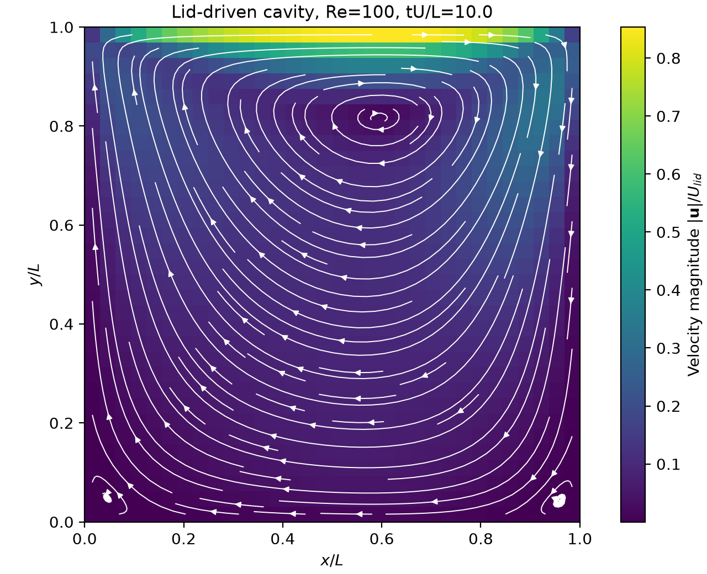
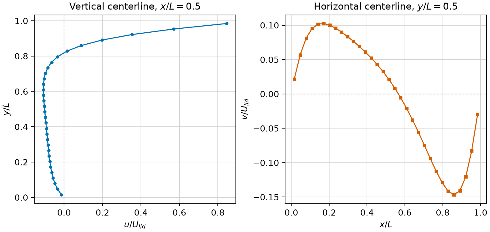
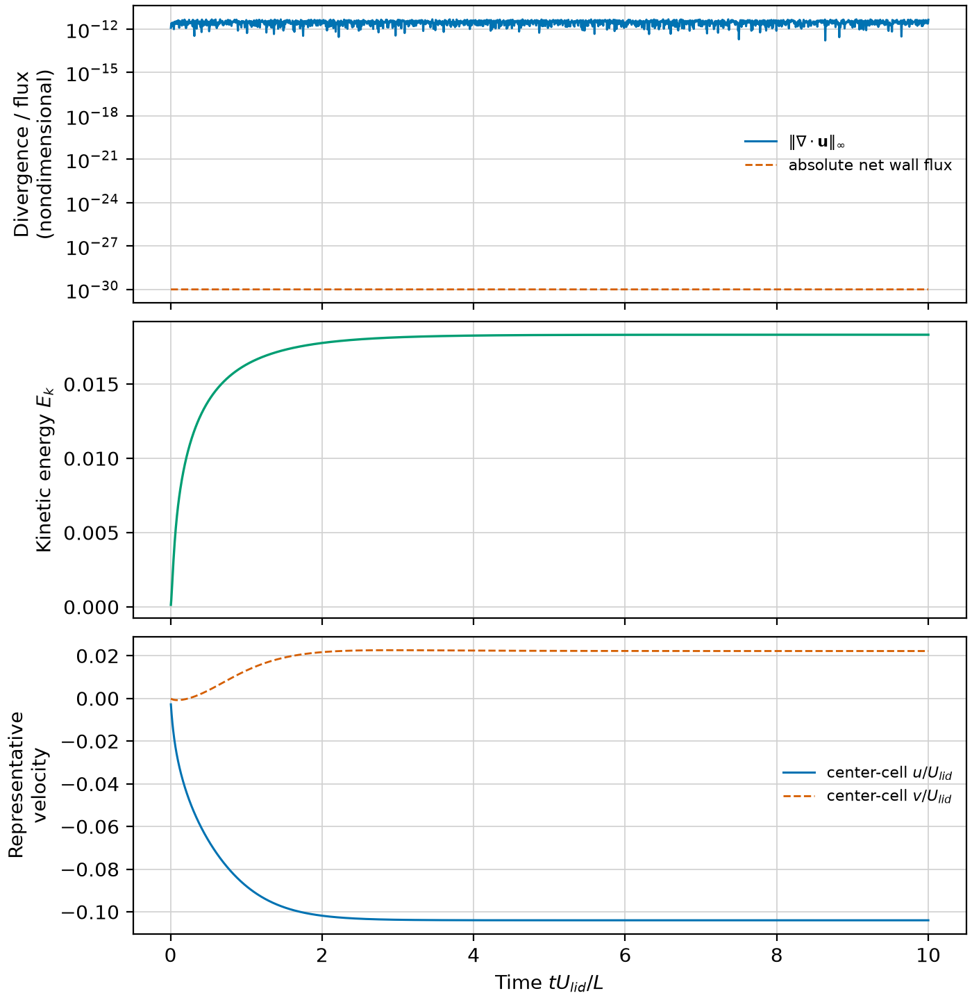

# VWiS AMReX lid-driven cavity engineering result

_Reproducible CPU demonstration recorded on 2026-08-29; this is not full CFD validation._

---

## 📋 Result summary

The AMReX port now supports a named `moving_wall` boundary. This case uses it
to produce a finite, mass-closed primary recirculation in a square cavity at
`Re=100`. The run reached `tU_lid/L=10`; kinetic energy and the representative
center velocity had visually plateaued by approximately `tU_lid/L=4`.

> ⚠️ **Evidence boundary:** The result demonstrates that this implementation
> runs coherently on one grid. It is not validation against Ghia, the legacy
> VWiS solver, or another independent reference, and it contains no grid/time
> convergence study.

| Item | Recorded value |
| --- | ---: |
| Grid | `32 x 32 x 1` cells |
| Domain | `[0,1] x [0,1] x [0,1]` |
| Periodicity | `z` only |
| Lid velocity | `(1,0,0)` |
| Kinematic viscosity | `0.01` |
| Reynolds number | `U_lid L / nu = 100` |
| Time step / steps | `0.005` / `2000` |
| Final nondimensional time | `10.000000000000163` |
| Maximum advective CFL at final step | `0.1891350632` |
| Explicit diffusive number | `0.2049` |
| Final kinetic energy | `0.01832113499` |
| Final center-cell velocity | `(-0.1039676613, 0.02219392273, 0)` |

## ⚙️ Equations and implementation

The single-level, constant-density Cartesian solver advances the
nondimensional incompressible equations

```text
du/dt + div(u tensor u) = -grad(p) + nu Laplacian(u)
div(u) = 0
```

with the port's existing explicit Euler predictor and MAC pressure projection.
Advection uses centered cell values with integrated face volume fluxes;
viscosity uses the cell-centered three-point Laplacian in each direction. The
numerical method was not changed for this case.

The boundary conditions are `u=(0,0,0)` at `x=0`, `x=1`, and `y=0`,
`u=(1,0,0)` at `y=1`, and periodicity in `z`. The one periodic z cell makes the
run 2D-equivalent while retaining the three-dimensional AMReX data layout.
Pressure correction has homogeneous Neumann data on all four walls and a
zero-mean gauge.

For `moving_wall`, the cell ghost value is
`U_ghost = 2 U_wall - U_interior`. Tangential face-flux ghosts use the same
reflection after multiplication by face area, while the wall-normal valid face
flux is exactly zero. This makes the wall value seen by the viscous stencil
consistent with the configured velocity. `noslip` retains its prior zero-wall
reflection. No IBM or EB code path is involved.


Checkpoint writes use schema version 2 to record and strictly check the
configured moving-wall velocity. The reader retains the schema-v1 path for
checkpoints that predate this field; the P8 restart consistency and
strict-rejection tests remain in the verification suite.

## 📊 Field and centerline results


_Figure 1: Final cell-centered velocity magnitude with integrated streamline paths. Color uses the unsmoothed 32 x 32 values; `streamplot` interpolates only to trace paths._


_Figure 2: Final centerline `u(y)` and `v(x)`. Each line is linearly interpolated between the two cell-center columns or rows adjacent to 0.5; markers show every resulting sample, with no smoothing._


_Figure 3: Per-step divergence/mass, kinetic energy, and representative center-cell velocity. Exact zero mass flux is displayed at `1e-30` only on the logarithmic plot; the preserved CSV remains zero._

The accessible machine-readable alternatives are
[`final_field.csv`](raw/final_field.csv),
[`centerlines.csv`](raw/centerlines.csv), and
[`history.csv`](raw/history.csv). SVG versions of every figure are also stored
under `figures/`.

## ✅ Numerical sanity checks

| Check | Result | Interpretation |
| --- | ---: | --- |
| Finite field/history | Pass | No NaN or Inf in exported field or diagnostics |
| Maximum post-projection `L_inf` divergence | `4.685342392e-12` | Below the case's hard `1e-8` rejection threshold |
| Final post-projection `L_inf` divergence | `4.364938966e-12` | Projection remained effective at the final step |
| Final integrated divergence | `-6.098637220e-20` | Roundoff-scale global balance |
| Maximum absolute net wall flux | `0` | Closed boundary has no mass source |
| Moving-wall reconstruction error | `0` | Average of top interior/ghost states equals prescribed wall velocity |
| Final stability guards | CFL `0.1891`; diffusion `0.2049` | Both below the existing explicit limit of 1 |

These checks establish basic engineering sanity only. In particular, they do
not establish discretization accuracy or agreement with a reference solution.

## 🔧 Reproduction record

### Locked build

| Component | Exact record |
| --- | --- |
| Executable | `/home/wangzw/agent-workspace/Projects/HPC_matters/CFD/vwis2.0/build/amrex_port_cavity/vwis_amrex_skeleton` |
| AMReX package | `/tmp/vwis-p5-amrex-git-install.Ra0ukN/lib/cmake/AMReX` |
| AMReX release / SHA | `26.04` / `9219ba416b7ba2073dd1b12bf19fdce27391f17b` |
| Compiler | GNU C++ `13.3.0` |
| CMake | `3.28.3` |
| Backend / ranks | CPU / 1 |
| Plot stack | Matplotlib `3.11.1`, NumPy `2.5.1` |

### Exact commands

All commands were run from the repository root:

```bash
CFD/vwis2.0/amrex_port/tests/static_contract_check.sh

cmake -S CFD/vwis2.0/amrex_port \
  -B CFD/vwis2.0/build/amrex_port_cavity \
  -DAMReX_DIR=/tmp/vwis-p5-amrex-git-install.Ra0ukN/lib/cmake/AMReX \
  -DCMAKE_BUILD_TYPE=Release -DBUILD_TESTING=ON

cmake --build CFD/vwis2.0/build/amrex_port_cavity -j2

ctest --test-dir CFD/vwis2.0/build/amrex_port_cavity \
  --output-on-failure -R 'lid_driven_cavity|p8_restart'

VWIS_AMREX_EXE=/home/wangzw/agent-workspace/Projects/HPC_matters/CFD/vwis2.0/build/amrex_port_cavity/vwis_amrex_skeleton \
  CFD/vwis2.0/run_cases/lid_driven_cavity/run.sh

ctest --test-dir CFD/vwis2.0/build/amrex_port_cavity --output-on-failure
git diff --check
```

`run.sh` invokes the executable with `inputs.in`, captures `raw/solver.log` and
`raw/command.txt`, then calls `plot_results.py`. Re-running it overwrites only
this case's generated raw/figure files.

## 💾 Artifact inventory

| Artifact | Purpose |
| --- | --- |
| `inputs.in` | Frozen case configuration |
| `run.sh` | Build-independent case runner with executable override |
| `plot_results.py` | Deterministic Matplotlib rendering code |
| `raw/summary.json` | Build, method, case, and sanity summary |
| `raw/final_field.csv` | All 1024 final cell-centered field rows |
| `raw/centerlines.csv` | 64 interpolated centerline samples |
| `raw/history.csv` | All 2000 post-step diagnostic samples |
| `raw/figure_manifest.json` | Plot sources, transformations, and package versions |
| `raw/solver.log` | Complete AMReX run output |
| `figures/*.png`, `figures/*.svg` | Static result figures |

The PNG files are opaque RGBA at 200 dpi: `1280x1040`, `1600x760`, and
`1400x1440` pixels. No journal target or publisher compliance is claimed.

## ⚠️ Limitations and observed failure mode

- The explicit Euler method is only first order in time and is not the legacy
  PETSc SNES integrator. The conservative `dt=0.005` was chosen without
  silently changing that method.
- The field is a single `32x32` grid at one final time. There is no formal
  steady-state residual, grid study, time-step study, uncertainty estimate, or
  comparison with Ghia/reference data.
- The accumulated `P` field reaches approximately `[-1748,2416]`. Pressure is
  an accumulated correction with unresolved legacy scaling in this port, so it
  is preserved in `final_field.csv` but is not interpreted or plotted as a
  validated physical pressure.
- AMReX 26.04 on this `Nx x Ny x 1` periodic-z geometry did not reliably
  project the lid-startup field when `max_grid_size` was 16 or larger. One-step
  probes at `32x32x1` gave post-projection divergence near `6.55` for
  `max_grid_size=16`, versus about `1.20e-12` for `max_grid_size=8`. The frozen
  case therefore uses 16 boxes of at most 8 cells and enforces a hard `1e-8`
  divergence guard. This is documented as a locked-build thin-domain/BoxArray
  limitation, not hidden as a tuning choice.
- The path is single-level, uniform Cartesian, CPU, and one rank. It contains
  no MPI run, GPU run, AMR, LES, IBM, EB, curvilinear metric, or FSI claim.
- Streamline integration interpolates the cell-centered vector field to trace
  paths. The colored field is shown at native cells with no smoothing; all raw
  values and transformations are preserved.

## 🔗 Related records

- [`amrex_port/README.md`](../../amrex_port/README.md) — port capability boundary
- [`AMReX migration task list`](../../_Docs/AMReX移植任务清单.md) — `P10-002` remains in progress
- [`raw/summary.json`](raw/summary.json) — authoritative machine-readable run summary
