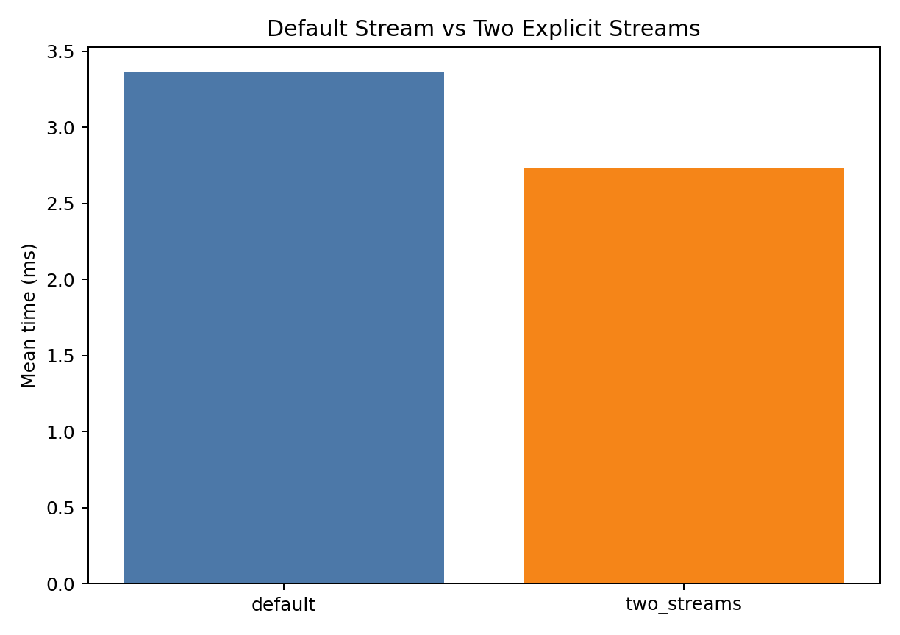
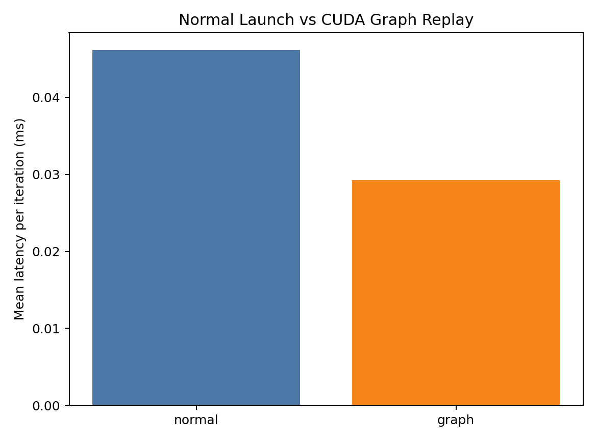
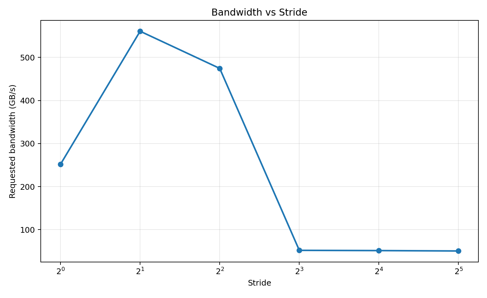

# GPU CUDA 性能学习指南

## Overview：这个目录是什么

`Projects/HPC_matters/CUDA/` 是一组面向 CUDA 性能理解的实验项目。其目的是为了持续建立这条链路：

```text
代码写法 -> GPU 硬件行为 -> 可测量的性能结果 -> profiler 证据
```

每个子项目都尽量保持同一种格式：

- `src/*.cu`：可编译、可运行的最小 benchmark
- `CMakeLists.txt`：独立构建
- `results/*.csv`：实验数据
- `scripts/plot_results.py`：画图和汇总
- `README.md`：解释概念、运行方式和结果解读

本指南覆盖 12 个核心学习项目：`cuda_stream_intro`、`cuda_graph_intro`、`memory_coalescing_intro`、`shared_memory_bank_conflict`、`register_Occupancy`（基础版 / Legacy）、`occupancy_vs_registers`、`warp_schedule`、`nsight_systems_intro`、`nsight_compute_intro`、`reduction_scan_intro`、`kernel_type_playground`、`nccl_intro`。

## 学习顺序

1. [`cuda_stream_intro`](./cuda_stream_intro/README.md)：理解 GPU 工作队列和异步拷贝
2. [`cuda_graph_intro`](./cuda_graph_intro/README.md)：理解固定工作流的 launch 开销优化
3. [`memory_coalescing_intro`](./memory_coalescing_intro/README.md)：理解 global memory 访问模式
4. [`shared_memory_bank_conflict`](./shared_memory_bank_conflict/README.md)：理解 shared memory 的bank存储
5. [`register_Occupancy`（基础版 / Legacy）](./register_Occupancy/README.md)：入门学习寄存器压力如何限制并发
6. [`occupancy_vs_registers`](./occupancy_vs_registers/README.md)：系统分析寄存器压力、Occupancy 阶梯、资源 cliff 与 spilling
7. [`warp_schedule`](./warp_schedule/README.md)：学习 warp 数量和 latency hiding
8. [`nsight_systems_intro`](./nsight_systems_intro/README.md)：用时间线验证 stream/graph/overlap
9. [`nsight_compute_intro`](./nsight_compute_intro/README.md)：用硬件指标解释single kernel
10. [`kernel_type_playground`](./kernel_type_playground/README.md)：按瓶颈类型选择优化策略
11. [`reduction_scan_intro`](./reduction_scan_intro/README.md)：真实的并行算法sample
12. [`nccl_intro`](./nccl_intro/README.md)：学习多 GPU 集合通信基础

## 第一章：运行时机制 Runtime

### 1. cuda_stream_intro

概念：`cudaStream` 是提交 GPU 工作的队列。同一个 stream 内顺序执行，不同 stream 在条件允许时可重叠。

官网内容见：https://docs.nvidia.com/cuda/cuda-programming-guide/02-basics/asynchronous-execution.html

核心代码：

```cpp
cudaMemcpyAsync(dev.a0, host.a, bytes, cudaMemcpyHostToDevice, s0);
vector_add<<<blocks, threads, 0, s0>>>(dev.a0, dev.b0, dev.c0, n, iters);
cudaMemcpyAsync(host.out, dev.c0, bytes, cudaMemcpyDeviceToHost, s0);
```

关键洞察：

- `Async` 表示异步提交，不保证并发
- host 侧 pinned memory 是高效异步 H2D/D2H 的重要条件
- stream 优化的是流水线组织，不是让单个 kernel 算得更快

已有 benchmark 结果位置：

- `cuda_stream_intro/results/stream_benchmark.csv`
- `cuda_stream_intro/results/stream_vs_default.png`

数值实验对比了默认一个stream和2个stream处理同问题的效率差异（RTX 4060），直观结论：




### 2. cuda_graph_intro

概念：CUDA Graph 把固定 GPU 工作流 capture 成图，然后反复 replay，降低多次 launch 的 CPU 调度开销。

官网内容见：https://docs.nvidia.com/cuda/cuda-programming-guide/04-special-topics/cuda-graphs.html

核心代码：

```cpp
cudaStreamBeginCapture(s, cudaStreamCaptureModeGlobal);
add_bias<<<blocks, threads, 0, s>>>(d_x, 0.1f, n);
scale<<<blocks, threads, 0, s>>>(d_x, 1.01f, n);
relu<<<blocks, threads, 0, s>>>(d_x, n);
cudaStreamEndCapture(s, &graph);
cudaGraphInstantiate(&graph_exec, graph, nullptr, nullptr, 0);
cudaGraphLaunch(graph_exec, s);
```

关键洞察：

- Graph 适合固定、重复、小 kernel 多的场景
- Graph 不改变 kernel 内部算法效率
- 如果 kernel 很重，launch overhead 占比小，收益会变弱

已有 benchmark 结果位置：

- `cuda_graph_intro/results/graph_benchmark.csv`
- `cuda_graph_intro/results/graph_vs_normal.png`

数值实验对比了默认无graph和进行graph优化处理同问题的效率差异（RTX 4060），直观结论：




## 第二章：内存层次 Memory

### 3. memory_coalescing_intro

概念：global memory coalescing 决定一个 warp 的内存访问能否合并访问，从而减少成内存的LS成本。

核心代码：

```cpp
out[idx] = in[idx * stride] * 1.000001f + 1.0f;
```

关键洞察：

- stride=1 通常最容易合并访问
- stride 变大，请求元素数不变，但实际内存访问成本可能增加

已有 benchmark 结果位置：

- `memory_coalescing_intro/results/memory_coalescing.csv`
- `memory_coalescing_intro/results/bandwidth_vs_stride.png`
- `memory_coalescing_intro/results/bandwidth_vs_offset.png`

数值实验对比了不同stride对lane的LS效率差异（RTX 4060），直观结论：



### 4. shared_memory_bank_conflict

概念：shared memory 在 SM 内，低延迟，但按 bank 组织。一个 warp 内多个线程访问（包括读和写）同一 bank 的不同地址，可能产生 bank conflict。

核心代码：

```cpp
int lane = threadIdx.x & 31;
int index = lane * stride;
volatile float* vsmem = smem;
acc += vsmem[index];
```

关键洞察：

- shared memory 快，但访问模式仍然重要
- `stride=1` 通常冲突少，`stride=2/4/8/16/32` 可能冲突更强
- benchmark 需要防止编译器把 shared load 提前到寄存器

已有 benchmark 结果位置：

- `shared_memory_bank_conflict/results/bank_conflict.csv`
- `shared_memory_bank_conflict/results/runtime_vs_stride.png`
- `shared_memory_bank_conflict/results/estimated_conflict_degree.png`

学习：

- bank conflict 的基本模型
- 为什么理论冲突度和实测时间不一定线性对应
- reduction/scan 中 shared memory 访问也要考虑 bank

## 第三章：计算资源 Compute

### 5. register_Occupancy（基础版 / Legacy）

概念：每个 thread 使用的寄存器越多，SM 能同时驻留的 block/warp 可能越少，理论 occupancy 下降。

核心代码：

```cpp
float tmp[HIGH_REG_TMP_SIZE];
#pragma unroll
for (int k = 0; k < HIGH_REG_TMP_SIZE; ++k) {
    tmp[k] = x + static_cast<float>(k) * 1e-6f;
}
```

关键洞察：

- 寄存器是 SM 资源，线程越“胖”，并发越受限
- occupancy 下降会削弱隐藏延迟的能力
- 但 occupancy 不是越高越好，够用后继续提高可能收益很小

已有 benchmark 结果位置：

- `register_Occupancy/results/reg_occ_sweep.csv`
- `register_Occupancy/results/sweep_occupancy_vs_regs.png`
- `register_Occupancy/results/sweep_runtime_vs_regs.png`

学习：

- 用 `cudaFuncGetAttributes` 看 `numRegs`
- 用 occupancy API 估算 active blocks/SM
- 把寄存器、occupancy、runtime 三者放在一起判断

这是寄存器与 Occupancy 主题的入门版。进阶实验 `occupancy_vs_registers` 会进一步比较不同 block size，建立资源限制导致的 Occupancy 阶梯，并演示 `__launch_bounds__` 引发 register spilling 的性能代价。

### 6. warp_schedule

概念：GPU 通过在 SM 上驻留多个 warp 来隐藏访存和流水线延迟。warp 数太少，调度器没有足够可运行 work。

核心代码：

```cpp
for (int i = 0; i < iters; ++i) {
    x = x * 1.000001f + 0.00001f;
}
```

关键洞察：

- blocks/SM 和 warps/block 共同决定总 warp 数
- warp 多不一定越好，资源压力和调度开销也会出现
- latency hiding 是吞吐型 GPU 的核心机制

已有 benchmark 结果位置：

- `warp_schedule/results/warp_benchmark.csv`
- `warp_schedule/results/throughput_heatmap.png`
- `warp_schedule/results/top10_configs.csv`

学习：

- block size 不是风格问题，而是调度和资源配置问题
- 用热力图观察 blocks/SM 与 warps/block 的组合
- 识别“并发不足”和“资源过度占用”的区别

## 第四章：性能分析 Profiling

### 7. nsight_systems_intro

概念：Nsight Systems 看系统级时间线，适合分析 stream、memcpy、kernel launch、CPU/GPU 同步和 overlap。

核心命令：

```bash
nsys profile --trace=cuda,osrt,nvtx --output=results/stream_overlap \
  ../cuda_stream_intro/build/stream_bench results/stream_profile_input.csv
```

关键洞察：

- CSV 只能说明耗时变化，timeline 才能证明是否重叠
- 看 CUDA API 行可以发现 CPU 侧同步和 launch 间隔
- 看 GPU rows 可以发现 copy engine、kernel、stream 是否并发

学习：

- 打开 `.nsys-rep` 并定位 CUDA timeline
- 判断 two streams 是否真的 overlap
- 识别 GPU 空洞和 CPU 同步点

### 8. nsight_compute_intro

概念：Nsight Compute 分析单 kernel 的硬件指标，适合解释 occupancy、stall、memory throughput 和 roofline。

核心命令：

```bash
ncu --set full --target-processes all --kernel-name-base demangled \
  --export results/mem_coalescing_ncu ../memory_coalescing_intro/build/mem_coalescing_bench
```

关键洞察：

- `Stall Long Scoreboard` 常指向 global memory 依赖
- memory throughput 要和 load/store efficiency、transaction 数一起看
- roofline 帮你判断 compute-bound、memory-bound 或其他瓶颈

学习：

- 区分 theoretical occupancy 和 achieved occupancy
- 用 stall reasons 解释 runtime 差异
- 用 roofline 给 kernel 分类

## 第五章：模式分类 Patterns

### 9. kernel_type_playground

概念：不同 kernel 类型对优化手段的敏感性不同。

核心代码：

```cpp
// compute-bound
x = fmaf(x, 1.000001f, y);

// memory-bound
c[i] = a[i] + 1.7f * b[i];

// latency-bound
idx = next[idx];

// launch-overhead-bound
launch_overhead_kernel<<<1, 1>>>(d_tiny);
```

关键洞察：

- compute-bound 看算术吞吐、依赖链、寄存器
- memory-bound 看字节数、coalescing、带宽
- latency-bound 看 dependent load 和 latency hiding
- launch-overhead-bound 看 graph、fusion、batching

结果位置：

- `kernel_type_playground/results/kernel_type_benchmark.csv`
- `kernel_type_playground/results/block_size_sweep.png`
- `kernel_type_playground/results/graph_compare.png`

学习：

- 先分类，再优化
- 同一个 block size 对不同 kernel 影响不同
- Graph 主要解决 tiny launches，不解决内存带宽

### 10. reduction_scan_intro

概念：reduction 和 scan 是并行算法基本基元。它们把线程协作、shared memory、warp shuffle、同步成本放在一个真实问题里。

核心代码：

```cpp
for (int stride = blockDim.x / 2; stride > 0; stride >>= 1) {
    if (tid < stride) smem[tid] += smem[tid + stride];
    __syncthreads();
}

for (int offset = 16; offset > 0; offset >>= 1) {
    x += __shfl_down_sync(0xffffffffu, x, offset);
}
```

关键洞察：

- block-level reduction 通常先输出 partial sums
- warp shuffle 减少 shared memory 和同步
- scan 比 reduction 更难，因为每个位置都要输出前缀结果
- shared memory reduction 也可能遇到 bank conflict

结果位置：

- `reduction_scan_intro/results/reduce_scan_benchmark.csv`
- `reduction_scan_intro/results/runtime_compare.png`
- `reduction_scan_intro/results/bandwidth_compare.png`

学习：

- tree reduction 的结构
- Blelloch scan 的 upsweep/downsweep
- 为什么真实 scan/reduction 往往是多阶段实现

## CUDA 性能概念掌握清单

- 能解释 block、thread、warp、SM 的关系
- 能说明 stream 和 graph 优化的是运行时调度
- 能判断一个 kernel 更像 compute-bound、memory-bound、latency-bound 还是 launch-overhead-bound
- 能解释 coalescing、stride、offset 对 global memory transaction 的影响
- 能解释 shared memory bank conflict 的基本模型
- 能使用 CUDA event 做 kernel 计时
- 能输出 CSV 并用图验证趋势
- 能用 Nsight Systems 验证 timeline overlap
- 能用 Nsight Compute 查看 occupancy、stall、memory throughput 和 roofline
- 能解释为什么 occupancy 不是越高越好
- 能写出基本 block reduction 和 warp shuffle reduction
- 能说明 exclusive scan 和 inclusive scan 的区别

## CUDA API Quick Reference

运行时与设备：

```cpp
cudaSetDevice(0);
cudaGetDeviceProperties(&prop, 0);
cudaDeviceSynchronize();
cudaGetLastError();
```

内存：

```cpp
cudaMalloc(&d_ptr, bytes);
cudaFree(d_ptr);
cudaMemcpy(d_ptr, h_ptr, bytes, cudaMemcpyHostToDevice);
cudaMallocHost(&h_ptr, bytes);
cudaFreeHost(h_ptr);
```

Stream：

```cpp
cudaStreamCreate(&s);
kernel<<<blocks, threads, 0, s>>>(...);
cudaMemcpyAsync(dst, src, bytes, kind, s);
cudaStreamSynchronize(s);
cudaStreamDestroy(s);
```

Event timing：

```cpp
cudaEventCreate(&start);
cudaEventCreate(&stop);
cudaEventRecord(start);
kernel<<<blocks, threads>>>(...);
cudaEventRecord(stop);
cudaEventSynchronize(stop);
cudaEventElapsedTime(&ms, start, stop);
```

Graph：

```cpp
cudaStreamBeginCapture(s, cudaStreamCaptureModeGlobal);
kernel<<<blocks, threads, 0, s>>>(...);
cudaStreamEndCapture(s, &graph);
cudaGraphInstantiate(&graph_exec, graph, nullptr, nullptr, 0);
cudaGraphLaunch(graph_exec, s);
```

Occupancy：

```cpp
cudaFuncGetAttributes(&attr, kernel);
cudaOccupancyMaxActiveBlocksPerMultiprocessor(&active_blocks, kernel, block_size, shmem);
```

Warp shuffle：

```cpp
float y = __shfl_down_sync(0xffffffffu, x, offset);
```

## Profiling Tools Reference

### nvprof

老工具，很多新平台上已被 Nsight 工具链取代。历史命令：

```bash
nvprof ./app
nvprof --print-gpu-trace ./app
```

现在新项目优先使用 `nsys` 和 `ncu`。

### Nsight Systems / nsys

用途：

- 程序级 timeline
- CPU/GPU 同步
- stream overlap
- memcpy/kernel 排队关系

常用命令：

```bash
nsys profile --trace=cuda,osrt,nvtx --output=results/report ./app
nsys-ui results/report.nsys-rep
```

### Nsight Compute / ncu

用途：

- 单 kernel 深入指标
- occupancy
- warp stall
- memory workload
- roofline

常用命令：

```bash
ncu --set full ./app
ncu --section MemoryWorkloadAnalysis ./app
ncu --section SpeedOfLight_RooflineChart ./app
ncu-ui results/report.ncu-rep
```

## 常见优化模式总结

运行时：

- 多 stream 组织 pipeline，让 copy 和 compute 有机会 overlap
- CUDA Graph 降低固定小任务流的 launch overhead
- 减少不必要的 `cudaDeviceSynchronize`

Global memory：

- 保持 warp 内连续访问
- 尽量让数据布局服务于 coalescing
- 减少重复 global load/store
- 区分 requested bandwidth 和实际事务开销

Shared memory：

- 只在有数据复用或通信需求时使用
- 注意 bank conflict
- 对 reduction/scan 优先考虑 warp shuffle 减少同步

Compute resources：

- 控制寄存器压力，避免 occupancy 被过度压低
- block size 结合 occupancy、memory bandwidth 和 latency hiding 一起调
- 不把 occupancy 当唯一目标

Profiling：

- 先用 CSV 发现趋势
- 用 Nsight Systems 验证时间线和调度
- 用 Nsight Compute 解释单 kernel 指标
- 每次只改变少数变量，避免无法解释结果

最后的学习原则：

不要把 CUDA 性能优化当成 API 清单。每次优化都要能回答三件事：代码改变了什么硬件行为，这个行为应该改变哪个指标，实测结果是否支持这个解释。
