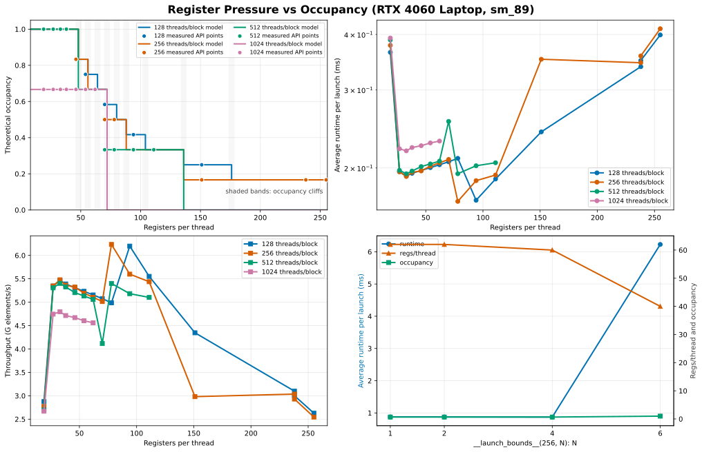

# GPU CUDA 性能学习指南

## Overview：这个目录是什么

`Projects/HPC_matters/CUDA/` 是一组面向 CUDA 性能理解的实验项目。其目的是为了持续建立这条链路：

```text
代码写法 -> GPU 硬件行为 -> 可测量的性能结果 -> profiler 证据
```

每个子项目都尽量保持同一种格式：

- `src/*.cu`：可编译、可运行的最小 benchmark
- `CMakeLists.txt`：独立构建
- `results/*.csv`：实验数据
- `scripts/plot_results.py`：画图和汇总
- `README.md`：解释概念、运行方式和结果解读

本指南覆盖 12 个核心学习项目：`cuda_stream_intro`、`cuda_graph_intro`、`memory_coalescing_intro`、`shared_memory_bank_conflict`、`register_Occupancy`（基础版 / Legacy）、`occupancy_vs_registers`、`warp_schedule`、`nsight_systems_intro`、`nsight_compute_intro`、`reduction_scan_intro`、`kernel_type_playground`、`nccl_intro`。

## 学习顺序

1. [`cuda_stream_intro`](./cuda_stream_intro/README.md)：理解 GPU 工作队列和异步拷贝
2. [`cuda_graph_intro`](./cuda_graph_intro/README.md)：理解固定工作流的 launch 开销优化
3. [`memory_coalescing_intro`](./memory_coalescing_intro/README.md)：理解 global memory 访问模式
4. [`shared_memory_bank_conflict`](./shared_memory_bank_conflict/README.md)：理解 shared memory 的bank存储
5. [`register_Occupancy`（基础版 / Legacy）](./register_Occupancy/README.md)：入门学习寄存器压力如何限制并发
6. [`occupancy_vs_registers`](./occupancy_vs_registers/README.md)：系统分析寄存器压力、Occupancy 阶梯、资源 cliff 与 spilling
7. [`warp_schedule`](./warp_schedule/README.md)：学习 warp 数量和 latency hiding
8. [`nsight_systems_intro`](./nsight_systems_intro/README.md)：用时间线验证 stream/graph/overlap
9. [`nsight_compute_intro`](./nsight_compute_intro/README.md)：用硬件指标解释single kernel
10. [`kernel_type_playground`](./kernel_type_playground/README.md)：按瓶颈类型选择优化策略
11. [`reduction_scan_intro`](./reduction_scan_intro/README.md)：真实的并行算法sample
12. [`nccl_intro`](./nccl_intro/README.md)：学习多 GPU 集合通信基础

## 第一章：运行时机制 Runtime

### 1. cuda_stream_intro

概念：`cudaStream` 是提交 GPU 工作的队列。同一个 stream 内顺序执行，不同 stream 在条件允许时可重叠。

官网内容见：https://docs.nvidia.com/cuda/cuda-programming-guide/02-basics/asynchronous-execution.html

核心代码：

```cpp
cudaMemcpyAsync(dev.a0, host.a, bytes, cudaMemcpyHostToDevice, s0);
vector_add<<<blocks, threads, 0, s0>>>(dev.a0, dev.b0, dev.c0, n, iters);
cudaMemcpyAsync(host.out, dev.c0, bytes, cudaMemcpyDeviceToHost, s0);
```

关键洞察：

- `Async` 表示异步提交，不保证并发
- host 侧 pinned memory 是高效异步 H2D/D2H 的重要条件
- stream 优化的是流水线组织，不是让单个 kernel 算得更快

已有 benchmark 结果位置：

- `cuda_stream_intro/results/stream_benchmark.csv`
- `cuda_stream_intro/results/stream_vs_default.png`

数值实验对比了默认一个stream和2个stream处理同问题的效率差异（RTX 4060），直观结论：


### 2. cuda_graph_intro

概念：CUDA Graph 把固定 GPU 工作流 capture 成图，然后反复 replay，降低多次 launch 的 CPU 调度开销。

官网内容见：https://docs.nvidia.com/cuda/cuda-programming-guide/04-special-topics/cuda-graphs.html

核心代码：

```cpp
cudaStreamBeginCapture(s, cudaStreamCaptureModeGlobal);
add_bias<<<blocks, threads, 0, s>>>(d_x, 0.1f, n);
scale<<<blocks, threads, 0, s>>>(d_x, 1.01f, n);
relu<<<blocks, threads, 0, s>>>(d_x, n);
cudaStreamEndCapture(s, &graph);
cudaGraphInstantiate(&graph_exec, graph, nullptr, nullptr, 0);
cudaGraphLaunch(graph_exec, s);
```

关键洞察：

- Graph 适合固定、重复、小 kernel 多的场景
- Graph 不改变 kernel 内部算法效率
- 如果 kernel 很重，launch overhead 占比小，收益会变弱

已有 benchmark 结果位置：

- `cuda_graph_intro/results/graph_benchmark.csv`
- `cuda_graph_intro/results/graph_vs_normal.png`

数值实验对比了默认无graph和进行graph优化处理同问题的效率差异（RTX 4060），直观结论：


## 第二章：内存层次 Memory

### 3. memory_coalescing_intro

概念：global memory coalescing 决定一个 warp 的内存访问能否合并访问，从而减少成内存的LS成本。

核心代码：

```cpp
out[idx] = in[idx * stride] * 1.000001f + 1.0f;
```

关键洞察：

- stride=1 通常最容易合并访问
- stride 变大，请求元素数不变，但实际内存访问成本可能增加

已有 benchmark 结果位置：

- `memory_coalescing_intro/results/memory_coalescing.csv`
- `memory_coalescing_intro/results/bandwidth_vs_stride.png`
- `memory_coalescing_intro/results/bandwidth_vs_offset.png`

数值实验对比了不同stride对lane的LS效率差异（RTX 4060），直观结论：


### 4. shared_memory_bank_conflict

概念：shared memory 在 SM 内，低延迟，但按 bank 组织。一个 warp 内多个线程访问（包括读和写）同一 bank 的不同地址，可能产生 bank conflict。

核心代码：

```cpp
int lane = threadIdx.x & 31;
int index = lane * stride;
volatile float* vsmem = smem;
acc += vsmem[index];
```

关键洞察：

- shared memory 快，但访问模式仍然重要
- `stride=1` 通常冲突少，`stride=2/4/8/16/32` 可能冲突更强
- benchmark 需要防止编译器把 shared load 提前到寄存器

已有 benchmark 结果位置：

- `shared_memory_bank_conflict/results/bank_conflict.csv`
- `shared_memory_bank_conflict/results/runtime_vs_stride.png`
- `shared_memory_bank_conflict/results/estimated_conflict_degree.png`

学习：

- bank conflict 的基本模型
- 为什么理论冲突度和实测时间不一定线性对应
- reduction/scan 中 shared memory 访问也要考虑 bank

## 第三章：计算资源 Compute

### 5. register_Occupancy（基础版 / Legacy）

概念：每个 thread 使用的寄存器越多，寄存器文件可能越早成为 SM 的资源限制，使能同时驻留的 block/warp 变少，理论 occupancy 下降。occupancy 是 active warps 与硬件最大 active warps 的比值，不是单独追求的性能目标。[CUDA C++ Best Practices Guide](https://docs.nvidia.com/cuda/cuda-c-best-practices-guide/index.html#occupancy)

核心代码：

```cpp
float tmp[HIGH_REG_TMP_SIZE];
#pragma unroll
for (int k = 0; k < HIGH_REG_TMP_SIZE; ++k) {
    tmp[k] = x + static_cast<float>(k) * 1e-6f;
}
```

关键洞察：

- 寄存器是 SM 资源，线程越“胖”，并发可能越受限；实际阶梯还受 block size、shared memory 和架构分配粒度影响
- 较低 occupancy 可能削弱隐藏访存或依赖延迟的能力，但更高 occupancy 不保证更快；寄存器复用、指令级并行和 spilling 也要一起看
- `__launch_bounds__` 或 `--maxrregcount` 可能改变资源分配；若寄存器不足而 spilling 到 local memory，性能可能变差，需用实测确认

已有 benchmark 结果位置：

- `register_Occupancy/results/reg_occ_sweep.csv`
- `register_Occupancy/results/sweep_occupancy_vs_regs.png`
- `register_Occupancy/results/sweep_runtime_vs_regs.png`


_图：`occupancy_vs_registers` 的已有分析图；用于观察资源限制导致的 occupancy 阶梯，不代表所有 GPU 或 kernel 的通用曲线。_

学习：

- 用 [`cudaFuncGetAttributes`](https://docs.nvidia.com/cuda/cuda-runtime-api/group__CUDART__KERNEL.html) 看 `numRegs`
- 用 [`cudaOccupancyMaxActiveBlocksPerMultiprocessor`](https://docs.nvidia.com/cuda/cuda-runtime-api/group__CUDART__OCCUPANCY.html) 估算给定 block size/shared memory 下的 active blocks/SM；这是预测，不是实际运行时吞吐
- 把寄存器、occupancy、spill 指标和 runtime 放在一起判断

这是寄存器与 Occupancy 主题的入门版。进阶实验 `occupancy_vs_registers` 会进一步比较不同 block size，建立资源限制导致的 Occupancy 阶梯，并演示寄存器限制可能带来的 spilling 代价。

### 6. occupancy_vs_registers

概念：Occupancy 计算是资源约束的交集：寄存器、shared memory、线程数、block 数等任一项都可能成为限制因素。它回答“最多能驻留多少”，不直接回答“kernel 有多快”。[CUDA Runtime Occupancy API](https://docs.nvidia.com/cuda/cuda-runtime-api/group__CUDART__OCCUPANCY.html)

关键洞察：

- 先看理论 occupancy 的限制来源，再看 achieved occupancy、eligible warps、stall 和吞吐是否真的受影响
- 为了提高 occupancy 而强行压低寄存器数，可能引入 local-memory spilling；最佳点必须由目标 GPU、输入规模和 kernel 实测决定
- 资源 cliff 是离散分配造成的阶梯现象，不应把某一架构上的阈值外推到另一架构

### 7. warp_schedule

概念：SM 调度器从可发射的 warp 中选择指令；当一个 warp 因内存依赖、同步或流水线资源暂时不能发射时，其他 eligible warp 有机会填补空档，从而隐藏延迟。[CUDA C++ Programming Guide：Hardware Multithreading](https://docs.nvidia.com/cuda/cuda-programming-guide/)

核心代码：

```cpp
for (int i = 0; i < iters; ++i) {
    x = x * 1.000001f + 0.00001f;
}
```

关键洞察：

- blocks/SM 和 warps/block 共同决定理论 active warps，但资源限制和同步会决定实际可运行/可发射的 warp
- warp 多不一定越好；更多线程可能增加寄存器/shared memory 压力，且当瓶颈在带宽或指令吞吐时继续增加并发未必有收益
- stall reason 是“warp 当时为什么不能发射”的分类，不是单独的根因证明；只有结合 scheduler issue、依赖链、内存请求和代码位置才能解释 runtime

已有 benchmark 结果位置：

- `warp_schedule/results/warp_benchmark.csv`
- `warp_schedule/results/throughput_heatmap.png`
- `warp_schedule/results/top10_configs.csv`

学习：

- block size 既是调度参数，也是资源配置参数
- 用热力图观察 blocks/SM 与 warps/block 的组合，不把单一峰值当成普适结论
- 区分“没有足够 eligible warp”与“已有 warp 但某个执行/内存管线饱和”

## 第四章：性能分析 Profiling

### 8. nsight_systems_intro

概念：Nsight Systems 观察程序级时间线，适合分析 CPU/GPU 工作、CUDA API、stream、memcpy、kernel launch、同步和 overlap。[Nsight Systems User Guide：CUDA Trace](https://docs.nvidia.com/nsight-systems/UserGuide/index.html#cuda-trace)

核心命令：

```bash
nsys profile --trace=cuda,osrt,nvtx --output=results/stream_overlap \
  ../cuda_stream_intro/build/stream_bench results/stream_profile_input.csv
```

关键洞察：

- CSV 可以发现耗时趋势，但只有时间线能直接检查任务的排队顺序和时间区间是否重叠；“异步提交”本身不等于“已经并发”
- CUDA API 行可帮助定位 host 侧同步和 launch 间隔；GPU rows 可观察 kernel、copy engine 和 stream 的时间关系
- 时间线能说明“发生了什么”，不必然说明 kernel 内部为何慢；单 kernel 的硬件瓶颈应转到 Nsight Compute 或代码分析


_图：已有 stream benchmark 结果；它是 overlap 的实验背景图，不是本机本次运行的 Nsight Systems 报告。_

学习：

- 打开 `.nsys-rep` 并定位 CUDA timeline
- 判断 two streams 是否真的 overlap，并检查是否有同步或资源竞争
- 识别 GPU 空洞、CPU 提交间隔和 memcpy/kernel 排队关系

### 9. nsight_compute_intro

概念：Nsight Compute 面向单个 CUDA kernel，提供 occupancy、scheduler、memory workload、compute/memory throughput 和 roofline 等指标。[Nsight Compute Profiling Guide](https://docs.nvidia.com/nsight-compute/ProfilingGuide/index.html)

核心命令：

```bash
ncu --set full --target-processes all --kernel-name-base demangled \
  --export results/mem_coalescing_ncu ../memory_coalescing_intro/build/mem_coalescing_bench
```

关键洞察：

- `Stall Long Scoreboard` 表示 warp 在等待较长延迟的 scoreboard 依赖，常见于未完成的 global/local memory 相关依赖；它不是“global memory 一定是唯一根因”，需结合内存请求和源码位置确认
- memory throughput、load/store efficiency、请求/事务和 cache 命中率应一起看；单个百分比不能独立证明带宽瓶颈
- roofline 把算术强度、已达性能与若干硬件上限放在同一图中，适合提出“可能受哪条 ceiling 限制”的假设；它不是自动生成的因果证明
- 只在 scheduler 有大量未使用 issue slot 时重点追 stall reason；有些 stall 是正常等待，也可能被其他 warp 隐藏。[Nsight Compute：Warp Stall Reasons](https://docs.nvidia.com/nsight-compute/ProfilingGuide/index.html#warp-stall-reasons)

学习：

- 区分 theoretical occupancy 与 achieved occupancy；二者差异还可能来自负载不均衡等运行时因素
- 用 stall、scheduler issue、内存/计算 throughput 和源码关联解释 runtime 差异
- 用 roofline 做 kernel 分类的起点，再用其他 section 验证假设

以上分析是概念/示例；本仓库没有在此处附带 Nsight Systems/Compute 的硬件报告，不能据此声称本机已经测得某个指标。

## 第五章：模式分类 Patterns

### 10. kernel_type_playground

概念：不同 kernel 对优化手段的敏感性不同；“compute-bound”或“memory-bound”是当前实现、输入规模和硬件下的工作假设，而不是 kernel 的永久标签。[CUDA C++ Best Practices Guide：Performance Metrics](https://docs.nvidia.com/cuda/cuda-c-best-practices-guide/index.html#performance-metrics)

核心代码：

```cpp
// compute-bound
x = fmaf(x, 1.000001f, y);

// memory-bound
c[i] = a[i] + 1.7f * b[i];

// latency-bound
idx = next[idx];

// launch-overhead-bound
launch_overhead_kernel<<<1, 1>>>(d_tiny);
```

关键洞察：

- compute 型要看指令吞吐、依赖链、寄存器和实际 achieved throughput
- memory 型要看有效字节、访问合并、cache/事务和可达到带宽；“带宽百分比低”也可能是请求模式或并行度不足
- latency 型常见 dependent load 或同步链；增加并发只有在有独立 work 且资源允许时才可能隐藏延迟
- launch-overhead 型可评估 Graph、fusion、batching，但 Graph 主要减少重复工作流的提交开销，不会自动提高 kernel 内存带宽

结果位置：

- `kernel_type_playground/results/kernel_type_benchmark.csv`
- `kernel_type_playground/results/block_size_sweep.png`、`graph_compare.png`：当前仓库未找到对应文件，因此不作为图片引用


_图：已有 CUDA Graph benchmark，作为 launch-overhead 模式的代表性实验；不是 `kernel_type_playground` 的专题结果。_

学习：

- 先用时间、字节数、指令/吞吐和依赖关系分类，再选择优化方向
- 同一个 block size 对不同 kernel 的影响不同，应在相同正确性和计时语义下比较
- 每次改变少数变量，并记录 GPU、编译选项、输入规模和重复次数

### 11. reduction_scan_intro

概念：reduction 把一组值按结合操作汇聚成较少的结果；scan 则为每个位置保留前缀结果。inclusive scan 包含当前位置，exclusive scan 不包含当前位置，二者不是同一个输出的简单重命名。[CUDA Programming Guide：Cooperative Groups Reduce/Scan](https://docs.nvidia.com/cuda/cuda-programming-guide/04-special-topics/cooperative-groups.html#collective-operations)

核心代码：

```cpp
for (int stride = blockDim.x / 2; stride > 0; stride >>= 1) {
    if (tid < stride) smem[tid] += smem[tid + stride];
    __syncthreads();
}

for (int offset = 16; offset > 0; offset >>= 1) {
    x += __shfl_down_sync(0xffffffffu, x, offset);
}
```

关键洞察：

- block-level reduction 常先得到每个 block 的 partial sum，再由后续 kernel 或 host/库完成最终聚合；最后一步不能把多个 block 的结果当作天然同步
- warp shuffle 可减少 shared memory 往返和部分 block barrier，但 mask 必须覆盖实际参与的线程，不能无条件把 `0xffffffffu` 当作所有场景的安全 mask
- scan 比 reduction 更难，因为每个位置都要产生前缀结果；Blelloch upsweep/downsweep 是一种算法组织方式，实际实现也可能采用其他分块或库原语
- shared memory 版本仍需考虑 bank conflict、同步覆盖范围和非 2 的幂次长度

结果位置：

- `reduction_scan_intro/results/reduce_scan_benchmark.csv`
- 文档中原先列出的 `runtime_compare.png`、`bandwidth_compare.png` 当前不在仓库中，因此不引用它们

以上算法说明是概念/示例；没有附带该专题的本机 profiler 结果。需要生产实现时，可进一步对照 [CUDA Cooperative Groups](https://docs.nvidia.com/cuda/cuda-programming-guide/04-special-topics/cooperative-groups.html) 或使用经过验证的 CUB collective primitives。

## CUDA 性能概念掌握清单

- 能解释 block、thread、warp、SM 的关系
- 能说明 stream 和 graph 优化的是运行时组织/提交，而不是自动改变 kernel 内部算法
- 能判断一个 kernel 更像 compute-bound、memory-bound、latency-bound 还是 launch-overhead-bound，并说明这只是待验证假设
- 能解释 coalescing、stride、offset 对 global memory 请求和事务的影响
- 能解释 shared memory bank conflict 的基本模型
- 能使用 CUDA event 做设备时间区间计时，并知道记录 event 与等待 event 的同步语义
- 能输出 CSV 并用图验证趋势
- 能用 Nsight Systems 验证 timeline overlap
- 能用 Nsight Compute 查看 occupancy、scheduler/stall、memory workload 和 roofline，并避免单指标下结论
- 能解释为什么 occupancy 不是越高越好
- 能写出基本 block reduction 和 warp shuffle reduction
- 能说明 exclusive scan 和 inclusive scan 的区别

## CUDA API Quick Reference

运行时与设备：见 [CUDA Runtime API](https://docs.nvidia.com/cuda/cuda-runtime-api/index.html)。

```cpp
cudaSetDevice(0);
cudaGetDeviceProperties(&prop, 0);
cudaDeviceSynchronize();
cudaGetLastError();
```

内存：见 [Memory Management](https://docs.nvidia.com/cuda/cuda-runtime-api/group__CUDART__MEMORY.html)。

```cpp
cudaMalloc(&d_ptr, bytes);
cudaFree(d_ptr);
cudaMemcpy(d_ptr, h_ptr, bytes, cudaMemcpyHostToDevice);
cudaMallocHost(&h_ptr, bytes);
cudaFreeHost(h_ptr);
```

Stream：见 [Stream Management](https://docs.nvidia.com/cuda/cuda-runtime-api/group__CUDART__STREAM.html)。

```cpp
cudaStreamCreate(&s);
kernel<<<blocks, threads, 0, s>>>(...);
cudaMemcpyAsync(dst, src, bytes, kind, s);
cudaStreamSynchronize(s);
cudaStreamDestroy(s);
```

Event timing：见 [Event Management](https://docs.nvidia.com/cuda/cuda-runtime-api/group__CUDART__EVENT.html)。`cudaEventRecord` 把当时该 stream 中已排队的工作捕获到 event；`cudaEventSynchronize(stop)` 等待 stop 完成，然后 `cudaEventElapsedTime` 计算两个已记录 event 之间的设备时间。它不是 host wall-clock 计时，也不意味着两 event 之间没有其他 stream 的工作。

```cpp
cudaEventCreate(&start);
cudaEventCreate(&stop);
cudaEventRecord(start, stream);
kernel<<<blocks, threads, 0, stream>>>(...);
cudaEventRecord(stop, stream);
cudaEventSynchronize(stop);
cudaEventElapsedTime(&ms, start, stop);
```

Graph：见 [CUDA Graphs](https://docs.nvidia.com/cuda/cuda-programming-guide/04-special-topics/cuda-graphs.html)。

```cpp
cudaStreamBeginCapture(s, cudaStreamCaptureModeGlobal);
kernel<<<blocks, threads, 0, s>>>(...);
cudaStreamEndCapture(s, &graph);
cudaGraphInstantiate(&graph_exec, graph, nullptr, nullptr, 0);
cudaGraphLaunch(graph_exec, s);
```

Occupancy：见 [Occupancy API](https://docs.nvidia.com/cuda/cuda-runtime-api/group__CUDART__OCCUPANCY.html)。

```cpp
cudaFuncGetAttributes(&attr, kernel);
cudaOccupancyMaxActiveBlocksPerMultiprocessor(
    &active_blocks, kernel, block_size, shmem);
```

Warp shuffle：见 [Warp Shuffle Functions](https://docs.nvidia.com/cuda/cuda-c-programming-guide/index.html#warp-shuffle-functions)。参与线程的 mask 和控制流必须匹配实际参与者。

```cpp
float y = __shfl_down_sync(mask, x, offset);
```

## Profiling Tools Reference

### nvprof

`nvprof` 和 Visual Profiler 已弃用，官方说明其将于未来 CUDA 版本移除；新平台和新项目应优先迁移到 Nsight Systems 与 Nsight Compute。[CUDA Profiler User’s Guide：Migrating to Nsight Tools](https://docs.nvidia.com/cuda/profiler-users-guide/#migrating-to-nsight-tools-from-visual-profiler-and-nvprof)

历史命令（仅用于旧环境复现）：

```bash
nvprof ./app
nvprof --print-gpu-trace ./app
```

### Nsight Systems / nsys

用途：

- 程序级 timeline
- CPU/GPU 同步与 API 调用
- stream overlap
- memcpy/kernel 排队关系

官方内容见 [Nsight Systems User Guide](https://docs.nvidia.com/nsight-systems/UserGuide/index.html)。

```bash
nsys profile --trace=cuda,osrt,nvtx --output=results/report ./app
nsys-ui results/report.nsys-rep
```

### Nsight Compute / ncu

用途：

- 单 kernel 深入指标
- theoretical/achieved occupancy
- warp scheduler 与 stall sampling
- memory workload
- roofline

官方内容见 [Nsight Compute Documentation](https://docs.nvidia.com/nsight-compute/)。

```bash
ncu --set full ./app
ncu --section MemoryWorkloadAnalysis ./app
ncu --section SpeedOfLight_RooflineChart ./app
ncu-ui results/report.ncu-rep
```

## 常见优化模式总结

运行时：

- 多 stream 组织 pipeline，让 copy 和 compute 在依赖、硬件 engine 和资源允许时有机会 overlap
- CUDA Graph 降低固定小任务流的重复提交开销
- 减少不必要的 `cudaDeviceSynchronize`，但用正确的 stream/event 依赖替代它

Global memory：

- 保持 warp 内连续访问，优先改善请求合并和数据布局
- 减少重复 global load/store，但要权衡额外寄存器和 shared memory
- 区分 requested bytes、实际事务、cache 命中和有效带宽

Shared memory：

- 在有数据复用或线程间通信时使用
- 检查 bank conflict 和同步范围
- 对 reduction/scan 可考虑 warp shuffle 或库原语，但先验证 mask、边界和数值正确性

Compute resources：

- 控制寄存器压力，避免不必要的 spilling；不要为了 occupancy 数字而牺牲关键指令级并行
- block size 结合 occupancy、scheduler issue、memory throughput、依赖延迟和实际 runtime 调整
- 不把 occupancy 当唯一目标

Profiling：

- 先用轻量 benchmark/CSV 发现趋势并固定计时语义
- 用 Nsight Systems 验证时间线和调度
- 用 Nsight Compute 解释单 kernel 指标，并把指标与源码和硬件限制关联
- 每次只改变少数变量，记录硬件、编译选项、输入规模和重复次数

最后的学习原则：

不要把 CUDA 性能优化当成 API 清单。每次优化都要能回答三件事：代码改变了什么硬件行为，这个行为应该改变哪个指标，实测结果是否支持这个解释。
