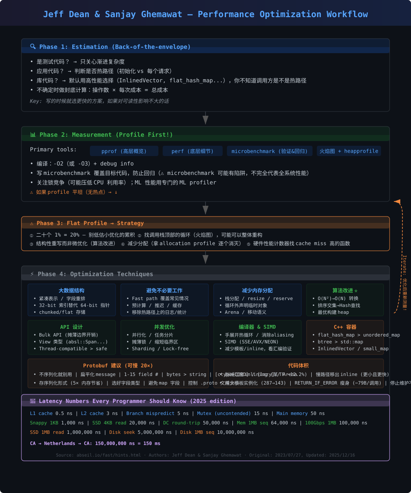

# Google Performance Optimization Guide — 精要笔记

> **来源：** [abseil.io/fast/hints.html](https://abseil.io/fast/hints.html)  
> **作者：** Jeff Dean & Sanjay Ghemawat (Google)  
> **原版：** 2023/07/27 | **更新：** 2025/12/16  
> **整理：** 奥创 ⚡ | 2026-07-07

---

> **📌 文档范围：** 原文聚焦单二进制程序的通用性能调优（CPU、内存、缓存、分配、API、并发、代码体积）。  
> 分布式系统与 ML 硬件性能调优不在原文讨论范围内（作者：这些领域自成体系，各自浩瀚）。本文最后补充 HPC/CUDA/MPI/AMReX 映射，属于延伸解读。

---

## 📐 优化工作流



---

## 一、性能思维：先估算再动手

### 🔑 Knuth 的正确打开方式

> "We should forget about small efficiencies, say about 97% of the time: premature optimization is the root of all evil. Yet we should not pass up our opportunities in that critical 3%."

- 这篇文档讲的就是那关键的 **3%**
- Knuth 另一句话更值得记住：**12% 的性能提升在任何工程学科里都不是"微不足道"的**
- Jeff & Sanjay 的建议：**写代码时就选更快的方案，如果对可读性影响不大的话**

### ⚠️ 为什么"先写简单，后优化"往往是错的

> 很多人会说："先用最简单的方式写代码，等 profile 出来再优化。"
> Jeff & Sanjay 指出这个方法有四个问题：

1. **忽视性能会导致 flat profile** — 大型系统中，性能损失分散在各处，没有明显热点，优化无从下手
2. **库代码的作者坑了下游** — 用你库的人遇到性能问题时，往往没有能力修改你的代码，还得跨团队协商
3. **系统重度使用后，重构更难** — 线上运行的系统做重大改动，阻力远大于开发阶段
4. **掩盖简单可修复的性能问题** — 最终可能用过度复制或严重超配机器来弥补，代价极高

**正确态度：** 写代码时就选更快的方案，如果对可读性影响不大的话。

### 🧠 写代码时的性能估算

| 代码类型 | 策略 |
|---|---|
| **测试代码** | 只关心渐进复杂度，别写跑太久的测试 |
| **应用代码** | 判断冷/热路径（初始化 vs 每请求执行的代码） |
| **库代码** | 默认考虑高性能选择（小型/短 vector 用 `InlinedVector`，hash map 优先评估 `flat_hash_map`），因为你不知道调用者是不是在热路径上 |

### 📊 封底估算 (Back-of-the-envelope)

```
1. 估算各类底层操作的数量（磁盘寻道、网络往返、字节传输...）
2. 乘以每种操作的大致成本
3. 加总 → 得到资源使用总量的粗略估计
```

#### 案例：排序 10 亿个 int32

```
内存带宽：4GB × 30 次遍历 / 16GB/s ≈ 7.5 秒
分支预测失败：300亿次比较 × 50%预测失败 × 5ns ≈ 75 秒
───────────────────────────────
总计：≈ 82.5 秒（瓶颈在分支预测！）
考虑 L3 cache：最后22轮走cache → 内存时间降至 2.5 秒
```

#### 案例：生成含 30 张缩略图的网页

| 方案 | 延迟 |
|---|---|
| 串行读 HDD（单盘） | 30 × (5ms seek + 10ms transfer) = **450ms** |
| 并行读 HDD（K盘分布） | **~15ms** |
| 单 SSD | 30 × (20µs + 1ms) ≈ **30ms** |

---

## 二、测量：性能优化的第一工具

### 🛠 Profiling 工具链

| 工具 | 用途 |
|---|---|
| **pprof** | 高层概览，本地+生产环境都方便 |
| **perf** | 底层细节，硬件性能计数器 |
| **microbenchmark** | 验证优化效果 + 防止回归（Google Benchmark / JMH） |
| **火焰图** | 可视化调用栈热点 |
| **heapprofile** | 分析内存分配热点（gperftools） |

**Profile 前置准备：**
- 用 `-O2`（或 `-O3`）加 debug info 编译生产二进制
- 用 benchmark 库发射硬件性能计数器读数（更精确 + 更多洞察）
- microbenchmark 只验证局部假设；仍要用真实 workload/profile 检查优化是否转化为端到端收益
- 关注锁竞争 — 它会人为压低 CPU 利用率（某些 mutex 实现支持锁竞争 profiling）
- ML 性能调优用专门的 ML profiler

### ⚠️ Profile 平坦（无热点）时怎么办？

> 二十个 1% 的优化 = 20%！

1. **不要低估小优化的累积效应** — 需要稳定高质量的 microbenchmark
2. **找调用栈顶部的循环** — 可能可以整体重构
3. **结构性重写** — 不要死磕微优化，往上看调用栈
4. **削减过度通用代码** — 用前缀匹配替代正则，用专用路径替代通用库
5. **减少分配** — 拿 allocation profile，逐个消灭
6. **硬件性能计数器** — 找 cache miss 高的函数

---

## 三、优化技巧全集

### 3.1 大数据结构优化

#### 紧凑表示

- 32-bit 索引替代 64-bit 指针
- Bitset 替代 set（`InlinedBitVector`）
- 字段重排：热字段在一起，冷字段远离热字段，读写分离放不同 cache line

#### 内存布局

```
1. 按 alignment 需求重排字段 → 减少 padding
2. 小数值用小类型（uint16_t 而非 int）
3. 一起访问的字段放在一起 → 减少 cache line 数
4. 热只读字段远离热可变字段 → 避免 false sharing
5. 冷数据放结构体末尾或间接引用
```

#### Batch 存储

- ❌ `std::list<T>` — 每元素独立分配，cache unfriendly
- ✅ `absl::btree_map` — chunked 存储，cache friendly
- ✅ `absl::InlinedVector` — 小数据完全栈上，零分配

#### 避免不必要的嵌套 Map

```cpp
// ❌ 两次 lookup，两份 metadata
btree_map<A, btree_map<B, C>>

// ✅ 一次 lookup（当 A 不大的时候）
btree_map<pair<A,B>, C>
```

> ⚠️ 反例：当第一级 key (如长路径字符串) 很大且重复很多时，嵌套 map 更好 — 一个真实案例获得了 **76% 的性能提升**

#### Arena 分配

- 减少分配开销 + 数据紧凑 + 几乎免费的析构
- ⚠️ 别把短生命周期对象放长生命周期 arena → 内存膨胀

#### 数组替代 Map

```cpp
// ❌ 小整数 key 用 map
flat_hash_map<int, Value> m;

// ✅ 直接数组索引
Value arr[MAX_KEY];
```

#### Bit vector 替代 set

- 对稠密小整数集合，用 bit vector/bit matrix 代替 set/hash set
- 优势：内存紧凑、批量位运算快、cache footprint 小
- 原文案例：Spanner placement 用 `InlinedBitVector` 替代 `std::vector<bool>`；另一个 reachability 案例用 bit matrix 追踪可达性

### 3.2 减少内存分配

> 内存分配有三大成本：(1) 分配器本身耗时 (2) 新分配对象的构造/析构 (3) 每次分配 → 新 cache line → 数据稀疏 → 更大 cache footprint。减少分配可同时降低这三者，如 memory_manager 案例中减少分配带来 **21% 吞吐提升**。

| 技巧 | 示例 |
|---|---|
| 栈分配优先 | `T obj;` 而非 `T* obj = new T;` |
| `resize`/`reserve` | 已知大小就预分配，别一个一个 `push_back` |
| 循环外声明 | `std::string tmp; for(...) { tmp.clear(); ... }` |
| 移动而非拷贝 | `v = std::move(other);` |
| 重用临时对象 | 周期性重建控制内存峰值 |
| 静态预分配 | 用静态零 vector 而非每次分配后填零 |
| 排序索引而非对象 | 排序 `vector<int>` 而不是 `vector<BigObject>` |

#### `reserve`/`resize` 正确用法

```cpp
// ❌ 一次增长一个元素 → O(N²) 行为
for (int i = 0; i < N; i++) {
    vec.resize(vec.size() + 1);
    vec.back() = compute(i);
}

// ✅ 预分配合适大小
vec.reserve(N);  // 或 vec.resize(N);
for (int i = 0; i < N; i++) {
    vec.push_back(compute(i));  // 无重新分配
}
```

> ⚠️ 如果元素构造昂贵，优先 `reserve` + `push_back`/`emplace_back`，而非直接 `resize`——因为 `resize` 会立即构造 N 个元素，即使你之后还要覆盖它们。

#### 避免不必要的拷贝

```cpp
// ❌ stable_sort 内部会做一次额外拷贝
std::stable_sort(v.begin(), v.end());

// ✅ 如果不关心等值元素的相对顺序，用 sort（更快 & 更少拷贝）
std::sort(v.begin(), v.end());

// ✅ 排序大对象的索引，而非大对象本身
std::vector<int> indices(N);
std::iota(indices.begin(), indices.end(), 0);
std::sort(indices.begin(), indices.end(), [&](int a, int b) {
    return objects[a] < objects[b];  // 只比较，不移动大对象
});
```

#### 临时对象生命周期管理

> ⚠️ `protobuf`/`string`/`vector` 会涨到历史最大值；每 N 次循环重建一次控制内存

### 3.3 避免不必要的工作

#### Fast Path 设计

为常见情况创建快速路径，不常见情况走通用慢路径。

```cpp
// 例：InlinedVector 大多数时候有空间 → fast path 不分配
// 例：varint 解析 — fast path 只覆盖 1-byte 情况，减少 icache 压力
// 例：只在前 N 种情况（1D~4D tensor）做 fast path
```

#### 预计算

- 一次算好，多次使用（查表、预计算属性）
- 模块边界检查输入，内部不重复验证
- 把循环不变量移出循环（例如 bounds/shape/metadata 计算）

#### 推迟/跳过

- 推迟到真正需要时（lazy evaluation）
- 无错误时不更新统计（性能提升 20x+）
- 按需计算统计，而不是每次 mutation 时维护所有派生值

#### 缓存

```cpp
// 基于指纹缓存大 serialized proto 的解码结果
// 预先计算的 256 元素数组用于 trigram 初始化
```

#### 移出循环 / 延迟计算

```cpp
// Move expensive computations outside loops:
// bounds、shape、metadata、字符串解析等只要循环内不变，就不要每轮重算。

// Defer expensive computation:
// GetSubSharding 延迟到真正需要时调用 → CPU 时间从 43s 降至 2s。
```

#### 改变执行顺序

> 一个经典案例：Google 搜索系统（2000 年左右）有两层索引（全文本层 + 标题/锚文本层）。直觉上先搜小的标题层更快，但实际**先搜大的全文本层更快**——因为搜完全文本层有可能直接跳过标题层（它是子集），减少平均磁盘寻道次数，获得 **19% 吞吐提升**。

#### 专业化

```cpp
// ❌ 通用但慢
sprintf(buf, "%d.%d.%d.%d", a, b, c, d);

// ✅ 专用但快 4x
StrCat(a, ".", b, ".", c, ".", d);

// ❌ 正则表达式（即使只是简单前缀匹配）
RE2::FullMatch(str, pattern);

// ✅ 简单前缀匹配替代正则
absl::StartsWith(str, prefix);
```

### 3.4 API 设计

> **核心原则：** 尽量把性能优化控制在封装边界内，不暴露给调用者。  
> 如果你的模块是"深"模块（通过窄接口提供大量功能），内部可以自由优化而不影响调用方。
> 
> ⚠️ **警惕 API 膨胀：** 广泛使用的 API 承受巨大的"加功能"压力。每加一个新功能，都会约束未来实现，并让不需要此功能的用户付出代价。例如：C++ 标准库容器的 iterator stability 保证，在典型实现中大幅增加了分配次数，而很多用户并不需要。

#### Bulk API

```cpp
// ❌ 每个元素一次调用 → N 次锁获取
for (auto& item : items) {
    store.DeleteRef(item.handle);  // 每次获取锁
}

// ✅ 一次处理全部 → 1 次锁获取
store.DeleteRefs(all_handles);  // 只获取一次锁
```

#### View 类型

```cpp
// ❌ 强制拷贝 / 限制调用者容器类型
void Process(std::vector<int> data);
void Process(const std::vector<int>& data);

// ✅ 零拷贝 + 接受任何连续容器
void Process(absl::Span<const int> data);
```

#### Thread-compatible vs Thread-safe

- **默认 thread-compatible** — 调用者不需要线程安全时不用付出代价
- 如果典型用例需要同步 → 把同步内置到类型里（方便后续优化如 sharding）

#### Pre-allocated / Pre-computed Arguments

对于频繁调用的函数，让高层调用者传入他们已有的数据结构或信息，避免底层函数自己分配临时对象或重新计算。

```cpp
// ❌ 每个 RPC 调用都重新获取当前时间
void RecordRPC(Stats& s) {
    s.Record(WallTime_Now());  // 每次 syscall
}

// ✅ 调用者传入已知的 WallTime 值
void RecordRPC(Stats& s, WallTime t) {
    s.Record(t);  // 零开销
}
```

#### Deep Modules

> 通过窄接口提供大量功能 → 内部可以自由优化，不影响调用者

### 3.5 并发优化

#### 并行化

```
任务分片，合批处理 → 4路并行取 3.6x 编码吞吐, 5x 解码加速
```

> ⚠️ 如果 CPU 没空闲或内存带宽已饱和，并行化可能无效甚至更差。必须用测量验证。

#### 锁优化

| 技术 | 说明 | 效果 |
|---|---|---|
| **摊薄锁** | 获取一次锁处理整批 (DeleteRefs) | 减少锁获取开销 |
| **缩短临界区** | 避免 RPC/IO 在临界区内；预计算属性减少临界区中访问的 cache line 数 | ML 训练 3.3% 提升 |
| **注意析构函数** | 有昂贵析构的对象声明在 MutexLock 之前（解锁时不需要运行析构） | — |

#### Sharding

```
将竞争热点拆分成多个分片 (2x 吞吐提升)
```

> 实例：Spanner 的 ActiveCallMap 拆成 64 shards，每个 shard 独立 mutex，在 8192 fibers 下 **wall-clock 时间减少 69%**。
>
> ⚠️ Shard 选择小心：如果用 hash value 的某些 bits 选 shard，后续又用相同 bits 做 hash table 索引 → 偏斜分布导致性能问题。如果被保护的是 map，直接考虑 concurrent hash map。

#### 其他技术

```
False Sharing → 不同线程的独立可变数据放不同 cache line
Lock-free    → 读多写少场景考虑 (3-5% 延迟降低)
减少上下文切换 → 小工作项内联处理，不抛到线程池
缓冲通道    → 流水线场景用 buffered channel 避免 writer 阻塞
```

### 3.6 算法改进

> 最关键的优化机会，但在稳定代码中很少见。

| 改进 | 效果 |
|---|---|
| 反向后序建图替代逐边插入 | 循环检测从 O(E²) → O(V+E) |
| 死锁检测算法替换 (Pearce-Kelly) | **50x 加速**，从 2K 限制扩展到百万 mutex |
| IntervalMap → Hash Table | **4x** 分配器性能 |
| 排序交集 → Hash Table 查找 | O(N log N) → O(N) |
| 修正 hash function | 避免退化分布，让 hash table 接近 O(1) |
| Floyd 堆构建替代逐一插入 | O(N log N) → O(N)（适合批量建堆场景）|

### 3.7 编译器辅助

> 编译器在通过层层抽象优化时可能做出保守假设。程序员知道更多系统行为，可以用低层重写帮助编译器。**但只在 profile 指示有问题时才这样做**——编译器通常能正确优化。

#### 通用技术

```
• 热函数避免函数调用 → 避免帧建立开销
• 慢路径 tail-call 到单独函数 → 减小主函数 icache 占用
• 数据复制到局部变量 → 让编译器假设无 aliasing，改善向量化
• 手工展开热循环
• 用 pprof 看源码+反汇编对照验证编译器是否"做对了"
```

#### 来自 Google 的真实案例

```cpp
// 1. 热循环中替换 absl::Span 为裸指针 → 编译器更容易向量化
// ShapeUtil::ForEachState: 用 raw pointer 替代 span 的 operator[]

// 2. 手工展开 CRC 计算循环
// 原：逐字节 CRC → 展开后：一次处理 4 字节

// 3. Spanner key 解析：一次处理 4 个字符，替代 memchr 逐字节扫描

// 4. 宏替代 ABSL_LOG(FATAL) 为 ABSL_DCHECK(false)
// → 避免帧建立开销（arena_cleanup.h）

// 5. Index Serving 案例：用宏将 BitDecoder 字段提升到局部变量，
//    在整个循环中持有，循环结束后写回
//    + inline assembly 用 bsf 指令查找第一个 1-bit
//    → 解码速度 8.9 MB/s → 13.1 MB/s
```

### 3.8 SIMD 指令

> 现代 CPU 的 SIMD 指令（SSE/AVX/NEON）可以在一条指令中处理多个数据元素。

```
• 一次处理多个元素 → 4/8/16 路并行
• GroupVarInt: 4 个 varint 组队解码 
• Swiss Table: 批量 hash 查表 (SIMD 16路探测)
• 适合数据级并行（DOP）场景：图像处理、数值计算、编解码
```

> ⚠️ SIMD 优化先 benchmark 验证 — 编译器自动向量化可能已经够好；手写 intrinsics 降低可移植性。

#### Bulk Operations（数据级合批）

原文把 SIMD 放在更大的 **bulk operations** 思路下：一次指令/一次函数调用/一次边界检查处理多个元素。

- `absl::flat_hash_map` 的 Swiss Table 用控制字节批量探测多个槽位
- Reed-Solomon、整数编解码、压缩/校验和等适合按块处理
- 对 HPC 来说，这对应 CPU SIMD lane、GPU warp/wavefront、MPI 批量消息和 AMReX tile/block 级循环

### 3.9 代码体积 (Code Size)

> 大代码 = 慢编译 + 大二进制 + icache 压力 + 分支预测器压力

| 技巧 | 效果 |
|---|---|
| 削减过度 inlining | 某 TF 二进制减少 **12.2%** |
| 慢路径移出 inline | protobuf 编码消息长度 → 更小**且**更快 |
| 减少模板实例化 | bool 模板参数改成函数实参 → 实例数从 287 → 143 |
| `RETURN_IF_ERROR` 瘦身 | 每个调用点减少 **79 字节** |
| `CHECK_GE` 瘦身 | **125→77 字节**，同时 **4.5x 加速** |
| `TF_CHECK_OK` 优化 | 避免构造 Ok 对象 + 格式化外移 |
| 停止维护不必要统计 | 设置 alarm 从 771ns → 271ns |
| 容器操作收敛 | map 插入从 188KB 初始化代码 → **360 字节**（批量插入替代逐条插入）|
| `InlinedVector` 重度用户移出 inline | 大函数从 .h 移到 .cc，无性能损失，显著减小编译单元 |

### 3.10 Protobuf 特定建议

> ⚠️ Protobuf 方便，但有显著性能代价——某基准测试纯 proto vs struct 差 **20 倍**！

```
• 不要不必要地用 proto — 不序列化就不要用
• 避免深层 message 嵌套 → 扁平化
  ❌ message A { message B { int32 x = 1; } B b = 1; }
  ✅ message A { int32 x = 1; }
• 高频字段用 1-15 的 field number（varint 编码 1 字节 vs 2 字节）
• 仔细选择字段类型：
  - 一般用 int32/uint32
  - 大值用 fixed32/fixed64（编解码更快）
  - 常为负用 sint32/sint64
  - 哈希码等大值用 fixed32/fixed64
• 二进制数据用 bytes 而不是 string（避免 UTF-8 语义/验证问题）
• `string_type = VIEW` — 对读取字符串字段可减少拷贝（取决于 protobuf 版本/语言支持）
• proto2: repeated 数值字段加 [packed=true]（proto3 默认 packed）
• [ctype=CORD] — 对大字段减少拷贝（引用计数 + 树形存储）
• Arena — 减少分配/释放
• 内存中也考虑存序列化形式（内存占用 ~5x wire format）
• 避免 proto map 字段 — 用普通 C++ map
• 只定义需要的字段的子集 proto — 不用的字段被当 unknown field 丢弃
• 复用 proto 对象（循环外声明）
• 控制 .proto 文件大小 — 大 .proto 文件整个会被链接器拉入，用 extension/any 避免硬依赖
```

### 3.11 C++ 容器选择指南

> 注：`absl::*` 是开源 Abseil 容器；`gtl::*` 是 Google 内部容器名，外部项目需要寻找 Abseil、LLVM、Boost、folly 或项目本地等价物。

| 场景 | 推荐 | 原因 |
|---|---|---|
| 通用 hash map | `absl::flat_hash_map` | 几乎总是比 `std::unordered_map` 快 |
| 有序 map | `absl::btree_map` | Cache 友好的 chunk 存储 |
| 小 vector | `absl::InlinedVector<T,N>` | N 个以内零分配 |
| 小 map | `gtl::small_map` | N 个以内 inline 存储，超限自动升级 |
| 小有序 set | `gtl::small_ordered_set` | 固定数组存少量元素，超限回退到 set/multiset |
| Bit set | `InlinedBitVector` | 比 `vector<bool>` 更好，支持位操作 |
| 大 vector 但只需 32-bit 索引 | `gtl::vector32` | Spanner 省了 ~8TiB 内存 |
| 双向链表 | `gtl::intrusive_list<T>` | 每个元素省一个 cache line（link 指针嵌入 T 内部）|
| Status 返回值 | 热路径避免 | 即使成功路径也有非零开销 |

#### 避免 `absl::Status`/`absl::StatusOr` 在热路径

```cpp
// ❌ 热路径中返回 StatusOr（即使成功路径也有开销）
absl::StatusOr<int64_t> RoundUpToAlignment(int64_t n, int64_t alignment);

// ✅ 直接返回基本类型
int64_t RoundUpToAlignment(int64_t n, int64_t alignment);

// ✅ 为不需要 Status 的调用点提供 NoStatus 变体
ShapeUtil::ForEachIndexNoStatus(shape, [](auto idx) { return true; });
```

> 真实案例：某 RPC 热路径移除 `StatusOr` → 消除了之前引入的 **14% CPU 回归**。
> `ShapeUtil::ForEachIndexNoStatus` 避免了每次迭代的 `Status` 析构调用，显著快于带 Status 的版本。

### 3.12 日志与统计开销管理

> 日志和统计看似无害，但在热路径上有真实成本。即使 `VLOG(1)` 在当前级别不输出，也至少需要一次 load + 比较操作，还可能抑制编译器优化。

#### 热路径上移除日志

```cpp
// ❌ GPU 内存分配器热路径中的 VLOG
// → 即使是 VLOG (release 不输出)，也需要至少一次 load + 比较

// ✅ 完全移除，需要 debug 时 uncomment 重编译
// （gpu_bfc_allocator.cc）
```

#### 采样替代全量统计

| 策略 | 说明 | 效果 |
|---|---|---|
| **降采样率** | 从 1/10 降到 1/32，用 2 的幂取模加速判断 | Google Meet 数据包路径 |
| **按需计算** | 不在 allocation/deallocation 时更新，在 `Stats()` 被调用时才算 | — |
| **丢弃不必要统计** | SelectServer 移除 `MinuteTenMinuteHourStat` 对象 | alarm 设置从 771ns 降至 271ns |
| **样本统计** | 只对采样的请求维护 39 个直方图，大多数请求完全跳过 | tcmalloc, Dapper 通用模式 |

> 💡 **原则：** 平衡统计/日志的信息价值与其成本。如果某个统计从未被查看，直接删除。如果偶尔需要，用采样代替全量。

---

## 四、实战案例速览

| 案例 | 技术 | 效果 |
|---|---|---|
| GPU 内存分配器 | Handle 替代指针 + array 替代 set + fast path | **~40% 加速** |
| Pathways 分布式执行 | flat_hash_map + bytes替代string + bulk API | **~20% 吞吐提升** |
| XLA 编译器 | 避免不必要的拷贝 + DCHECK替代CHECK + 模板特化 | **~15% 编译加速** |
| Shape 处理 | 原始指针替代 Span + NoStatus 变体 + 特化 memcpy | **~31% 编译加速** |
| Plaque 编译 | 排序交集→Hash 查找 + 复用临时对象 + btree 优化 | **~22% 编译加速** |
| MapReduce | concat list 替代 flat set + 减少分配 | **~2x wordcount** |
| SelectServer Alarm | vector heap 替代 RB-tree + 移除统计 | **771ns → 271ns** |
| Index Serving | Checksum 消除边界检查 + 按需解码 + 局部变量提升 | **150 → 500+ QPS (3.3x)** |

---

## 五、HPC 开发者的关键 Takeaway

1. **Latency Numbers 刻进肌肉记忆** — L1: 0.5ns, Mem: 50ns, SSD: 20µs-1ms, Network: 50µs-150ms
2. **先测后优化** — pprof/perf 是你的眼睛，没 profile 别优化
3. **写 microbenchmark** — 验证效果 + 防回归，Google Benchmark 是标配
4. **数据结构决定上限** — `flat_hash_map` 常优于 `unordered_map`；小数据/短 vector 优先评估 `InlinedVector`
5. **CPU 瓶颈 ≠ 算力不够** — 常常是分支预测失败、cache miss、内存分配
6. **Bulk is better** — 合并操作摊薄 overhead（锁、函数调用、边界检查）
7. **Fast path 是艺术** — 让常见情况快到极致，不常见情况可以慢
8. **Protobuf 是双刃剑** — 方便但可能慢 20 倍，别滥用
9. **Code size matters** — 大代码有真实的性能代价（icache、分支预测）
10. **20 个 1% = 20%** — 没有明显热点时，积少成多是正解

---

## 延伸阅读

**来源文档推荐：**
- [Optimizing software in C++ (Agner Fog)](https://agner.org/optimize/) — C++ 优化的权威参考
- [What Every Programmer Should Know About Memory (Ulrich Drepper)](https://people.freebsd.org/~lstewart/articles/cpumemory.pdf) — 内存系统的经典长文

**Google 工具 & 设计笔记：**
- [pprof](https://github.com/google/pprof) — Google 的性能分析工具
- [Google Benchmark](https://github.com/google/benchmark) — C++ microbenchmark 框架
- [Swiss Table Design Notes](https://abseil.io/about/design/swisstables) — `flat_hash_map` 的内部设计
- [Protobuf Encoding](https://protobuf.dev/programming-guides/encoding/) — varint/wire format 详解

**Jeff Dean 演讲与论文：**
- Jeff Dean's [Stanford talk (2007)](https://static.googleusercontent.com/media/research.google.com/en//people/jeff/stanford-295-talk.pdf)
- [The Anatomy of a Large-Scale Hypertextual Web Search Engine](https://research.google/pubs/the-anatomy-of-a-large-scale-hypertextual-web-search-engine/) — Google 搜索引擎论文
- [Related 2011 Stanford talk (video)](https://www.youtube.com/watch?v=modXC5IWTJI) — 与 2007 talk 内容部分重叠

---

## 六、HPC 特别视角

> 以下将 Jeff & Sanjay 的通用性能原则映射到 HPC 场景（物理模拟、CUDA/GPU 计算、AMReX 风格框架）。

### 🎯 延迟数字对 HPC 的意义

HPC 开发者需要额外关注以下数字：

| 操作 | HPC 视角 |
|---|---|
| **分支预测失败 (5ns)** | Particle-in-cell、AMR 自适应网格 → 大量不规则分支是常态 |
| **Main memory (50ns)** | 内存带宽比延迟更关键 — HPC 代码通常是 bandwidth-bound 而非 latency-bound |
| **GPU Global Memory** | 通常是数百 cycles，具体取决于架构与命中路径 → 合并访问(coalescing)是生命线 |
| **GPU Shared Memory / L1** | 远快于 global memory，但有 bank conflict / occupancy 约束 |
| **PCIe / CXL / NVLink 传输 (host↔device)** | 固定启动开销 + 带宽上限 → 最小化传输次数，重计算可能比传输快 |
| **MPI 消息** | 微秒级 intra-node，毫秒级 inter-node → 通信-计算重叠是 scaling 关键 |

### 🏗 数据结构优化 → HPC 映射

| Jeff & Sanjay 技术 | AMReX/CUDA/HPC 对应 |
|---|---|
| **32-bit 索引替代 64-bit 指针** | AMReX 的 `IntVect` 已经用整数索引；GPU 上指针本身开销巨大 |
| **Batch/chunked 存储** | AMReX 的 `BoxArray`/`MultiFab` 按 box/fab 分组；`MFIter` tiling 与 GPU block/tile 思路一致 |
| **Arena 分配** | AMReX 的 `Arena` / `PODVector` / `AsyncArray` 可减少 host/device 分配成本；避免在热路径反复 `cudaMalloc`/`cudaFree` |
| **数组替代 map** | 结构化网格的自然选择；非结构化网格才需要 hash/btree |
| **Field reorder: AoS → SoA** | 粒子/多物理场数据通常优先 SoA 或 AoSoA；GPU coalescing 与 CPU SIMD 都受益 |
| **Inlined storage** | GPU register/shared memory 是终极 "inline storage"（但容量极小）|

### 🧵 并发优化 → HPC 映射

| 原则 | HPC 实践 |
|---|---|
| **并行化 + 任务分片** | HPC 的默认状态：MPI rank + OpenMP threads + CUDA blocks |
| **摊薄锁** | HPC 尽量无锁 — 用 atomic、reduction、per-rank/per-tile 局部化操作，最后合并 |
| **Sharding 减少竞争** | MPI domain decomposition 的本质 — 每个 rank 拥有自己的子域数据 |
| **False sharing** | OpenMP 中的 `#pragma omp parallel for` 要注意 cache line 对齐 |
| **缩短临界区** | GPU warp divergence 是"隐式临界区" — 尽量让 warp 内分支一致 |
| **Bulk/SIMD** | GPU warp/wavefront 执行同一指令；MPI halo exchange 用 bulk packing、persistent/nonblocking 通信摊薄启动开销 |

### 🔧 编译器辅助 → GPU 对应

| CPU 技术 | GPU 对应 |
|---|---|
| 手工展开循环 | `#pragma unroll` — 可能减少 loop overhead，也可能增加寄存器压力；必须看 occupancy 与寄存器数 |
| 局部变量拷贝（避免 aliasing） | `__restrict__` 关键字 — 告诉编译器指针不重叠，改善向量化 |
| 慢路径 tail-call 出 inline | GPU 上避免过大 kernel → 占用寄存器过多 → occupancy 下降 |
| pprof 看汇编 | Nsight Compute / rocprof / compiler reports 看 SASS/GCN、occupancy、stall reason |

### ⚡ 代码体积 → GPU 特殊考量

- **GPU instruction cache 极小**（几 KB）— 代码膨胀直接导致 warp stall
- **模板实例化爆炸** 在 GPU 上更致命 — 每个 `__device__` 模板实例化都会增加 PTX/SASS
- **`__device__` 函数默认 inline** — 需要显式 `__noinline__` 控制代码膨胀

### 📊 HPC 特有的测量工具

| 工具 | 用途 |
|---|---|
| **Nsight Systems / rocprof** | GPU timeline + kernel 时间轴 |
| **Nsight Compute** | GPU kernel 级性能计数器（ occupancy, memory throughput, warp stall） |
| **Score-P / TAU** | MPI + OpenMP 混合 profiling |
| **Intel VTune / AMD uProf** | CPU 端热点 + 内存带宽 + 向量化效率 |
| **Likwid** | 硬件性能计数器（FLOPS, bandwidth, energy） |
| **roofline model** | 判断代码是 compute-bound 还是 memory-bound |

### 🎯 HPC 核心 Takeaways

1. **Bandwidth > Latency** — HPC 代码通常是 memory bandwidth-bound。减少数据移动（计算密度提升）比减少延迟更重要
2. **AoS → SoA** — GPU 上 SoA 布局是必须的；CPU 上 SoA 也有利于 SIMD 向量化
3. **Roofline 先于 Profile** — 先画 roofline model 判断你的 kernel 在哪，再决定优化方向
4. **重计算 > 通信** — 当数据在 device 上，重算某些中间值可能比 host↔device 传输更快
5. **Warp/Wavefront 思维** — GPU 上 32/64 线程执行同一条指令；分支一致性 = 性能
6. **减少分配在 GPU 上更关键** — `cudaMalloc`/`cudaFree` 比 CPU 的 `malloc`/`free` 慢得多
7. **MPI 启动开销要合批摊薄** — halo packing、collective fusion、persistent communication 与原文 Bulk API 是同一个思想
8. **AMReX tile 是性能边界** — `MFIter` tiling、`ParallelFor`、Arena 与 SoA/AoSoA 决定 cache/GPU coalescing 的上限
9. **20 个 1% = 20% 依然适用** — 别以为 HPC 只有大算法优化；代码生成质量、数据结构布局这些"小优化"累积起来同样可观
