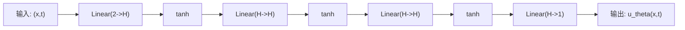

# 第三节课课件：第一个可运行的 PINN 实验（1D 热传导方程）

> 课程定位：从“知道 PINN 是什么”升级到“能自己跑、能看懂图、能改参数”。

---

# 0. 本节课目标（45~60 分钟）

1. 学生能在 CPU 上跑通一个最小 PINN。
2. 学生能说清楚 `方程-条件-损失-训练-评估` 这条链路。
3. 学生能看懂并解释三张核心图：预测解、真解、误差图。
4. 学生能独立修改至少 1 个超参数并观察影响。

---

# 1. 问题定义（延续第二节）

## 1.1 PDE

\[
\frac{\partial u}{\partial t}=\alpha\frac{\partial^2u}{\partial x^2},\quad x\in[0,1],\ t\in[0,1],\ \alpha=0.1
\]

## 1.2 初始条件

\[
u(x,0)=\sin(\pi x)
\]

## 1.3 边界条件

\[
u(0,t)=0,\quad u(1,t)=0
\]

## 1.4 解析解（用于评估）

\[
u(x,t)=e^{-\alpha\pi^2 t}\sin(\pi x)
\]

说明：这节课我们不是“只看 loss 降不降”，而是拿解析解做定量误差评估。

---

# 2. 本节课主线（一定要让学生记住）

1. 用神经网络表示未知函数：\(u_\theta(x,t)\)。
2. 用自动微分得到 \(u_t, u_x, u_{xx}\)。
3. 在内部采样点构造 PDE 残差：\(f_\theta=u_t-\alpha u_{xx}\)。
4. 合并三类损失：
   - 初值损失 \(\mathcal L_{IC}\)
   - 边界损失 \(\mathcal L_{BC}\)
   - PDE 损失 \(\mathcal L_{PDE}\)
5. 训练后在网格上预测并和解析解比较。

---

# 3. 课堂实现结构（Notebook 对应）

## Part A：准备与设定
- 导入 `torch / numpy / matplotlib`
- 固定随机种子
- 设备选择（CPU/GPU 自动）

## Part B：采样训练点
- 初值点：\((x,0)\)
- 边界点：\((0,t),(1,t)\)
- 内部点（collocation）：\((x_f,t_f)\)

## Part C：定义 PINN 网络
- 输入维度 2（x,t）
- 输出维度 1（u）
- 激活函数 `tanh`

## Part D：自动微分与 PDE 残差
- 用 `torch.autograd.grad` 计算一阶、二阶导
- 构建 `f = u_t - alpha * u_xx`

## Part E：损失函数与训练
\[
\mathcal L=\lambda_{ic}\mathcal L_{ic}+\lambda_{bc}\mathcal L_{bc}+\lambda_f\mathcal L_f
\]

建议初始权重：`lambda_ic=1, lambda_bc=1, lambda_f=1`。

## Part F：评估与可视化
- 2D 热力图：预测解 / 真解 / 绝对误差
- 切片曲线：`t=0,0.25,0.5,1.0`
- 指标：`L2 relative error`

---

# 4. 课堂讲解重点（老师讲解词可直接用）

## 4.1 为什么要三类点？
- 初值点：告诉模型“起点是什么”。
- 边界点：告诉模型“边界必须满足什么”。
- 内部点：告诉模型“在区域内部必须满足 PDE”。

## 4.2 为什么 PINN 也要“数值分析思维”？
- 采样分布会影响训练。
- 损失权重会影响收敛平衡。
- 网络深度和激活函数会影响可表示性与优化稳定性。

## 4.3 本节课最小成功标准
- 能跑完训练。
- 能得到合理温度场衰减趋势。
- 能说出“误差大的区域在哪里、为什么可能大”。

---

# 5. 课堂互动实验（建议至少做 2 个）

## 实验 A：改 collocation 点数量
- 例如 `N_f: 2000 -> 5000`
- 观察：误差图是否更平滑、边界附近是否改善。

## 实验 B：改 PDE 损失权重
- 例如 `lambda_f: 1 -> 10`
- 观察：PDE 约束更强后，IC/BC 拟合是否被牺牲。

## 实验 C：改网络深度
- 例如隐藏层 `3 -> 5`
- 观察：精度变化与训练时间变化。

---

# 6. 常见报错与排查

1. `element 0 of tensors does not require grad`
   - 说明输入点没开启 `requires_grad=True`。

2. `Trying to backward through the graph a second time`
   - 需要在求高阶导时正确设置 `create_graph=True`。

3. 训练很慢
   - 先减少 epoch 或采样点，确认流程正确后再加大。

4. loss 降不下去
   - 检查学习率、激活函数、损失权重比例。

---

# 7. 本节课与后续论文写作的连接

这节课完成后，学生就有了论文 Method 和 Experiments 的最小原型：

- Method：`PINN formulation + loss decomposition + network`
- Experiments：`解析解对比 + 参数敏感性`

后续可扩展为：
- PINN vs FDM 对比
- 不同采样策略（均匀/拉丁超立方）
- 不同激活函数与优化器对比

---

# 8. 课后作业（直接可执行）

## 必做
1. 完整跑通本节 Notebook。
2. 记录一组超参数与最终 `L2 relative error`。
3. 截图三张图：预测/真解/误差。

## 选做
1. 尝试 `tanh` 改 `sin` 或 `softplus`。
2. 尝试 Adam + LBFGS 两阶段训练。
3. 增加噪声观测点，做“数据 + 物理”联合训练。

---

# 9. 配套文件

- 本课讲义：`section3.md`
- 本课代码（Jupyter）：`section3_pinn_heat1d.ipynb`

---

# 10. 一句话收束

第三节课的目标不是“把 PINN 讲完”，而是“让学生第一次真正把 PINN 跑起来，并能解释结果”。

---

# 11. 神经网络基础补充（PINN 版）

## 11.1 网络输入输出与尺度（Normalization）

在这节课里，网络学的是一个映射：

\[
(x,t)\longmapsto u
\]

其中输入是空间和时间，输出是温度。  
虽然本例中 \(x,t\in[0,1]\) 已经比较规整，但要提醒学生一个通用原则：

- 输入尺度差异过大（例如 \(x\) 是 \(10^{-3}\)，\(t\) 是 \(10^2\)）会让训练变难；
- 实际项目里通常先做无量纲化或归一化，再送入网络。

这有助于优化器更稳定地下降，也更容易平衡不同损失项。

## 11.2 MLP 结构、深度宽度与激活函数

本课使用的是最常见的 PINN 结构：`MLP + tanh`。  
可以给学生一个直观解释：

- 深度（层数）增加：表达能力更强，但更难训；
- 宽度（hidden_dim）增加：拟合能力增强，但计算更慢；
- 激活函数影响可导性和优化行为。

为什么 PINN 常用 `tanh`：

- 光滑，便于求高阶导；
- 在很多 PDE 问题上比 ReLU 更稳定；
- 对本节热传导方程这种光滑解通常足够好。

## 11.3 自动微分与高阶导数链路

PINN 的关键不只是“前向预测”，更是“对预测结果求导”。  
在代码里我们要得到：

\[
u_t,\quad u_x,\quad u_{xx}
\]

并构造残差：

\[
f=u_t-\alpha u_{xx}
\]

教学时可强调：

- `requires_grad=True` 是入口；
- `create_graph=True` 是高阶导的关键；
- 自动微分让“方程约束”可直接写进 loss。

## 11.4 损失项权重平衡（为什么会互相拉扯）

总损失：

\[
\mathcal L=\lambda_{ic}\mathcal L_{ic}+\lambda_{bc}\mathcal L_{bc}+\lambda_f\mathcal L_f
\]

本质是多目标优化，三项常出现“拉扯”：

- \(\lambda_f\) 太小：PDE 不满足，解可能只是在贴边界；
- \(\lambda_f\) 太大：PDE 残差小了，但 IC/BC 拟合可能变差；
- 采样点数量变化（如 `N_f`）也会改变三项相对强度。

建议学生每次只改一个因素，记录最终 `L2 relative error` 与三项 loss 变化。

## 11.5 优化器与训练策略（课堂可执行版）

给学生一个实用策略：

1. 先用 Adam 快速下降到可用区间；
2. 若后期震荡或平台期明显，可尝试更小学习率；
3. 进阶可尝试 Adam + LBFGS 两阶段训练。

对应本课 Notebook：

- 先确保基础配置稳定：`tanh + 合理 N_f + 合理 lambda_f`；
- 再逐步增加训练轮次，不建议一开始就堆很大 epoch。

## 11.6 Dropout 在 PINN 里的作用与注意事项

可以加 Dropout，但要谨慎。  
原因是 PINN 依赖导数约束，随机失活会增加导数噪声，可能让 PDE 残差学习变难。

课堂建议：

- 先从很小值试起：`dropout_rate = 0.01 ~ 0.05`；
- 若发现 PDE loss 明显变差，先减小或关闭 Dropout；
- 优先调 `N_f`、`lambda_f`、学习率，再考虑较大 Dropout。

一句话告诉学生：

> Dropout 在分类任务常常“必试”，但在 PINN 里是“可试项”，不是默认最优项。

---

# 12. 神经网络结构示意与反向传播基础

## 12.1 神经网络结构示意图（以本课 PINN 为例）

```text
输入层                    隐藏层1                 隐藏层2                 隐藏层3                 输出层
(x, t)                Linear + Tanh            Linear + Tanh            Linear + Tanh             u_theta
  │                         │                        │                        │                        │
  ├── x ───────────────────▶○○○○○○○○──────────────▶○○○○○○○○──────────────▶○○○○○○○○────────────────▶○
  └── t ───────────────────▶○○○○○○○○──────────────▶○○○○○○○○──────────────▶○○○○○○○○────────────────▶

说明：
1. 每一层 Linear 都是仿射变换：z = W a + b
2. 每一层激活函数（本课用 tanh）做非线性映射：a = tanh(z)
3. 输出层一般不加激活，直接输出连续值 u_theta(x,t)
```

如果你希望在支持 Mermaid 的渲染器里展示，也可使用：



## 12.2 神经网络训练实际在“求”什么？

训练本质是在求一组参数：

\[
\theta=\{W^{(1)},b^{(1)},W^{(2)},b^{(2)},\dots\}
\]

使总损失最小：

\[
\theta^*=\arg\min_\theta \mathcal L(\theta)
\]

在 PINN 中：

\[
\mathcal L=
\lambda_{ic}\mathcal L_{ic}
+
\lambda_{bc}\mathcal L_{bc}
+
\lambda_f\mathcal L_f
\]

也就是说，训练是在找“最合适的网络参数”，让网络同时满足：

1. 初始条件；
2. 边界条件；
3. PDE 残差尽量小。

## 12.3 向后传播（Backpropagation）的数学核心

核心就是链式法则（Chain Rule）。  
以两层网络为例：

\[
a^{(1)}=\sigma(z^{(1)}),\quad z^{(1)}=W^{(1)}x+b^{(1)}
\]
\[
\hat y=a^{(2)}=W^{(2)}a^{(1)}+b^{(2)}
\]
\[
\mathcal L=\frac12(\hat y-y)^2
\]

我们要算的是每层参数的梯度，例如：

\[
\frac{\partial \mathcal L}{\partial W^{(2)}}=
\frac{\partial \mathcal L}{\partial \hat y}
\frac{\partial \hat y}{\partial W^{(2)}}
\]

对前一层则要继续链式展开：

\[
\frac{\partial \mathcal L}{\partial W^{(1)}}=
\frac{\partial \mathcal L}{\partial \hat y}
\frac{\partial \hat y}{\partial a^{(1)}}
\frac{\partial a^{(1)}}{\partial z^{(1)}}
\frac{\partial z^{(1)}}{\partial W^{(1)}}
\]

这就是“误差从后往前传”的本质：  
先拿到输出层误差信号，再逐层乘局部导数，把梯度传回去。

## 12.4 梯度下降更新（与代码的对应关系）

有了梯度后，参数按如下更新：

\[
\theta \leftarrow \theta - \eta \nabla_\theta \mathcal L
\]

其中 \(\eta\) 是学习率。  
在代码里对应：

1. `loss.backward()`：计算所有参数梯度（反向传播）
2. `optimizer.step()`：按优化器规则更新参数
3. `optimizer.zero_grad()`：清空旧梯度

## 12.5 放到 PINN 语境下一句话理解

普通监督学习是“让预测值贴近标签”；  
PINN 是“让预测值既贴近条件数据，又满足 PDE 物理规律”。  
两者训练机制相同，区别在于损失函数中加入了物理残差项。

## 12.6 计算图 + 梯度流向（课堂投影版）

### A. 前向计算图（从左到右）

```text
x,t
 │
 ▼
[Linear1] → z1
 │
 ▼
[tanh]    → a1
 │
 ▼
[Linear2] → z2
 │
 ▼
[tanh]    → a2
 │
 ▼
[Linear_out] → u_theta(x,t)
 │
 ├──────────────► 与 IC/BC 目标比较 → L_ic, L_bc
 │
 └──────────────► 自动微分求 u_t, u_xx → PDE残差 f → L_f

总损失：L = λ_ic L_ic + λ_bc L_bc + λ_f L_f
```

### B. 反向梯度流（从右到左）

```text
L
 ▲
 │ dL/du_theta, dL/df
u_theta, f
 ▲
 │ 链式法则逐层传递
Linear_out
 ▲
tanh
 ▲
Linear2
 ▲
tanh
 ▲
Linear1
 ▲
x,t
```

### C. 一段可直接讲给学生的话（3分钟版）

1. 前向时，网络先把 `(x,t)` 变成预测 `u_theta(x,t)`。  
2. 这个预测一方面去匹配初值和边界，另一方面通过自动微分构造 PDE 残差。  
3. 三部分损失加权得到总损失 `L`。  
4. 反向传播时，从 `L` 开始沿计算图反向走，用链式法则算出每层参数的梯度。  
5. 优化器根据梯度更新参数，重复这个过程，直到 `L` 和误差都降下来。  

### D. 和代码逐行对应（便于学生建立连接）

- `u_pred = model(x,t)`：前向图主干（得到 `u_theta`）  
- `u_t, u_xx = autograd(...)`：前向图的导数分支（得到 `f`）  
- `loss = ...`：汇总成总损失 `L`  
- `loss.backward()`：沿图反向传播，求所有参数梯度  
- `optimizer.step()`：参数更新  

### E. 一句话收束

> 训练神经网络不是“神秘调参”，本质就是：构图（前向）+ 求导（反向）+ 更新（优化器）的循环。
