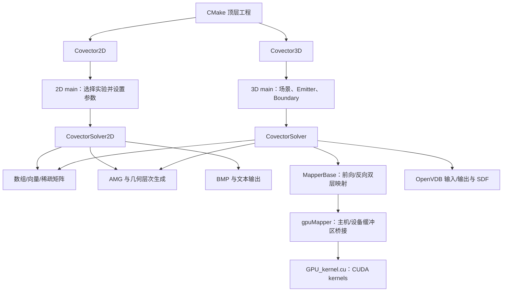

# CovectorFluids 项目结构分析

> 分析日期：2026-08-24  
> 分析范围：当前仓库的源码、CMake 配置、模型数据和已有说明文档；本文基于静态代码阅读，不代表所有平台均已成功编译运行。

## 1. 项目定位

本项目是 Covector Fluids 论文算法的 C++ 参考实现，并基于 BiMocq 代码修改而来。它在统一的不可压缩流体求解框架中实现并比较 8 种输运方案：

| 编号 | 枚举 | 命令行名称 | 含义 |
|---:|---|---|---|
| 0 | `SEMILAG` | SF | Stable Fluids / 半拉格朗日输运 |
| 1 | `REFLECTION` | SF+R | Stable Fluids + Reflection |
| 2 | `SCPF` | SCPF | Stable and Circulation Preserving Fluids |
| 3 | `MACCORMACK` | MC | MacCormack 输运 |
| 4 | `MAC_REFLECTION` | MC+R | MacCormack + Reflection |
| 5 | `BIMOCQ` | BiMocq | 双层映射方法 |
| 6 | `COVECTOR` | CF | Covector Fluids |
| 7 | `COVECTOR_BIMOCQ` | CF+MCM | Covector Fluids + 多层映射 |

工程分为两个彼此独立的可执行程序：

- `Covector2D`：CPU 实现，以 TBB 并行，直接输出 BMP/文本结果。
- `Covector3D`：CPU 负责时间步编排、边界和压力投影，CUDA 负责主要映射与输运计算，OpenVDB 负责三维体数据读写。

已有的 `docs/CovectorFluids_algorithm_design.md` 更偏向论文算法与代码的对应关系；本文重点说明工程目录、模块职责、依赖关系、运行入口以及维护风险。

## 2. 目录总览

```text
CovectorFluids_code/
├── CMakeLists.txt                    # 顶层构建配置：项目、编译选项、输出目录
├── README.md                         # 简要依赖、构建和运行说明
├── CMake/                            # 自定义 CMake 查找/下载模块
│   ├── FindHalf.cmake
│   ├── FindOpenVDB.cmake
│   ├── FindTBB.cmake
│   └── DownloadProject.*
├── docs/
│   ├── CovectorFluids_algorithm_design.md
│   └── project_structure_analysis.md # 本文
├── modelData/                        # 示例场景的外部输入数据
│   ├── DeltaWing/                    # 三角翼 SDF（64/128 分辨率 VDB）
│   ├── TrefoilKnot/                  # 三叶结速度场、密度场 VDB
│   ├── bunnyMeteor/                  # Stanford Bunny SDF VDB
│   └── sigg_logo.txt                 # 2D SIGGRAPH 图案密度初始化数据
└── src/
    ├── CMakeLists.txt                # 加入 2D、3D 子项目
    ├── covector2D/                   # 二维求解器与场景入口
    │   ├── CMakeLists.txt
    │   ├── main.cpp
    │   ├── CovectorSolver2D.h
    │   └── CovectorSolver2D.cpp
    ├── covector3D/                   # 三维编排、映射及 CUDA 实现
    │   ├── CMakeLists.txt
    │   ├── main.cpp
    │   ├── CovectorSolver.h/.cpp
    │   ├── Mapping.h/.cpp
    │   ├── GPU_Advection.h
    │   └── GPU_kernel.cu
    ├── include/                      # 通用数组、向量、稀疏矩阵和 3D 缓冲区
    │   ├── array.h, array1.h, array2.h, array3.h
    │   ├── array2_utils.h, array3_utils.h
    │   ├── fluid_buffer3D.h
    │   ├── sparse_matrix.h
    │   └── vec.h
    └── utils/                        # 线性求解、可视化与 VDB/BMP 工具
        ├── AlgebraicMultigrid.h
        ├── GeometricLevelGen.h
        ├── pcg_solver.h
        ├── blas_wrapper.h
        ├── volumeMeshTools.h
        ├── visualize.h
        ├── writeBMP.h/.cpp
        ├── util.h
        └── color_macro.h
```

工程规模约 1.5 万行。其中最集中的实现文件是 `CovectorSolver2D.cpp`、`CovectorSolver.cpp` 和 `GPU_kernel.cu`，三者合计约 6300 行，是理解与修改算法的主要入口。

## 3. 总体架构



架构上的核心特点是：

1. **入口即场景配置。** 两个 `main.cpp` 都通过大型 `switch` 设置分辨率、时间步、边界、发射器、初始场和输出路径。
2. **Scheme 在运行时分派。** 两个求解器的 `advance()` 根据相同的 `Scheme` 编号进入各自算法实现。
3. **MAC 网格布局。** 速度分量放在网格面上，密度、温度和压力放在单元中心；这决定了数组尺寸与采样偏移。
4. **压力投影共享基础设施。** 2D/3D 均使用稀疏矩阵、几何层次生成和代数多重网格相关工具处理不可压缩约束。
5. **3D 是 CPU/GPU 混合实现。** CUDA 并非独立后端，而是三维求解器的必需组成部分。

## 4. 构建系统与依赖

### 4.1 CMake 层级

构建调用链为：

```text
CMakeLists.txt
  └── src/CMakeLists.txt
        ├── src/covector2D/CMakeLists.txt  -> Covector2D
        └── src/covector3D/CMakeLists.txt  -> Covector3D + cuda_lib
```

顶层配置具有以下行为：

- 要求 out-of-source build，禁止直接在源码根目录运行生成构建文件。
- 声明 `project(Covector CXX CUDA)`，因此配置整个项目时就要求 CUDA 编译器存在。
- 2D 使用 C++11，3D 为兼容 OpenVDB 10 使用 C++14；Release 是未指定构建类型时的默认值。
- 可执行文件输出到源码目录下的 `build/`。
- GCC Release 构建在工具可用时启用 8 路 LTO，并要求 `gcc-ar`、`gcc-ranlib`。
- 生成 `compile_commands.json`。

### 4.2 外部依赖

| 依赖 | 2D | 3D | 用途 |
|---|:---:|:---:|---|
| CMake | ✓ | ✓ | 构建生成 |
| C++11 编译器 | ✓ | ✓ | 主体代码 |
| Intel TBB | ✓ | ✓ | CPU 并行循环与归约 |
| Boost filesystem/system | ✓ | ✓ | 创建输出目录等文件系统操作 |
| CUDA Toolkit | — | ✓ | 映射、输运、补偿、极值限制等 GPU kernel |
| OpenVDB | — | ✓ | VDB 场、SDF、发射器/障碍物及输出 |

注意：README 所说“无 NVIDIA GPU 时删除一行 CUDA 依赖即可运行 2D”并不完全符合当前构建配置。CUDA 同时出现在顶层 `project(... CUDA)` 和 3D 子目录中；若希望真正支持纯 2D 构建，应增加类似 `BUILD_3D` 的 CMake 选项，并条件化启用 CUDA 与 `covector3D`。

### 4.3 当前预期构建方式

```bash
mkdir build
cd build
cmake ..
cmake --build . -j
```

程序依赖相对路径读取 `../modelData`，因此从 `build/` 目录运行最符合源码中的路径假设：

```bash
./Covector2D <scheme:0-7> <example:0-5>
./Covector3D <scheme:0-7> <experiment:0-6>
```

## 5. 二维模块

### 5.1 `main.cpp`：实验配置层

二维入口提供 6 个实验：

| 编号 | 实验 | 主要特征 |
|---:|---|---|
| 0 | Taylor Vortices | 周期/Neumann 型设置，输出涡量积分和能量 |
| 1 | Leapfrogging Pairs | 双涡对，重复压力投影 |
| 2 | Ink Drop | Rayleigh–Taylor 型密度/温度浮力 |
| 3 | Ink Drop SIGGRAPH Logo | 从 `modelData/sigg_logo.txt` 初始化密度 |
| 4 | Inverted Zalesak's Disk | Covector/level-set 输运测试 |
| 5 | von Kármán Vortex Street | 圆柱 SDF 障碍、入口速度和尾涡 |

每个分支创建 `CovectorSolver2D`，设置边界/初值，建立多重网格，然后按帧执行 `advance()` 并输出结果。

### 5.2 `CovectorSolver2D`：单体求解器

该类同时承担以下职责：

- MAC 网格上的 `u/v`、密度 `rho`、温度、涡量和临时场存储。
- 半拉格朗日、MacCormack、Reflection、BiMocq、SCPF 和 Covector 输运。
- 前向/反向映射及重映射状态管理。
- 浮力、扩散、边界处理和压力投影。
- 初始条件、烟雾发射、诊断指标与 BMP/文本输出。

典型时间步可概括为：

```text
main 的帧循环
  -> CovectorSolver2D::advance(dt, frame)
     -> 按 Scheme 选择 advanceXxx()
        -> 输运速度/标量或更新映射
        -> 添加浮力等外力
        -> pressureProjectVelField()
        -> 必要时误差补偿、累积变化、重初始化
  -> 计算涡量/能量并输出
```

2D 代码没有单独的映射类或后端接口，算法状态全部作为求解器成员保存。这使论文公式与变量对应较直接，但也造成类较大、职责耦合较重。

## 6. 三维模块

### 6.1 `main.cpp`：实验与场景装配

三维入口提供 7 个实验：

| 编号 | 实验 | 外部数据/特征 |
|---:|---|---|
| 0 | Trefoil Knot | 读取初始速度和密度 VDB |
| 1 | Leapfrogging Rings | 程序化 slab/cylinder 发射器 |
| 2 | Smoke Plume | 球形烟雾发射器、浮力、顶部开放 |
| 3 | Pyroclastic Cloud | 柱形发射器、随机密度 |
| 4 | Ink Jet | 移动方向速度、球形发射器 |
| 5 | Delta Wing | 读取三角翼 SDF，设置入口流 |
| 6 | Bunny Meteor | 读取 Bunny SDF，设置入口流 |

`Emitter` 和 `Boundary` 用 OpenVDB SDF 描述形状，并通过函数对象描述运动或发射速度。入口组装这些对象、创建 `gpuMapper` 和 `CovectorSolver`、建立压力系统，然后运行子步循环。

### 6.2 `CovectorSolver`：时间步编排层

三维求解器保存速度、密度、温度、边界、压力系统及两个映射器：

- `VelocityAdvector`：速度映射和速度场输运。
- `ScalarAdvector`：密度、温度等标量映射与输运。
- `gpuSolver`：两个映射器共享的 CUDA 执行与缓冲对象。

`advance()` 只负责 Scheme 分派；具体方法组织以下阶段：

```text
更新边界
  -> 更新前向/反向映射
  -> 输运速度与标量
  -> 边界附近与半拉格朗日结果混合
  -> 发射烟雾、施加浮力/黏性
  -> 压力投影
  -> 累积外力和投影引起的增量
  -> 根据频率或畸变阈值重初始化映射
  -> OpenVDB 输出
```

### 6.3 `MapperBase`：映射状态层

`MapperBase` 封装 BiMocq/Covector 共享的双层映射机制，主要管理：

- 当前与临时前向映射 `forward_*`、`forward_temp_*`。
- 当前、前一层与临时反向映射 `backward_*`、`backward_*prev`、`backward_temp_*`。
- 映射更新、场输运、变化累积、误差补偿、畸变估计和重初始化。

类中的大多数高层操作会把宿主端 `buffer3Df` 交给共享的 `gpuMapper` 执行。

### 6.4 `gpuMapper` 与 `GPU_kernel.cu`：CUDA 执行层

`GPU_Advection.h` 同时定义：

- C ABI 的 CUDA 包装函数声明。
- `gpuMapper` 类及主机/设备缓冲区生命周期和数据复制逻辑。

`GPU_kernel.cu` 实现的 kernel 覆盖：

- 映射梯度、前向和反向映射更新。
- Semi-Lagrangian/DMC 路径回溯。
- 普通场与 Covector 速度场输运。
- 双层结果混合、误差补偿和变化累积。
- 极值限制、映射畸变计算与归约。

这种组织将 CUDA 调用细节从 `CovectorSolver` 隔离出去，但 `GPU_Advection.h` 体积较大且包含大量资源管理实现，后续可进一步拆分为接口头和 `.cu/.cpp` 实现。

## 7. 公共数据结构与数值工具

### 7.1 网格与内存布局

- `Array2<T>` / `Array3<T>`：通用二维、三维连续数组。
- `Vec<T, N>`：固定维度向量及常用运算。
- `Buffer3D<T>`：三维流体专用缓冲区，以 `8×8×8` block 排布，并保存世界坐标步长与采样偏移。
- `SparseMatrix` / `FixedSparseMatrix`：压力泊松系统使用的稀疏矩阵表示。

MAC 网格的典型尺寸如下：

| 场 | 2D 尺寸 | 3D 尺寸 | 位置 |
|---|---|---|---|
| `u` | `(nx+1, ny)` | `(nx+1, ny, nz)` | x 方向面中心 |
| `v` | `(nx, ny+1)` | `(nx, ny+1, nz)` | y 方向面中心 |
| `w` | — | `(nx, ny, nz+1)` | z 方向面中心 |
| `rho/T/p` | `(nx, ny)` | `(nx, ny, nz)` | 单元中心 |

### 7.2 压力求解

`GeometricLevelGen.h` 和 `AlgebraicMultigrid.h` 构造多重网格层次、限制和延拓算子；`blas_wrapper.h` 提供向量运算，`pcg_solver.h` 提供 PCG 路径。2D 与 3D 求解器各自负责根据边界描述构造压力矩阵和右端项。

### 7.3 输入输出

- 2D：`writeBMP.*`、`visualize.h` 负责密度、涡量和速度图像；诊断量写入文本文件。
- 3D：`volumeMeshTools.h` 和 OpenVDB API 负责 SDF/场读取及 VDB 输出。
- `color_macro.h` 仅用于终端彩色日志。

## 8. 数据流与输出位置

### 8.1 二维

二维入口使用 `../Out_2D` 作为基路径。从 `build/` 启动时，结果会落在仓库根目录的 `Out_2D/` 下，并按实验、Scheme 和部分参数分层。

### 8.2 三维

三维入口使用仓库内的相对输出路径：

```cpp
string filepath = "../Out_3D/";
```

从 `build/` 启动时，结果会写入仓库根目录的 `Out_3D/`。长期仍建议将输出根目录改为命令行参数或配置项。

## 9. 当前代码中的重要风险

以下结论来自静态检查，按影响优先级排列。

### 高优先级

1. **顶层构建无条件要求 CUDA。** 这阻止了没有 CUDA 工具链的用户只构建 2D 程序，与 README 的预期不一致。
2. **CUDA 架构固定。** NVCC flags 只列出 `sm_61`、`sm_75`/`compute_75`，对更新或不同代际 GPU 的可移植性有限。

### 中优先级

1. **资源所有权不清晰。** 3D 中 `new gpuMapper(...)` 没有对应显式 `delete`；`Buffer3D` 内部自行管理裸指针，拷贝/赋值语义也依赖调用方先正确初始化目标尺寸。
2. **头文件包含重。** 数值工具多为大型 header-only 实现，且求解器头直接引入 OpenVDB、CUDA 和 AMG，导致编译耦合与增量构建成本较高。
3. **场景配置与执行逻辑耦合。** 大型 `switch` 中散布分辨率、物理量、文件路径和输出规则，不便于批量实验、参数扫描和测试。
4. **两个维度重复定义 Scheme。** 2D/3D 分别维护相同枚举和字符串转换，长期修改时可能漂移。

### 低优先级/文档一致性

1. README 对命令行“第二/第三参数”的描述与实际 `argv[1]`、`argv[2]` 表述容易混淆；严格说它们是程序名之后的第一个和第二个参数。
2. README 一处写 3D 实验编号 `0-7`，实际枚举与代码只支持 `0-6`。
3. 顶层存在测试开关和 Valgrind 配置，但当前没有实际 `add_test()` 测试用例。
4. 缺少许可证文件、版本锁定和自动化构建配置，复现实验环境主要依赖 README 的系统包说明。

## 10. 推荐的阅读顺序

若目标是快速理解代码，推荐按以下顺序：

1. `README.md`：了解运行方式和 Scheme 编号。
2. `src/covector2D/main.cpp`：从较小的场景入口理解参数、初始化和帧循环。
3. `src/covector2D/CovectorSolver2D.cpp` 中的 `advance()` 及目标 `advanceXxx()`：建立单步算法直觉。
4. `src/covector3D/main.cpp`：理解 Emitter、Boundary、VDB 输入和子步输出。
5. `src/covector3D/CovectorSolver.cpp` 的 `advance()`、`fullAdvect()`、`projection()`：掌握三维编排。
6. `Mapping.cpp`：理解双层前向/反向映射及重初始化。
7. `GPU_Advection.h`、`GPU_kernel.cu`：最后追踪具体 CUDA 数据流和 kernel。
8. `docs/CovectorFluids_algorithm_design.md`：将调用链重新对应到论文算法。

## 11. 建议的后续工程化方向

短期优先完成以下工作，能够显著改善可构建性和可复现性：

1. 修复 3D 命令行解析顺序，并为两个程序增加一致的范围检查和 `--help`。
2. 增加 `BUILD_2D`、`BUILD_3D` CMake 选项，仅在构建 3D 时启用 CUDA/OpenVDB。
3. 把输出根目录、基础分辨率、帧数和输入数据目录改成参数或配置文件。
4. 使用 `CMAKE_CUDA_ARCHITECTURES` 取代硬编码 `-gencode`，并处理 Linux/Windows CUDA 库链接差异。
5. 提取共享 `Scheme` 定义以及公共 MAC 网格/压力投影接口。
6. 为小分辨率、少时间步场景增加 smoke tests，至少覆盖参数分派、压力投影和输出文件生成。
7. 将场景定义从 `main.cpp` 拆到配置结构或独立 factory，使数值算法与实验参数解耦。

总体而言，这是一套面向论文复现、算法对比而编写的研究代码：算法覆盖较完整，2D/3D 实验齐全，数据布局与映射实现直接；主要技术债集中在构建可移植性、配置硬编码、类职责过重和自动化验证不足。
